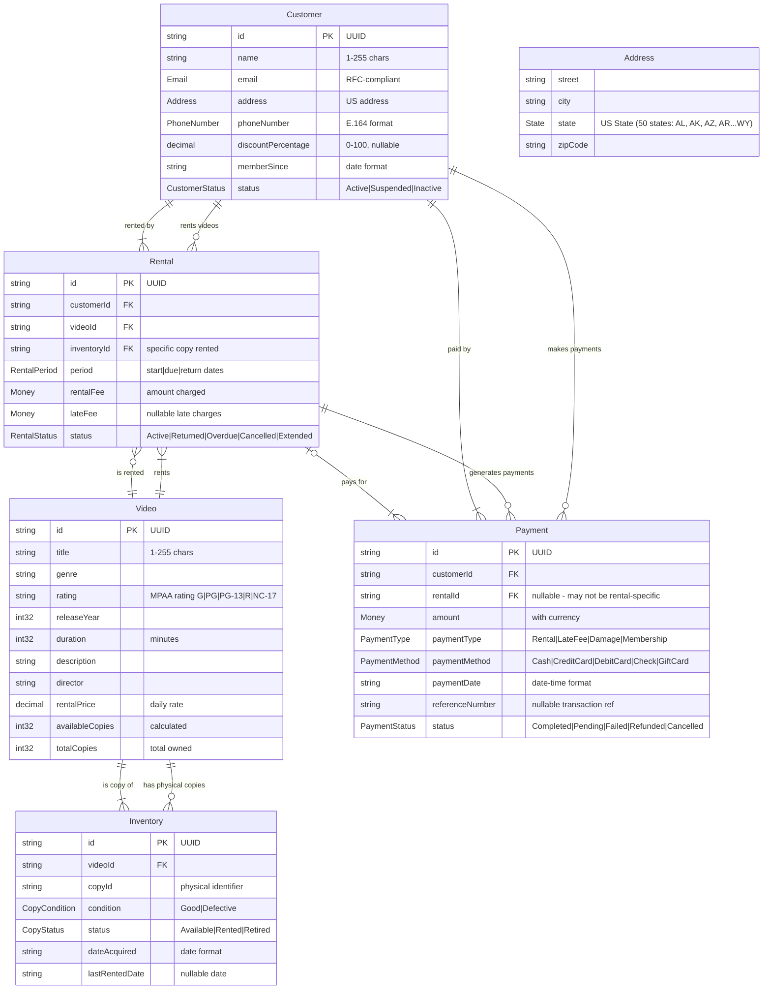

# Video Rental Store - Entity Relationship Diagram

This document contains the Entity Relationship Diagram (ERD) for the Video Rental Store domain model, accurately reflecting the current TypeSpec implementation.

## Domain Model Overview

The video rental store domain consists of the following core entities and their relationships:

- **Customer**: People who rent videos with personal information, membership details, and optional discount percentage
- **Video**: The movies/shows available for rent with pricing and availability
- **Inventory**: Physical copies of videos with condition and status tracking
- **Rental**: Active rental transactions with period and fee management
- **Payment**: Financial transactions with comprehensive payment method support

## Entity Relationship Diagram

## Business Rules and Constraints

### Key Business Logic

1. **Rental Lifecycle**:

   - Customer rents a video → Rental becomes Active → Returns to complete cycle
   - Customers with discount percentage get automatic pricing reductions
   - Rentals can become Overdue if not returned by due date
   - Late fees are calculated for overdue rentals

2. **Inventory Management**:

   - Each Video can have multiple physical copies (Inventory)
   - Copy status tracks availability: Available → Rented → Available
   - Copy condition affects rental eligibility

3. **Payment Processing**:

   - Payments can be for rentals, late fees, damages, or membership
   - Multiple payment methods supported
   - Payment status tracks transaction lifecycle

4. **Customer Management**:

   - Customers can have multiple active rentals
   - Payment history is maintained per customer
   - Customer discounts are configurable via discountPercentage field
   - Address information is directly stored with customer

### Data Integrity Rules

- All primary keys are UUIDs for global uniqueness
- Foreign key relationships ensure referential integrity
- Nullable fields allow for incomplete transactions (e.g., dateReturned)
- Enum constraints ensure valid status values
- Date/time fields track transaction chronology

### API Operations

Each entity supports full CRUD operations plus specialized business operations:

- **Videos**: Search, genre filtering, availability checking
- **Rentals**: Return processing, overdue tracking, customer history, price calculation with customer discounts
- **Inventory**: Video-specific tracking, availability reporting
- **Payments**: Customer payment history, transaction processing
- **Customers**: Standard CRUD operations, discount percentage management

This domain model provides a comprehensive foundation for a video rental store management system with proper business logic, data integrity, and operational workflows.
