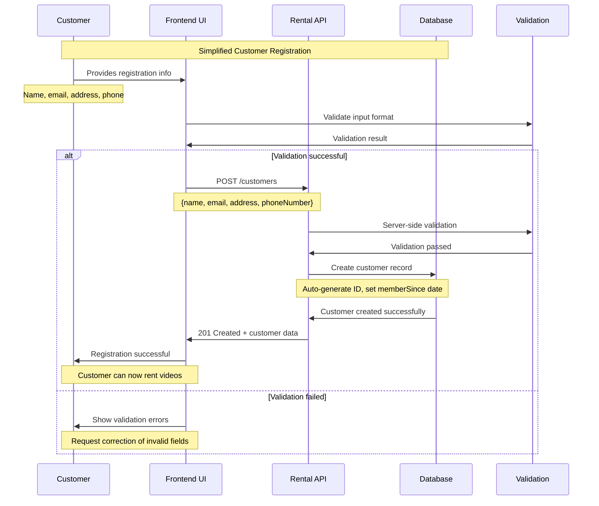
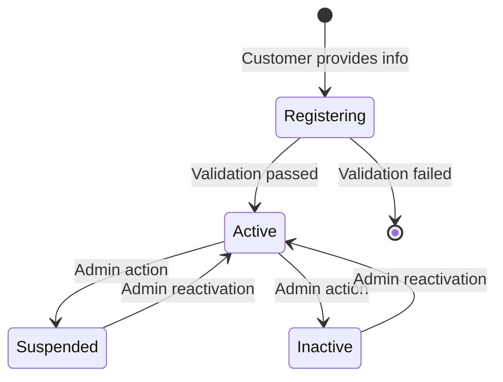

# Customer Registration Sequence Diagram

This diagram shows the simplified customer registration workflow in the video rental system.

## Sequence Flow

## Key Points

- **Simplified Process**: Direct customer creation without employee involvement
- **Auto-Generated Fields**: System sets `id`, `memberSince`, and default `status`
- **Optional Discount**: `discountPercentage` can be set later via admin operations
- **Immediate Access**: Customer can start renting videos immediately after registration
- **Validation**: Both client and server-side validation ensure data integrity

## Status Transitions

The registration process creates customers in `Active` status, ready for immediate video rentals.
