# Video Rental Creation Sequence Diagram

This diagram shows the complete rental creation workflow with customer discount handling.

## Sequence Flow

## Pricing Calculation Details

```mermaid
flowchart TD
    A[Base Rental Price] --> B{Customer has discount?}
    B -->|Yes| C[Apply discount percentage]
    B -->|No| D[Use base price]
    C --> E[Calculate daily rate × rental period]
    D --> E
    E --> F[Final Rental Fee]

    style C fill:#e1f5fe
    style F fill:#c8e6c9
```

## Key Business Rules

1. **Inventory Management**: System automatically selects an available copy
2. **Customer Discounts**: Applied automatically based on `discountPercentage` field
3. **Rental Period**: Standard rental period with due date calculation
4. **Status Tracking**: Rental status set to `Active`, copy status to `Rented`
5. **Fee Calculation**: Includes customer discounts and any applicable taxes

## Error Handling

- **No Available Copies**: Customer notified, can request notification when available
- **Invalid Customer**: Suspended or inactive customers cannot rent
- **Payment Required**: Some rentals may require upfront payment
- **System Errors**: Graceful fallback with inventory reservation rollback
