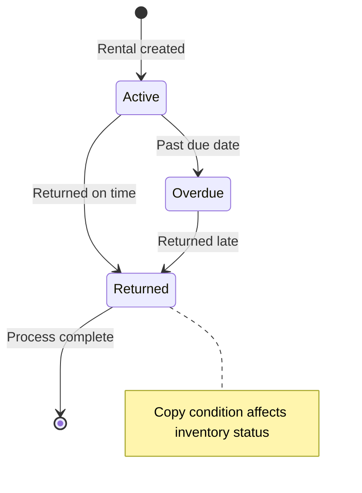
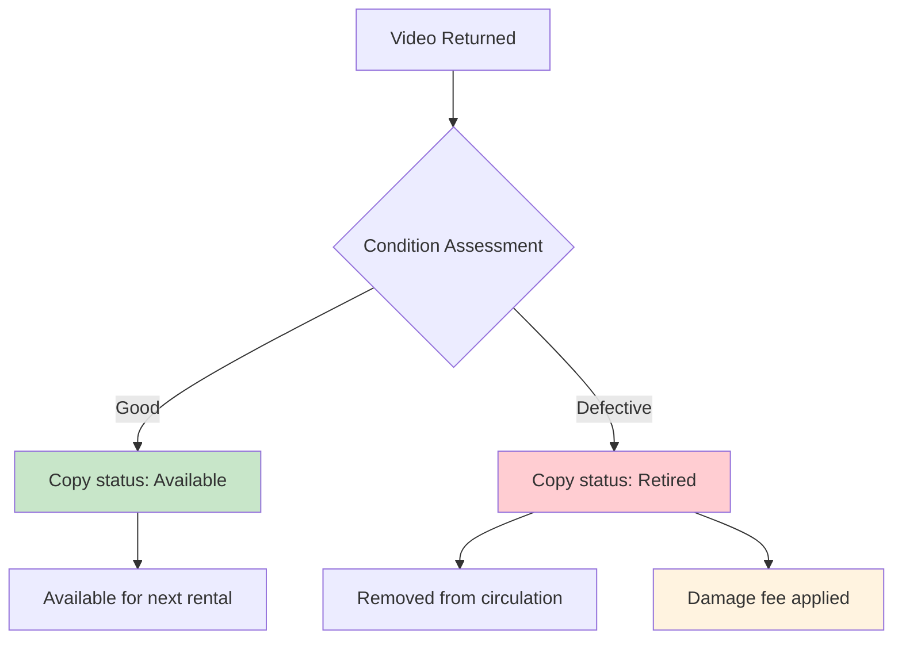

# Video Return Processing Sequence Diagram

This diagram shows the simplified return processing workflow with condition assessment.

## Sequence Flow

```mermaid
sequenceDiagram
    participant C as Customer
    participant S as Store Staff
    participant UI as POS System
    participant API as Rental API
    participant IDB as Inventory Service
    participant PDB as Pricing Service
    parameter DB as Database

    note over C, DB: Simplified Video Return Processing

    C->>S: Returns video copy
    S->>UI: Scan copy barcode/ID

    UI->>API: GET /rentals/active?copyId={copyId}
    API->>DB: Find active rental
    DB->>API: Rental details

    alt No active rental found
        API->>UI: Error: No active rental
        UI->>S: Invalid return
    else Active rental found
        API->>UI: Rental details + customer info

        S->>S: Inspect video condition
        note over S: Physical inspection of returned copy

        S->>UI: Enter condition assessment
        note over S, UI: Good or Defective only

        alt Video in Good condition
            UI->>API: POST /rentals/{id}/return
            note over UI, API: {condition: "Good", returnDate: now}

            API->>PDB: Calculate any late fees
            PDB->>API: Late fee amount (if overdue)

            API->>DB: Update rental status to Returned
            API->>IDB: Update copy status to Available
            API->>IDB: Update copy condition to Good

            DB->>API: Rental updated
            IDB->>API: Inventory updated

            alt Late fees apply
                API->>DB: Create payment record for late fee
                DB->>API: Payment record created
                API->>UI: Return processed + late fee due
                UI->>S: Show late fee to customer
            else No late fees
                API->>UI: Return processed successfully
                UI->>S: Return complete
            end

        else Video is Defective
            UI->>API: POST /rentals/{id}/return
            note over UI, API: {condition: "Defective", returnDate: now}

            API->>PDB: Calculate late fees + damage fee
            PDB->>API: Total fees due

            API->>DB: Update rental status to Returned
            API->>IDB: Update copy status to Retired
            API->>IDB: Update copy condition to Defective

            API->>DB: Create payment record for damage

            DB->>API: Records updated
            API->>UI: Return processed + damage fee due
            UI->>S: Show damage fee to customer
        end

        S->>C: Explain any fees due
        note over S, C: Late fees and/or damage fees
    end
```

## Return Status Transitions



## Condition Assessment Impact



## Key Features

1. **Simplified Conditions**: Only `Good` or `Defective` assessment needed
2. **Automatic Fee Calculation**: Late fees calculated based on return date
3. **Inventory Management**: Copy status updated based on condition
4. **Damage Handling**: Defective copies retired from circulation
5. **Payment Integration**: Fees automatically recorded for collection

## Business Rules

- **Late Fee Calculation**: Based on days overdue × daily rental rate
- **Damage Assessment**: Staff makes binary decision on copy condition
- **Copy Retirement**: Defective copies cannot be rented again
- **Fee Collection**: Fees recorded but collected separately via payment workflow
