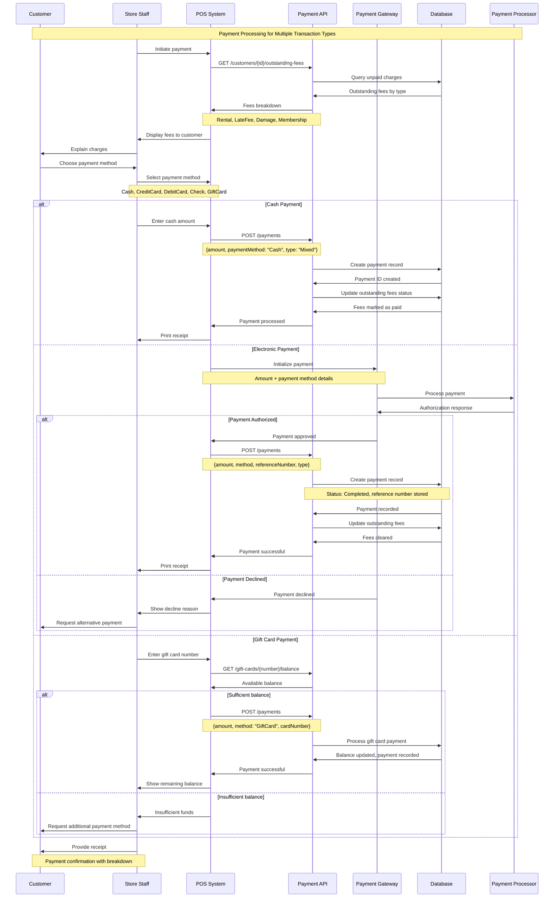
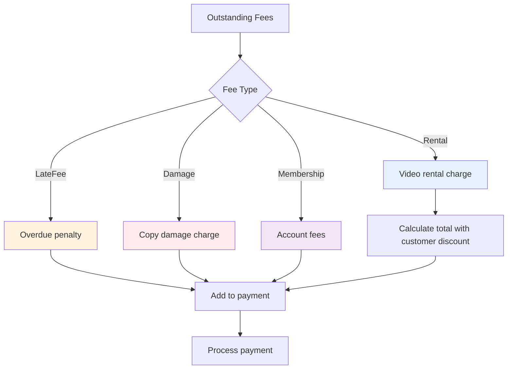
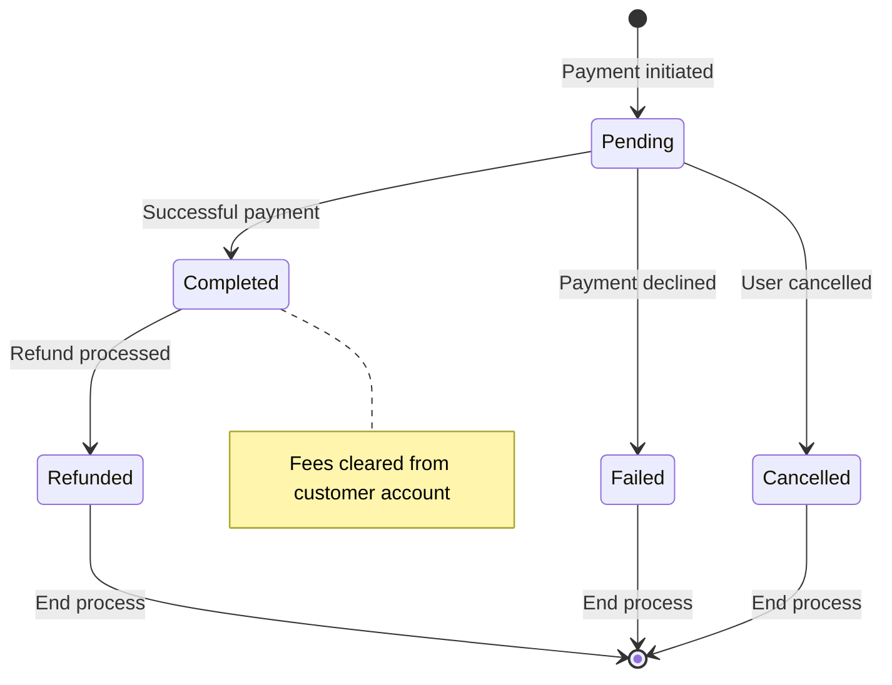

# Payment Processing Sequence Diagram

This diagram shows the payment processing workflow for various transaction types.

## Sequence Flow

## Payment Type Handling

## Payment Status Lifecycle

## Key Features

1. **Multiple Payment Types**: Supports all rental-related fee types
2. **Payment Method Flexibility**: Cash, cards, checks, gift cards
3. **Customer Discount Integration**: Applied to rental fees automatically
4. **Transaction Tracking**: Reference numbers for electronic payments
5. **Partial Payments**: Can handle insufficient gift card balances
6. **Receipt Generation**: Detailed breakdown of fees and payments

## Business Rules

- **Fee Aggregation**: Multiple fee types can be paid in single transaction
- **Payment Methods**: Different validation rules per payment type
- **Reference Numbers**: Required for electronic payments, optional for cash
- **Customer Discounts**: Applied only to rental fees, not penalties
- **Gift Card Integration**: Real-time balance checking and updates
