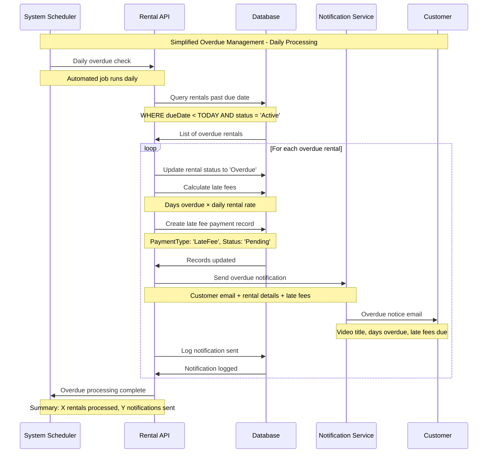
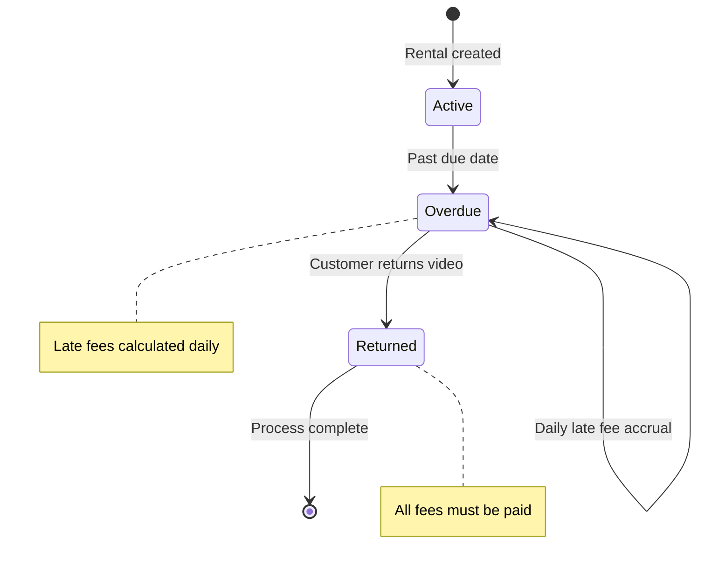
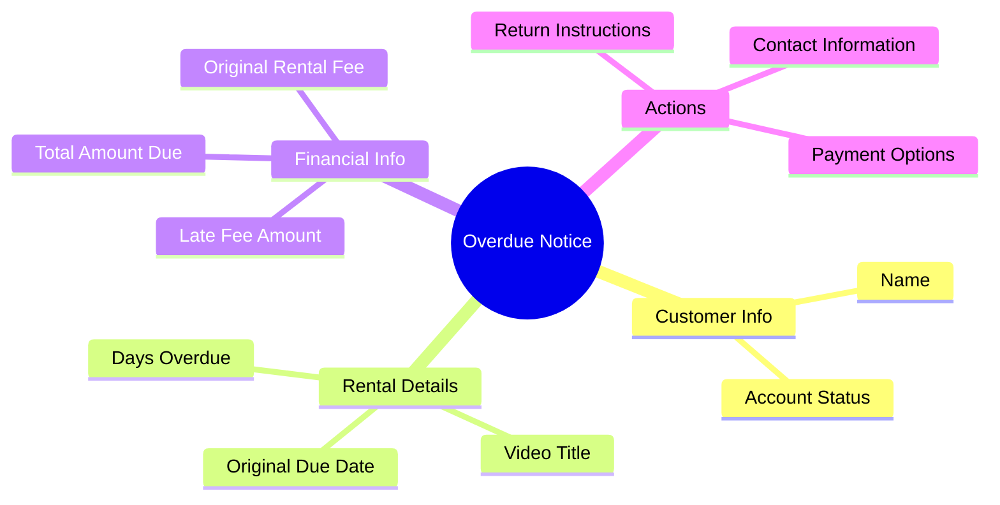

# Overdue Management Sequence Diagram

This diagram shows the simplified overdue rental management workflow.

## Sequence Flow



## Overdue Status Management



## Late Fee Calculation

```mermaid
flowchart TD
    A[Rental Past Due] --> B[Calculate days overdue]
    B --> C[Days × Daily rental rate]
    C --> D{Customer has discount?}
    D -->|Yes| E[Apply discount to base rental only]
    D -->|No| F[Full late fee amount]
    E --> G[Late fees = Full late fee]
    F --> G
    G --> H[Create payment record]

    style G fill:#fff3e0
    style H fill:#ffcdd2

    note right of E: Discounts don't apply to penalties
```

## Notification Content



## Key Features

1. **Automated Processing**: Daily batch job identifies overdue rentals
2. **Progressive Fees**: Late fees calculated per day overdue
3. **Customer Notifications**: Email alerts with detailed fee breakdown
4. **Simplified Workflow**: Single notification type, no escalation tiers
5. **Payment Integration**: Late fees automatically added to customer account

## Business Rules

- **Daily Processing**: System runs overdue check once per day
- **Late Fee Formula**: Days overdue × original daily rental rate
- **Discount Policy**: Customer discounts don't apply to late fees
- **Notification Timing**: Sent immediately when rental becomes overdue
- **Status Persistence**: Rentals remain "Overdue" until returned

## Error Handling

- **Email Failures**: Logged for manual follow-up
- **Database Errors**: Transaction rollback to prevent inconsistent state
- **Calculation Errors**: Default to base rental rate for late fees
- **Customer Account Issues**: Processing continues but flagged for review
