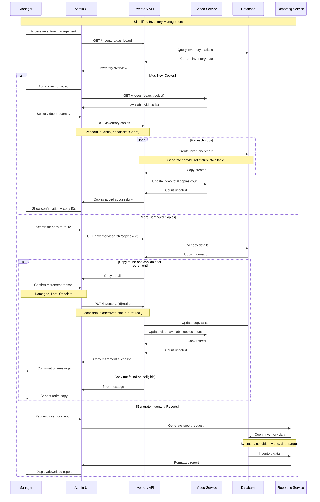
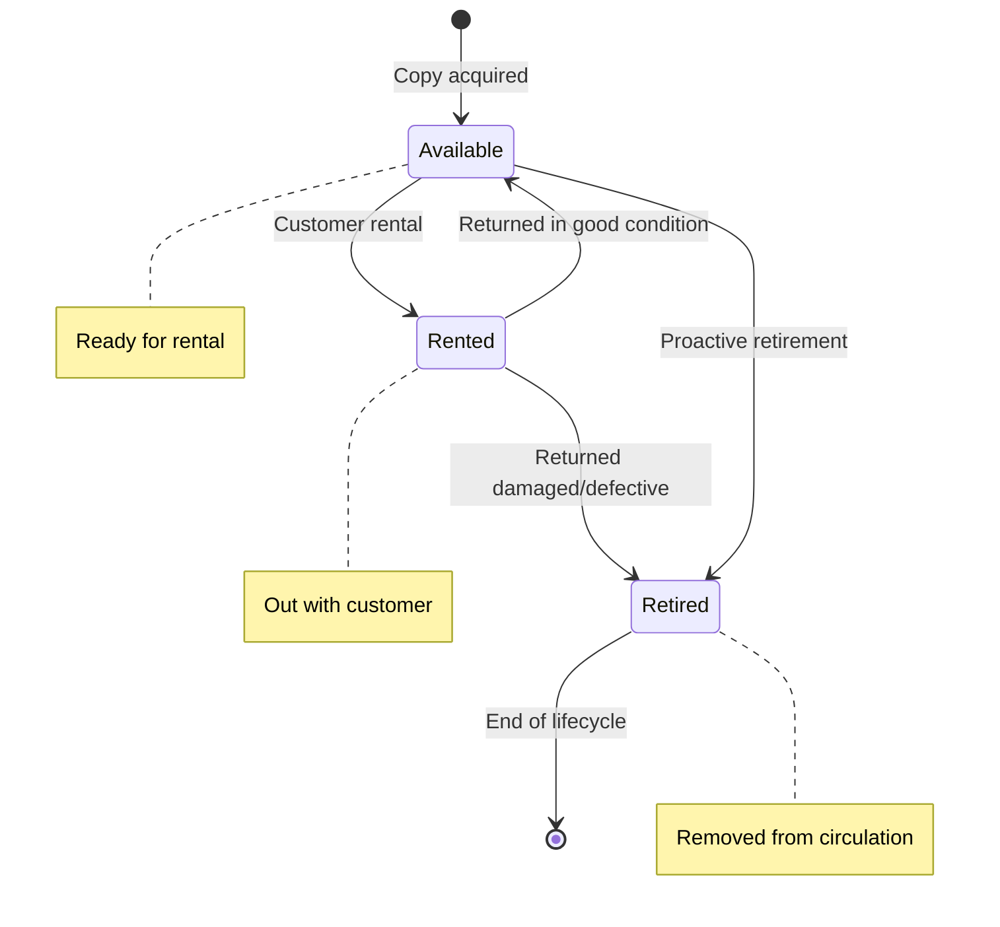
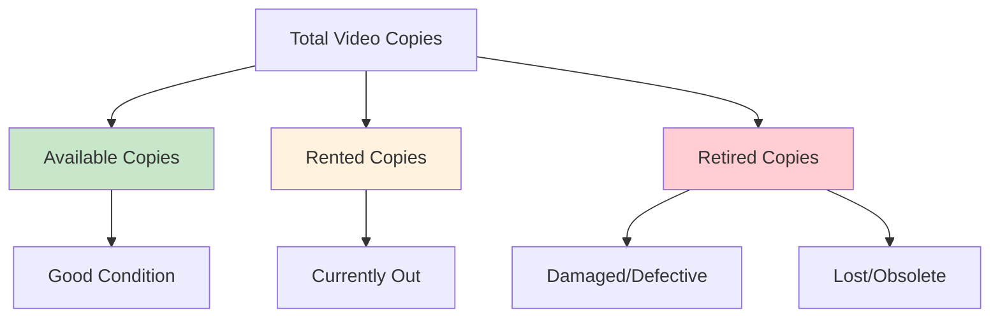
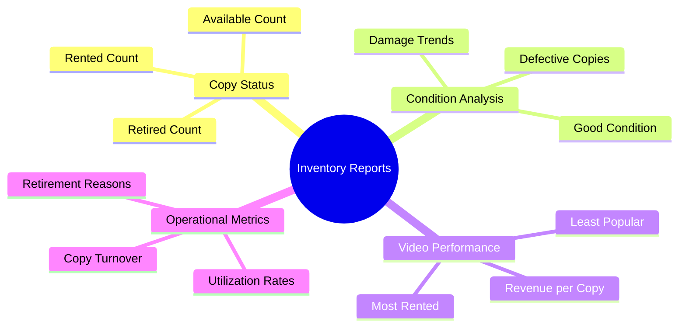

# Inventory Management Sequence Diagram

This diagram shows the simplified inventory management workflow for video copies.

## Sequence Flow

## Copy Lifecycle Management

## Inventory Status Overview

## Inventory Reporting

## Key Features

1. **Simplified Workflow**: Add copies and retire damaged ones - no maintenance complexity
2. **Automatic Counting**: Video availability automatically calculated from copy status
3. **Condition Tracking**: Binary condition assessment (Good/Defective)
4. **Retirement Management**: Clear process for removing copies from circulation
5. **Reporting Integration**: Real-time inventory status and historical analysis

## Business Rules

- **Copy Addition**: New copies default to "Good" condition and "Available" status
- **Status Transitions**: Only specific transitions allowed (see state diagram)
- **Retirement Criteria**: Defective copies must be retired, cannot return to circulation
- **Count Accuracy**: Video availability reflects actual rentable copies
- **Audit Trail**: All status changes logged with timestamps and reasons

## Administrative Controls

- **Access Control**: Only managers can add/retire inventory
- **Validation**: System prevents invalid status transitions
- **Bulk Operations**: Support for adding multiple copies at once
- **Search Capabilities**: Find copies by ID, video, status, or condition
- **Reporting**: Comprehensive inventory analysis and trends
