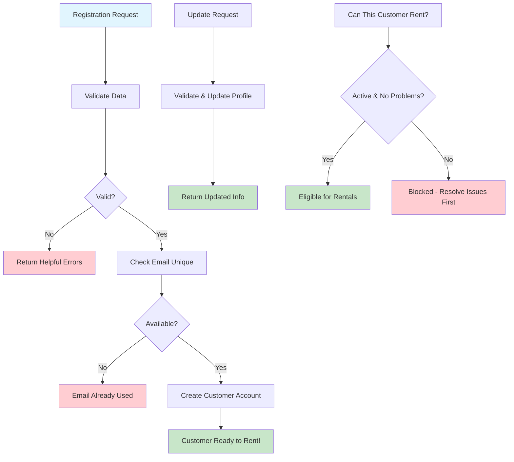

# Learning Customer Registration - Your First Business Workflow

## Why Start Here?

Customer registration is the perfect introduction to Domain-Driven Design because it's **simple but complete**. Everyone understands what it means to sign up for something, but there's enough business logic to teach you important patterns.

**What You'll Learn**: Validation, business rules, error handling, and how to think about data from a business perspective rather than just database tables.

## The Business Story

Imagine you're running a video rental store. New customers walk in wanting to rent movies. What do you need to know about them? What business rules apply? How do you keep their information safe and useful?

**The Goal**: Transform a person who wants to rent videos into a customer who _can_ rent videos.

## Essential Business Rules (Domain Logic)

These aren't arbitrary technical requirements - they're real business needs:

- **Valid Contact Information**: We need name, email, address, and phone to run our business
- **Unique Email Addresses**: One account per email (prevents confusion and fraud)
- **Standard Phone Format**: E.164 international format (so our systems can actually call customers)
- **Real Addresses**: US addresses with proper state codes (for delivery and compliance)
- **Flexible Discounts**: Customer discount percentage (0-100%) for loyalty programs
- **Status Management**: Active, Suspended, or Inactive (business needs to control access)

## The Registration Process - Step by Step

**Learning Focus**: Notice how each step has a clear business purpose. This isn't just data entry - it's a business process.

### Key Learning Points

1. **Validation Happens Twice**: Client-side for user experience, server-side for business integrity
2. **Unique Constraints Matter**: Email uniqueness prevents business problems (duplicate accounts)
3. **Meaningful Status**: Customer status directly affects business operations (can they rent?)
4. **Error Messages Help**: When validation fails, tell users exactly how to fix it

## How the API Supports the Business

Instead of just CRUD operations, our endpoints reflect business capabilities:

| Business Need             | API Endpoint                      | Why This Design Matters                                |
| ------------------------- | --------------------------------- | ------------------------------------------------------ |
| "Add new customer"        | `POST /customers`                 | Creates complete customer account with validation      |
| "Look up customer info"   | `GET /customers/{id}`             | Retrieves all data needed for customer service         |
| "Update customer details" | `PATCH /customers/{id}`           | Allows profile changes without breaking business rules |
| "Can this customer rent?" | `GET /customers/{id}/eligibility` | Direct business question, clear business answer        |

**DDD Insight**: Notice how the eligibility endpoint answers a business question directly, rather than making the caller figure out the rules from raw customer data.

## What Makes This Customer Management Special

- **Business-First Validation**: Email uniqueness matters for customer service, not just technical reasons
- **Flexible Discount System**: Percentage-based discounts that integrate with all pricing calculations
- **Real-Time Eligibility**: Instant answers to "can this customer rent more videos?"
- **Thoughtful Profile Updates**: Changes that preserve business data integrity

## How This Connects to Other Workflows

Understanding these connections helps you see the bigger system picture:

- **Powers Rental Creation**: Customer eligibility checking prevents problem transactions
- **Enables Payment Processing**: Customer information links to payment history and methods
- **Supports Customer Service**: Complete profile data for staff helping customers

## When Things Go Wrong - Learning from Errors

**Why Error Handling Matters**: Good error messages turn frustrated users into successful customers.

- **Validation Errors**: "Email format invalid" vs "Please enter a valid email address"
- **Business Rule Violations**: "Duplicate email detected - do you already have an account?"
- **System Problems**: Graceful fallbacks when the database is temporarily unavailable
- **User Guidance**: "Customer ID not found - please check the number and try again"

**Learning Point**: Domain-driven error handling explains problems in business terms, not technical jargon.
