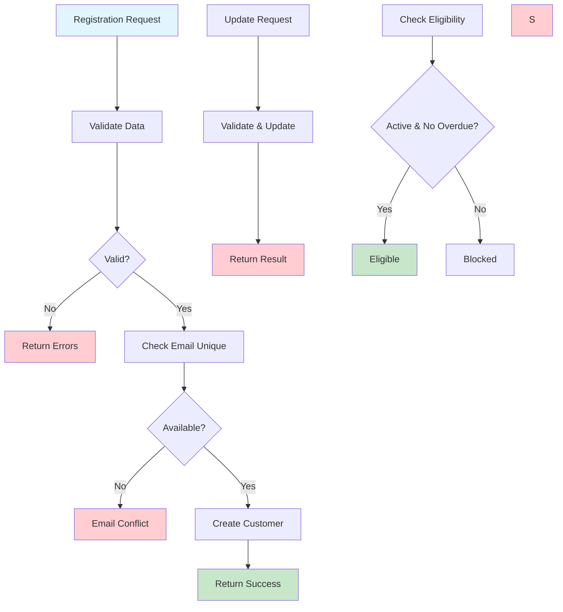

# Customer Registration & Management Workflow

## Overview

Handles customer registration, profile management, and eligibility verification with support for customer discount configuration.

## Business Rules

- Valid personal information required (name, email, address, phone)
- Email addresses must be unique across all customers
- Phone numbers in E.164 international format
- US addresses with proper state codes
- Customer discount percentage can be configured (0-100%)
- Customer status: Active, Suspended, or Inactive

## Workflow Diagram

## API Endpoints

| Method | Endpoint                      | Purpose                             |
| ------ | ----------------------------- | ----------------------------------- |
| POST   | `/customers`                  | Create new customer with validation |
| GET    | `/customers/{id}`             | Retrieve customer profile           |
| PATCH  | `/customers/{id}`             | Update customer information         |
| GET    | `/customers/{id}/eligibility` | Check rental eligibility            |

## Key Features

- **Email Validation**: Uniqueness across all customers
- **Discount Configuration**: Configurable discount percentages for customers
- **Eligibility Checking**: Real-time rental availability verification
- **Profile Management**: Comprehensive customer data updates

## Integration Points

- **Rental Service**: Provides eligibility data for rental creation
- **Payment Service**: Links customer to payment history and transactions
- **Database**: Persists customer data with referential integrity constraints

## Error Handling

- **Validation Errors**: Invalid email format, phone number, or address
- **Business Rule Violations**: Duplicate email, invalid customer data
- **Database Errors**: Connection issues, constraint violations
- **Not Found Errors**: Customer ID not found for updates/lookups
