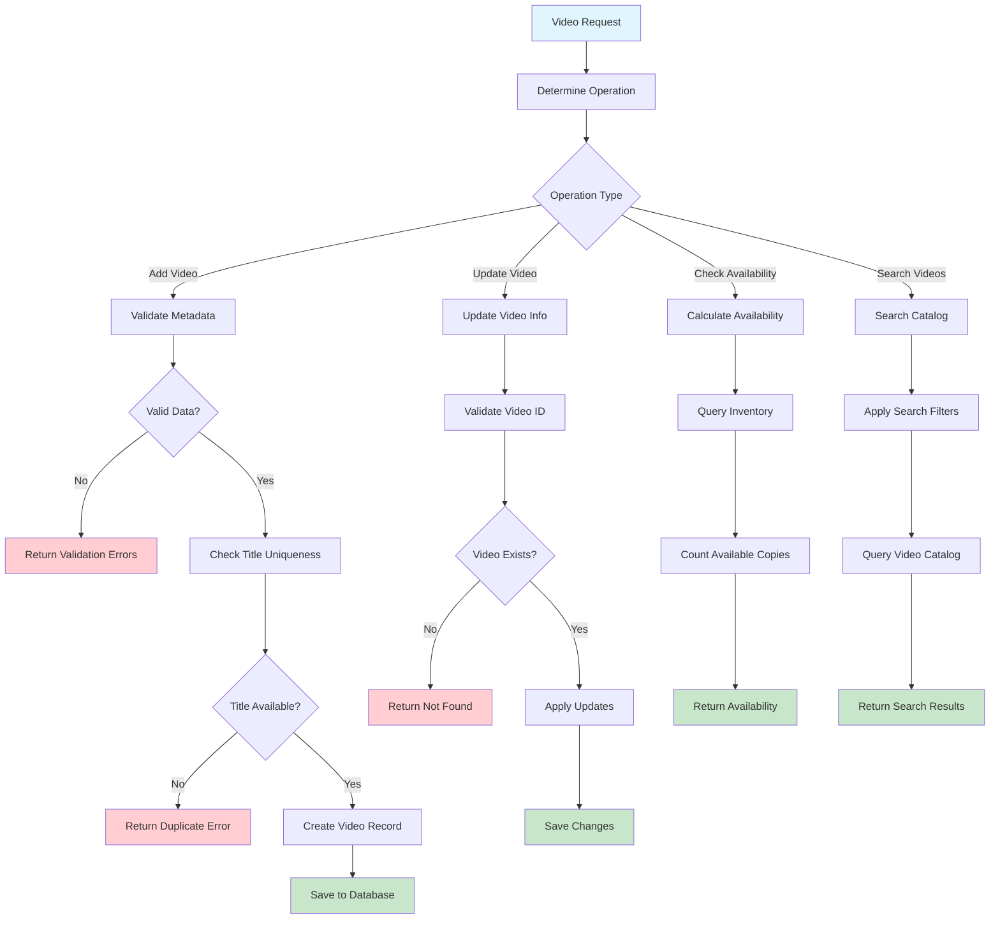

# Video Catalog Management Workflow

## Overview

Video catalog management including adding titles, updating metadata, availability checking, and video information maintenance. Each video supports multiple physical copies tracked through inventory integration.

## Business Rules

- Video titles must be unique within catalog
- Valid pricing information required (rental rates)
- Genre classification and rating information mandatory
- Available copy count calculated from inventory status
- Video status: Active, Inactive, or Discontinued
- Real-time availability calculations with inventory integration

## Workflow Diagram

## API Endpoints

| Method | Endpoint | Purpose |
|--------|----------|---------|
| POST | `/videos` | Add new video to catalog |
| GET | `/videos/{id}` | Retrieve video details |
| PATCH | `/videos/{id}` | Update video information |
| GET | `/videos/search` | Search catalog with filters |

## Key Features

- **Title Management**: Unique title enforcement and metadata validation
- **Inventory Integration**: Real-time availability calculations from physical copies
- **Search & Filtering**: Advanced search by genre, rating, and availability
- **Status Management**: Active/Inactive/Discontinued video lifecycle
- **Pricing Management**: Rental rate configuration and updates

## Integration Points

- **Inventory Service**: Queries physical copy availability and condition
- **Rental Service**: Provides video data for rental transactions
- **Search Service**: Indexes video metadata for advanced searching
- **Database**: Maintains video catalog and metadata integrity

## Error Handling

- **Validation Errors**: Invalid metadata, missing required fields
- **Business Rule Violations**: Duplicate titles, invalid status transitions
- **Integration Errors**: Inventory service failures, search index issues
- **Database Errors**: Constraint violations, update failures
