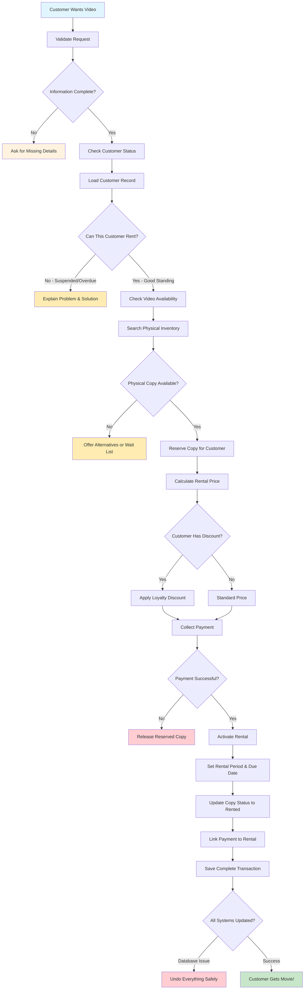

# Learning Rental Creation - The Heart of Your Business

## Why This Workflow Matters Most

This is where your video store makes money! But more importantly for learning DDD, rental creation demonstrates how complex business processes get broken down into manageable, validated steps.

**What You'll Learn**: Multi-step business validation, transaction integrity, automatic discount application, and how to coordinate multiple services while keeping your code clean.

## The Business Reality

A customer wants to rent a video. Sounds simple, right? But behind this simple request is a sophisticated business process:

- Is this customer allowed to rent more videos?
- Do we have this movie available?
- What's the right price including any discounts?
- How do we ensure they can actually pay?
- How do we handle failures gracefully?

**The Goal**: Turn a customer's request into a successful rental transaction that makes everyone happy - customer gets their movie, store gets paid, inventory gets tracked.

## Essential Business Rules (Complex but Logical)

These rules protect your business while serving customers well:

- **Customer Eligibility**: Must be active with no overdue rentals (can't rent if you haven't returned previous videos)
- **Inventory Reality**: Video must have available physical copies (can't rent what you don't have)
- **Automatic Fairness**: Customer discounts get applied automatically (loyal customers shouldn't have to ask)
- **Payment Security**: Payment confirmed before rental activation (no pay, no play)
- **Asset Tracking**: Each rental links to a specific physical copy (inventory accountability)
- **Time Management**: Rental period determined by video type and customer status (business policies as code)

## The Rental Creation Journey - Following the Business Logic

**Learning Focus**: This workflow shows how business complexity gets managed through clear steps. Each decision point represents a real business rule.

### Critical Learning Points

1. **Business First**: Every decision is about business rules, not technical constraints
2. **Fail Fast**: Check cheaper things first (customer status before inventory reservations)
3. **Automatic Benefits**: Customer discounts apply without customer having to ask
4. **Transaction Safety**: If anything fails, undo everything cleanly
5. **Clear Outcomes**: Success means customer gets their movie; failure means clear explanation why not

## API Design That Follows Business Thinking

Notice how these endpoints match how rental staff actually think about the process:

| Business Question                         | API Endpoint                         | What This Teaches About DDD                           |
| ----------------------------------------- | ------------------------------------ | ----------------------------------------------------- |
| "Rent this video to this customer"        | `POST /rentals`                      | Complex operations as single business transactions    |
| "What are the details of this rental?"    | `GET /rentals/{id}`                  | Business entities have rich information, not just IDs |
| "What's this customer currently renting?" | `GET /customers/{id}/rentals/active` | Queries should answer business questions              |
| "Is this video available to rent?"        | `GET /videos/{id}/availability`      | Direct business capability checks                     |

**DDD Learning**: APIs should speak business language, not expose technical implementation details.

## What Makes This Workflow Special

- **Business Process Integrity**: Multi-step validation ensures no broken transactions
- **Customer Experience Focus**: Automatic discounts mean customers don't have to remember to ask
- **Real-Time Accuracy**: Inventory reservations prevent double-booking of the same physical copy
- **Robust Recovery**: Complete rollback capability when anything goes wrong

## How This Connects Throughout Your System

Understanding these integration points shows you how Domain-Driven Design creates cohesive systems:

- **Customer Service Integration**: Real-time eligibility checking prevents problem rentals before they start
- **Video Catalog Connection**: Current availability calculations based on actual physical inventory
- **Inventory Coordination**: Copy reservations and status updates maintain accurate availability
- **Payment System Link**: Secure payment processing with automatic discount application
- **Data Consistency**: Transactional integrity across all business data

## Learning from Failure Scenarios

**Why Error Handling Is a Business Skill**: How you handle failures affects customer satisfaction and business reputation.

- **Customer Problems**: "Your account has overdue items - return them to rent more videos"
- **Inventory Issues**: "This video is currently unavailable - would you like us to notify you when it's back?"
- **Payment Failures**: "Payment was declined - would you like to try a different payment method?"
- **System Problems**: Graceful transaction rollback keeps data consistent during technical issues

**Learning Point**: Good error handling turns problems into customer service opportunities, and robust transaction management protects business data integrity.
