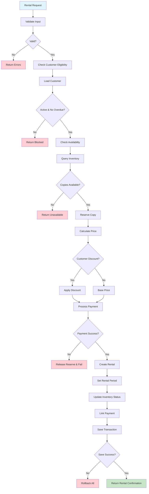

# Rental Creation Workflow

## Overview

Complete rental transaction processing from customer eligibility verification to rental activation. Core business transaction with multi-step validation, customer discount application, and payment processing.

## Business Rules

- Customer must be active with no overdue rentals
- Video must have available inventory copies
- Customer discounts receive automatic discount calculation
- Payment required before rental activation
- Each rental links to specific inventory copy
- Rental period determined by video type and customer tier

## Workflow Diagram

## API Endpoints

| Method | Endpoint                         | Purpose                        |
| ------ | -------------------------------- | ------------------------------ |
| POST   | `/rentals`                       | Create new rental transaction  |
| GET    | `/rentals/{id}`                  | Retrieve rental details        |
| GET    | `/customers/{id}/rentals/active` | List customer's active rentals |
| GET    | `/videos/{id}/availability`      | Check video availability       |

## Key Features

- **Multi-step Validation**: Customer eligibility, video availability, payment processing
- **Customer Discounts**: Automatic discount application based on customer discount percentage
- **Inventory Management**: Real-time copy reservation and status updates
- **Transaction Integrity**: Complete rollback on any failure

## Integration Points

- **Customer Service**: Validates eligibility and applies employee discounts
- **Video Service**: Checks availability and retrieval pricing
- **Inventory Service**: Reserves and updates copy status
- **Payment Service**: Processes payment transactions
- **Database**: Maintains transactional integrity across all operations

## Error Handling

- **Customer Errors**: Inactive status, overdue rentals, limit exceeded
- **Video Errors**: Not found, inactive, no copies available
- **Payment Errors**: Invalid method, declined transaction, gateway issues
- **Transaction Errors**: Database failures, rollback procedures
