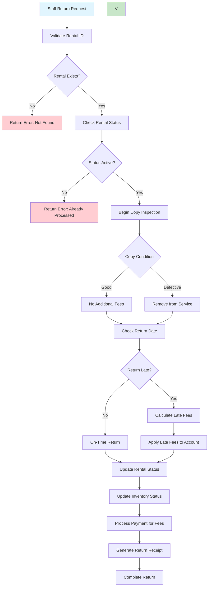

# Return Processing Workflow

## Overview

This workflow handles video returns including copy inspection, late fee calculation, payment processing for additional fees, and rental completion. The system automatically calculates late fees based on overdue days and applies appropriate charges to the customer's account.

## Business Rules

- Returns must be processed within business hours by staff
- Late fees are calculated automatically for overdue returns (daily rate-based)
- Copy condition must be inspected and recorded upon return (Good or Defective only)
- Defective copies are removed from circulation
- Returns update inventory status and availability immediately
- Customer accounts are updated with return completion status
- Staff can override late fees with manager approval

## Workflow Diagram

## API Endpoints

| Endpoint                    | Method | Purpose                 | Parameters                            |
| --------------------------- | ------ | ----------------------- | ------------------------------------- |
| `/api/rentals/{id}/return`  | POST   | Process video return    | rental_id, return_condition, staff_id |
| `/api/rentals/{id}/inspect` | PUT    | Update copy condition   | rental_id, condition, damage_notes    |
| `/api/rentals/{id}/fees`    | GET    | Calculate return fees   | rental_id                             |
| `/api/rentals/{id}/receipt` | GET    | Generate return receipt | rental_id                             |

## Key Features

- **Copy Inspection**: Physical condition assessment with damage fee calculation
- **Late Fee Calculation**: Automatic overdue fee computation based on daily rates
- **Inventory Updates**: Real-time availability status updates
- **Payment Processing**: Integration with payment system for fees
- **Staff Override**: Manager approval for fee adjustments

## Integration Points

- **Rental Service**: Rental status updates and completion
- **Inventory Service**: Copy availability and condition tracking
- **Payment Service**: Late fee and damage fee processing
- **Customer Service**: Account balance and transaction history
- **Notification Service**: Return confirmation and receipt delivery

## Error Handling

- **Validation Errors**: Invalid rental ID, already processed returns
- **Business Rule Violations**: Return outside business hours, unauthorized staff
- **Payment Failures**: Insufficient funds for fees, payment gateway issues
- **System Errors**: Database connectivity, inventory sync failures
