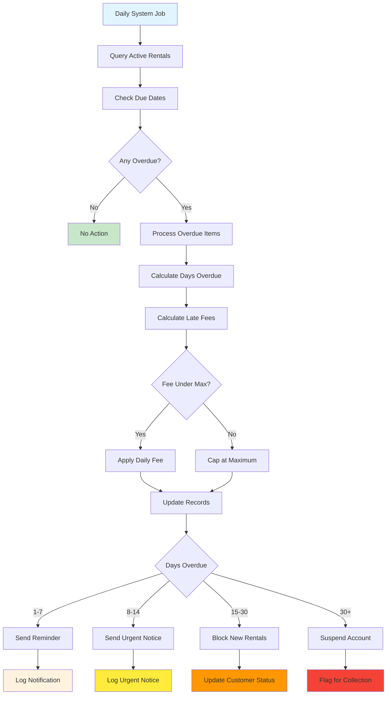

# Overdue Management Workflow

## Overview

Automated detection and management of overdue rentals with fee calculation, customer communications, and account status progression. Daily processing handles fee accumulation and graduated notification system.

## Business Rules

- Rentals overdue at midnight after due date
- Late fees accrue daily until return or maximum fee reached
- Customers with overdue items blocked from new rentals
- Automated notifications at overdue milestones
- Late fees capped at maximum (typically 2x rental price)
- Account suspension after extended overdue periods

## Workflow Diagram

## API Endpoints

| Method | Endpoint                   | Purpose                    |
| ------ | -------------------------- | -------------------------- |
| GET    | `/rentals/overdue`         | List all overdue rentals   |
| POST   | `/rentals/overdue/process` | Trigger overdue processing |
| GET    | `/customers/{id}/overdue`  | Customer's overdue items   |
| PATCH  | `/rentals/{id}/fees`       | Update late fees           |

## Key Features

- **Automated Processing**: Daily detection and fee calculation
- **Graduated Notifications**: Multi-stage customer communication
- **Account Management**: Status progression and rental blocking
- **Fee Calculation**: Daily accumulation with configurable caps
- **Staff Tools**: Overdue reports and management interfaces

## Integration Points

- **Rental Service**: Queries active rentals and updates fee records
- **Customer Service**: Updates customer status and communication preferences
- **Notification Service**: Sends automated emails, SMS, and postal notices
- **Payment Service**: Processes late fee payments and adjustments
- **Database**: Maintains audit trail of all overdue management actions

## Error Handling

- **Processing Errors**: Failed fee calculations, database update failures
- **Notification Errors**: Email delivery failures, invalid contact information
- **Status Errors**: Invalid customer status transitions
- **Authorization Errors**: Insufficient permissions for fee waivers or adjustments
