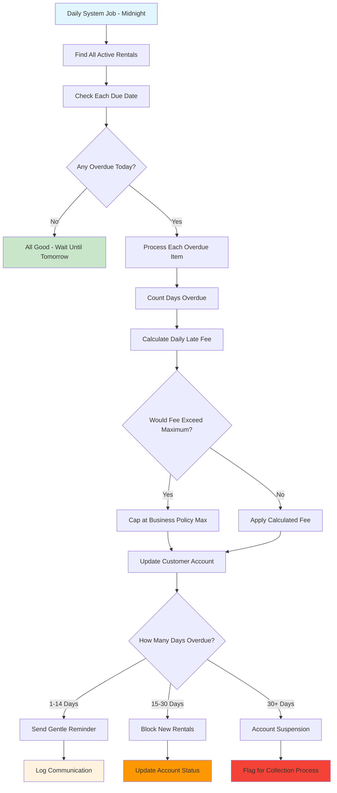

# Learning Overdue Management - Automated Business Processes

## Why Overdue Management Teaches Important Patterns

Overdue management is a perfect example of **business automation** and **batch processing**. It shows you how businesses use software to handle routine operations consistently and fairly.

**What You'll Learn**: Scheduled business processes, automated notifications, business rule enforcement, and how to design systems that work even when humans aren't watching.

## The Business Challenge

Video rental stores need to track overdue items without overwhelming staff with manual work:

- Which rentals are overdue today?
- How long has each item been overdue?
- What late fees should be applied?
- How do we notify customers appropriately?
- When should we restrict accounts for repeated violations?

**The Goal**: Automatically manage overdue rentals in a way that's fair to customers, reduces staff workload, and protects business interests.

## Essential Business Rules (Automation Logic)

These rules ensure consistent, fair treatment for all customers:

- **Daily Processing**: Automated detection runs every business day (consistent enforcement)
- **Graduated Fees**: Late fee calculation with configurable caps (prevents excessive penalties)
- **Account Status Management**: Progressive status changes and rental blocking (protecting business assets)
- **Customer Communication**: Automated email notifications (keeping customers informed)
- **Staff Tools**: Overdue reports and management interfaces (supporting customer service)
- **Fee Calculation History**: Complete audit trail of all late fee assessments (transparency and compliance)

## The Automated Processing Journey - Business Rules Working While You Sleep

**Learning Focus**: This workflow demonstrates how business automation reduces human error while ensuring consistent policy enforcement.

### Business Automation Lessons

1. **Consistent Timing**: Daily processing ensures no rentals "slip through the cracks"
2. **Fair Fee Calculation**: Mathematical precision eliminates human bias or error
3. **Progressive Enforcement**: Graduated responses give customers opportunities to resolve issues
4. **Business Policy Protection**: Maximum fee caps prevent excessive penalties
5. **Complete Audit Trail**: Every action logged for transparency and compliance

## API Design for Automated Operations

These endpoints support both automated processing and staff oversight:

| Business Need                   | API Endpoint                    | What This Teaches About Automation                    |
| ------------------------------- | ------------------------------- | ----------------------------------------------------- |
| "Show me all overdue rentals"   | `GET /rentals/overdue`          | Query capabilities for business reporting             |
| "Run the daily overdue process" | `POST /rentals/overdue/process` | Manual trigger for automated processes                |
| "What does this customer owe?"  | `GET /customers/{id}/overdue`   | Customer-specific business queries                    |
| "Adjust this late fee"          | `PATCH /rentals/{id}/fees`      | Staff override capabilities with proper authorization |

**DDD Learning**: Automated processes still need human oversight capabilities - design APIs that support both automation and manual intervention.

## What Makes Overdue Management Special

- **Business Consistency**: Every customer treated exactly the same way according to business policies
- **Graduated Response**: Progressive enforcement gives customers multiple chances to resolve issues
- **Staff Support**: Automated processing reduces manual work while providing oversight tools
- **Customer Communication**: Automated notifications keep customers informed without staff effort
- **Business Protection**: Account restrictions prevent additional losses from problem accounts

## How Overdue Management Connects to Your System

Understanding these integrations shows you how automated processes fit into larger business operations:

- **Drives Payment Processing**: Late fees become payment obligations that flow through your payment system
- **Controls Rental Creation**: Overdue status blocks new rentals until issues are resolved
- **Supports Customer Service**: Complete overdue history helps staff assist customers with questions
- **Informs Business Decisions**: Overdue patterns help optimize rental policies and inventory decisions
- **Maintains Data Integrity**: Automated processing ensures consistent application of business rules

## Learning from Automation Challenges

**Why Automation Edge Cases Matter**: Automated systems must handle unusual situations gracefully.

- **Processing Failures**: What happens when the daily job fails to run? (Backup processing, alerts)
- **Communication Issues**: Email delivery failures don't prevent fee calculation (separation of concerns)
- **Status Conflicts**: Customer payments during overdue processing (transaction coordination)
- **Policy Changes**: New fee structures need to handle existing overdue items (business continuity)

**Learning Point**: Good business automation handles edge cases transparently while maintaining business rule integrity and providing clear audit trails for accountability.
