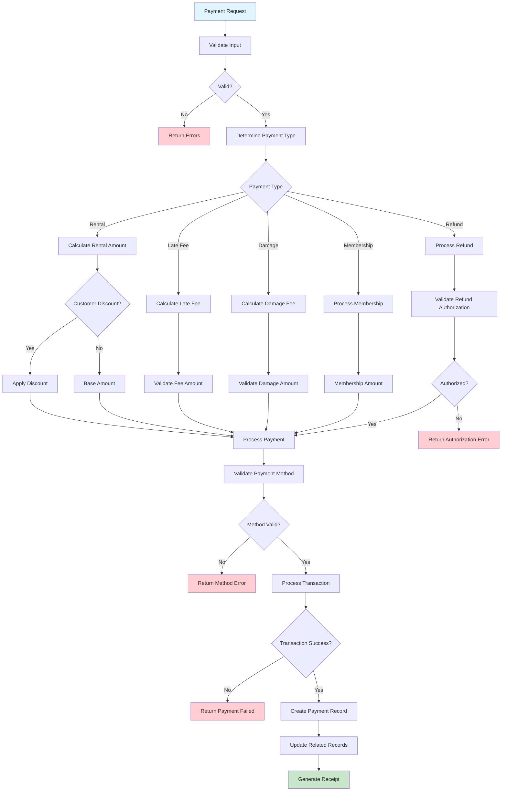

# Payment Processing Workflow

## Overview

Comprehensive payment transaction management supporting multiple payment methods, customer discounts, and payment types (rental, late fees, damage, refunds, membership). Maintains complete payment history and audit trails.

## Business Rules

- Payments processed for exact calculated amounts
- Multiple payment methods: cash, card, check, gift card
- Customer discounts applied before payment processing
- Failed payments require retry or alternative payment
- Refunds require manager approval over threshold
- Complete payment history maintained for accounting

## Workflow Diagram

## API Endpoints

| Method | Endpoint                   | Purpose                         |
| ------ | -------------------------- | ------------------------------- |
| POST   | `/payments`                | Process new payment transaction |
| GET    | `/payments/{id}`           | Retrieve payment details        |
| GET    | `/customers/{id}/payments` | Customer payment history        |
| POST   | `/payments/{id}/refund`    | Process payment refund          |

## Key Features

- **Multiple Payment Methods**: Cash, credit/debit cards, checks, gift cards
- **Customer Discounts**: Automatic discount application before payment
- **Payment Types**: Rental, late fees, damage charges, refunds, membership
- **Authorization**: Manager approval for refunds over threshold
- **Audit Trail**: Complete payment history and transaction logging

## Integration Points

- **Rental Service**: Links payments to rental transactions
- **Customer Service**: Updates customer payment history and status
- **Customer Service**: Validates customer discounts and authorization
- **Payment Gateway**: Processes credit card and electronic transactions
- **Database**: Maintains payment records and transaction integrity

## Error Handling

- **Validation Errors**: Invalid payment amount, method, or customer data
- **Authorization Errors**: Insufficient permissions for refunds or adjustments
- **Transaction Errors**: Payment gateway failures, declined transactions
- **Business Rule Violations**: Invalid payment type or amount combinations
