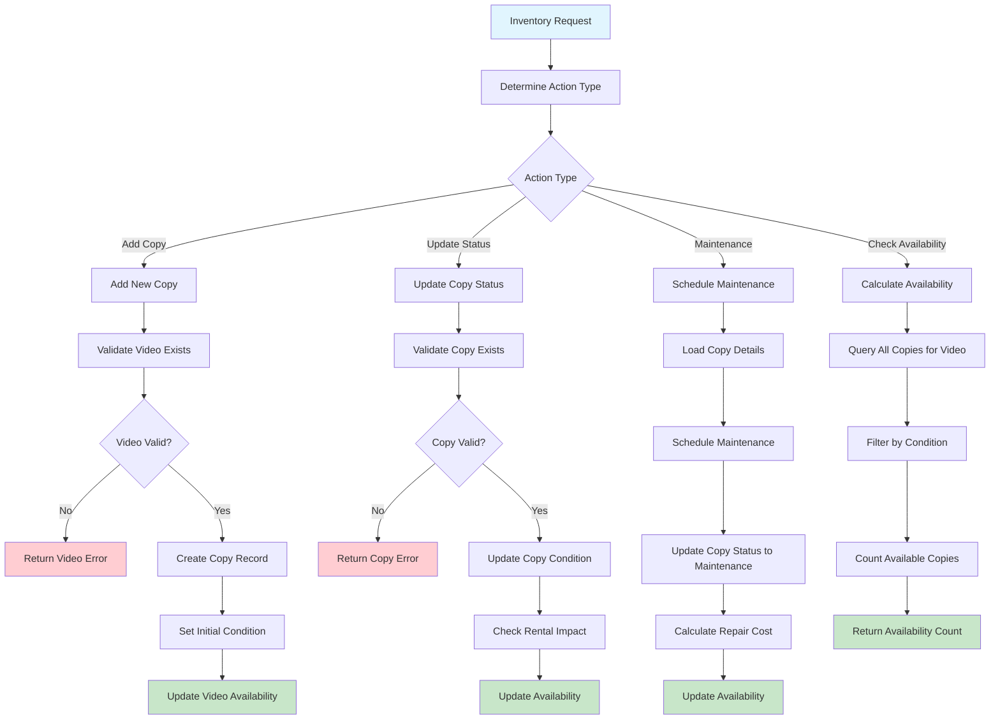

# Inventory Management Workflow

## Overview

Physical copy tracking and maintenance workflow managing individual video copies with condition monitoring, maintenance scheduling, and real-time availability calculations. Handles complete copy lifecycle from purchase to retirement.

## Business Rules

- Individual tracking for each physical copy with unique identifier
- Copy conditions: New, Good, Fair, Damaged, Defective
- Available copies must be in Good+ condition for rental
- Maintenance required for Damaged copies before rental
- Defective copies removed from rental inventory
- Real-time availability calculations based on copy status

## Workflow Diagram

## API Endpoints

| Method | Endpoint | Purpose |
|--------|----------|---------|
| POST | `/inventory` | Add new copy to inventory |
| PATCH | `/inventory/{copyId}` | Update copy status/condition |
| GET | `/inventory/video/{videoId}` | List copies for video |
| GET | `/videos/{videoId}/availability` | Check real-time availability |

## Key Features

- **Individual Copy Tracking**: Unique identifier and condition for each copy
- **Condition Management**: New, Good, Fair, Damaged, Defective status tracking
- **Maintenance Workflows**: Repair scheduling and cost tracking
- **Real-time Availability**: Live calculations based on copy status and condition
- **Lifecycle Management**: Complete tracking from purchase to retirement

## Integration Points

- **Video Service**: Links copies to video catalog entries
- **Rental Service**: Provides availability data for rental creation
- **Return Service**: Updates copy condition after returns
- **Maintenance Service**: Schedules and tracks repair activities
- **Database**: Maintains copy records and availability calculations

## Error Handling

- **Validation Errors**: Invalid copy ID, video ID, or condition values
- **Business Rule Violations**: Invalid condition transitions or status changes
- **Availability Errors**: Calculation failures or inconsistent copy counts
- **Maintenance Errors**: Scheduling conflicts or invalid repair requests
