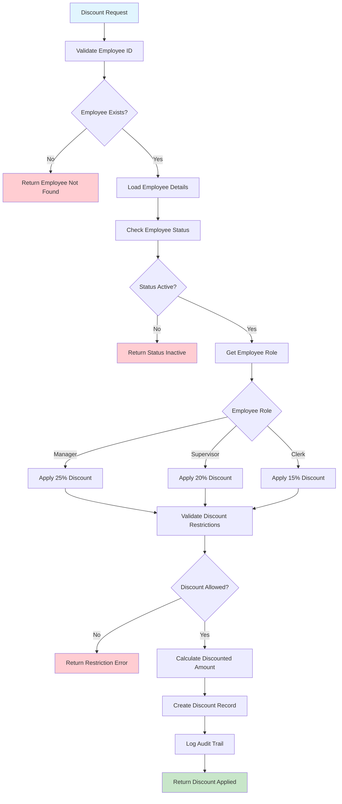

# Employee Discount Processing Workflow

## Overview

Employee benefits and discount management with role-based discount calculation, employee status validation, and discount application with restrictions. Provides audit tracking for compliance and benefits reporting.

## Business Rules

- Role-based discount rates: Manager 25%, Supervisor 20%, Clerk 15%
- Employee must have Active status to receive discounts
- Discounts apply to rental fees only (not late fees or damage charges)
- Employee status validated in real-time during transactions
- Discount restrictions enforced based on employee classification
- Complete audit trail maintained for benefits tracking

## Workflow Diagram

## API Endpoints

| Method | Endpoint | Purpose |
|--------|----------|---------|
| GET | `/employees/{id}/discount-rate` | Get employee discount rate |
| POST | `/discounts/calculate` | Calculate discount for transaction |
| GET | `/employees/{id}/discount-history` | Employee discount usage history |
| GET | `/discounts/audit` | Discount audit trail for reporting |

## Key Features

- **Role-based Rates**: Hierarchical discount percentages by employee role
- **Real-time Validation**: Employee status and eligibility verification
- **Restriction Enforcement**: Discount limitations by transaction type
- **Audit Tracking**: Complete history for compliance and benefits reporting
- **Transaction Integration**: Seamless discount application during transactions

## Integration Points

- **Employee Service**: Validates employee status and retrieves role information
- **Rental Service**: Applies discounts during rental creation process
- **Payment Service**: Calculates final amounts with discounts applied
- **Customer Service**: Links employee-customers for automatic discount application
- **Database**: Maintains discount records and audit trail

## Error Handling

- **Employee Errors**: Invalid employee ID, inactive status, role not found
- **Discount Errors**: Invalid discount rate, restriction violations
- **Authorization Errors**: Insufficient permissions for discount application
- **Audit Errors**: Failed to log discount transaction for compliance tracking
