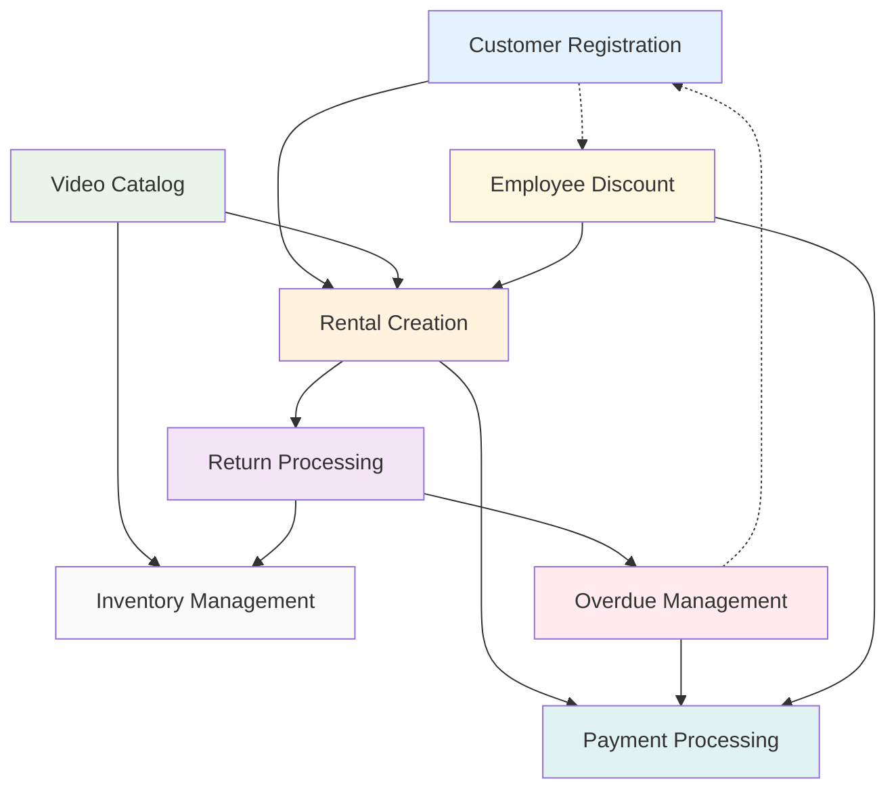

# Video Rental Store - Workflow Documentation

## Overview

This directory contains comprehensive workflow diagrams for the Video Rental Store domain. Each workflow represents a complete business process with Mermaid flowcharts, API endpoints, and integration patterns.

**Architecture**: All workflows use a **User/UI → API → Database** pattern with proper separation of concerns.

## Core Business Workflows

| Workflow                                                                      | Purpose                          | Key Features                                                       |
| ----------------------------------------------------------------------------- | -------------------------------- | ------------------------------------------------------------------ |
| [Customer Registration](./01-customer-registration-workflow.md)               | Customer lifecycle management    | Email validation, employee discount linking, eligibility checking  |
| [Video Catalog Management](./02-video-catalog-management-workflow.md)         | Video metadata and search        | Title uniqueness, availability calculations, advanced filtering    |
| [Rental Creation](./03-rental-creation-workflow.md)                           | Complete rental transactions     | Multi-step validation, discount application, inventory reservation |
| [Return Processing](./04-return-processing-workflow.md)                       | Video returns and fee assessment | Condition inspection, late fee calculation, refund processing      |
| [Overdue Management](./05-overdue-management-workflow.md)                     | Automated overdue handling       | Daily processing, notification system, account management          |
| [Payment Processing](./06-payment-processing-workflow.md)                     | Payment transaction management   | Multiple payment methods, employee discounts, audit trails         |
| [Inventory Management](./07-inventory-management-workflow.md)                 | Physical copy tracking           | Individual copy tracking, maintenance workflows, availability      |
| [Employee Discount Processing](./08-employee-discount-processing-workflow.md) | Employee benefits management     | Role-based rates, validation, audit tracking                       |

## Workflow Dependencies

## Business Rules

### Customer Management

- **Eligibility**: No rentals with overdue items or inactive status
- **Employee Integration**: Automatic discount linking for staff members
- **Status Progression**: Active → Suspended → Inactive based on violations

### Rental & Payment Operations

- **Pricing**: Base rates with role-based employee discounts (Manager 25%, Supervisor 20%, Clerk 15%)
- **Inventory**: One-to-one rental to physical copy relationship
- **Late Fees**: Daily accumulation with caps (typically 2x rental price)
- **Damage Fees**: Condition-based (Fair: $0, Damaged: $5, Defective: $25)

### System Operations

- **Validation**: Comprehensive input validation with clear error messages
- **Transactions**: Multi-step workflows with rollback capabilities
- **Audit**: Complete history tracking for all business operations
- **Real-time**: Live availability and pricing calculations

## Data Architecture

### Core Entities

- **PersonBase**: Shared composition for Customer and Employee data
- **Customer/Employee**: User profiles with role-based permissions
- **Video/Inventory**: Catalog entries with physical copy tracking
- **Rental/Payment**: Transaction records with lifecycle management

### API Summary

- **25 REST endpoints** across 7 functional areas
- **Event-driven**: Status changes trigger availability updates
- **Transactional**: Multi-step workflows with rollback support
- **Audit Trail**: Complete history tracking for compliance

## Implementation Notes

### Error Handling

- **Validation**: Comprehensive input validation with clear messages
- **Business Rules**: Prevention of invalid state transitions
- **System Errors**: Proper handling of database and integration failures
- **Recovery**: Transaction rollback and compensation patterns

### Performance

- **Optimization**: Indexed queries for frequent operations
- **Caching**: Availability calculations and pricing lookups
- **Monitoring**: Business and system metrics with alerting

---

_This documentation represents a comprehensive Domain-Driven Design implementation for the Video Rental Store domain._
