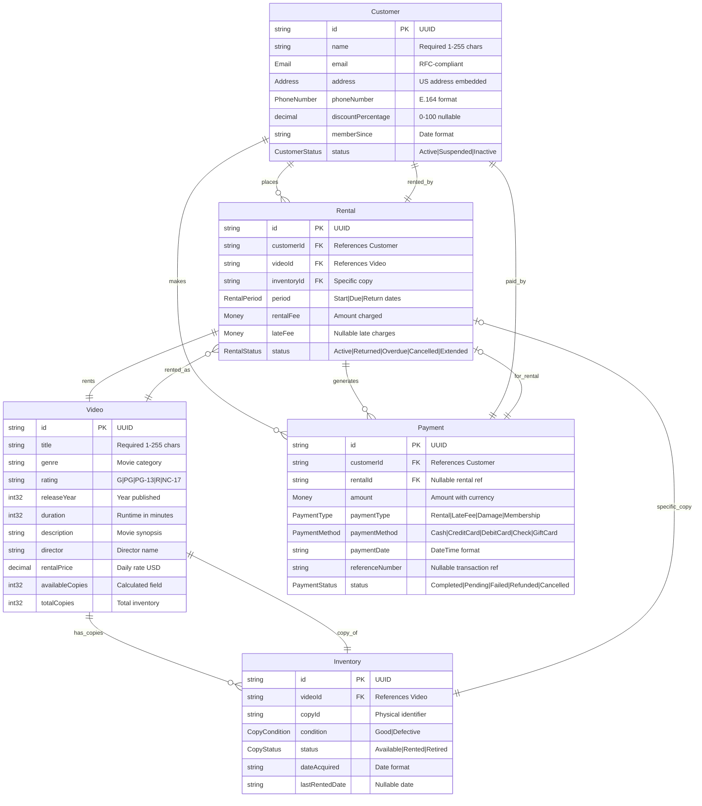

# Video Rental Store - Entity Relationship Diagram

This document contains the Entity Relationship Diagram (ERD) for the Video Rental Store domain model, accurately reflecting the current TypeSpec implementation.

## Domain Model Overview

The video rental store domain consists of the following core entities and their relationships:

- **Customer**: Individuals who rent videos, including personal information, membership status, and an optional discount percentage.
- **Video**: Represents movies or shows available for rent, detailing attributes like pricing and current availability.
- **Inventory**: Tracks individual physical copies of videos, including their physical condition and rental status.
- **Rental**: Records active rental agreements, managing rental periods and associated fees.
- **Payment**: Encompasses all financial transactions, supporting various payment methods.

## Entity Relationship Diagram

## Business Rules and Constraints

### Key Business Logic

1. **Rental Lifecycle**:

   - A customer rents a video, making the `Rental` record `Active`. The cycle completes when the video is returned.
   - Customers eligible for a discount (via `discountPercentage`) receive automatic price adjustments on rentals.
   - Rentals can become `Overdue` if not returned by the due date.
   - Late fees are calculated for overdue rentals.

2. **Inventory Management**:

   - Each `Video` can have multiple physical copies (tracked as `Inventory` items).
   - The status of an `Inventory` copy tracks its availability (e.g., `Available` → `Rented` → `Available`).
   - The condition of an `Inventory` copy affects its rental eligibility.

3. **Payment Processing**:

   - Payments can be for various purposes, including rentals, late fees, damages, or membership fees.
   - Multiple payment methods are supported.
   - Payment status tracks the lifecycle of a transaction (e.g., `Pending`, `Completed`, `Failed`).

4. **Customer Management**:
   - Customers can have multiple active rentals simultaneously.
   - Payment history is maintained for each customer.
   - Customer discounts are configurable via the `discountPercentage` field in the `Customer` entity.
   - Address information is stored directly with the customer record.

### Data Integrity Rules

- All primary keys are UUIDs to ensure global uniqueness.
- Foreign key relationships maintain referential integrity between entities.
- Nullable fields, such as `dateReturned` in the `Rental` entity, accommodate evolving states (e.g., a rental is active until the return date is recorded).
- Enumerated types (Enums) constrain status fields to predefined valid values.
- Date and time fields are used to track the chronology of transactions and events.

### API Operations

Beyond standard Create, Read, Update, Delete (CRUD) operations, each entity supports specialized business functions:

- **Videos**: Includes operations for searching, filtering by genre, and checking availability.
- **Rentals**: Includes operations for processing returns, tracking overdue items, viewing customer rental history, and calculating rental prices incorporating customer discounts.
- **Inventory**: Allows for tracking specific copies of videos and reporting on their availability.
- **Payments**: Supports processing transactions and retrieving customer payment history.
- **Customers**: Supports standard data management and specific operations like managing customer discount percentages.

This ERD and the accompanying business rules lay a comprehensive foundation for developing a robust video rental store management system, ensuring logical data organization, data integrity, and support for key operational workflows.
