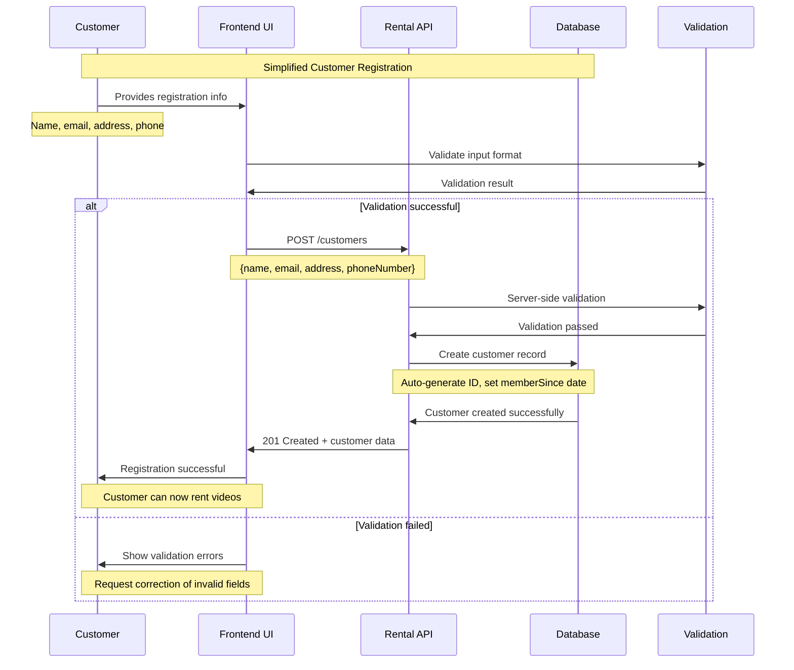
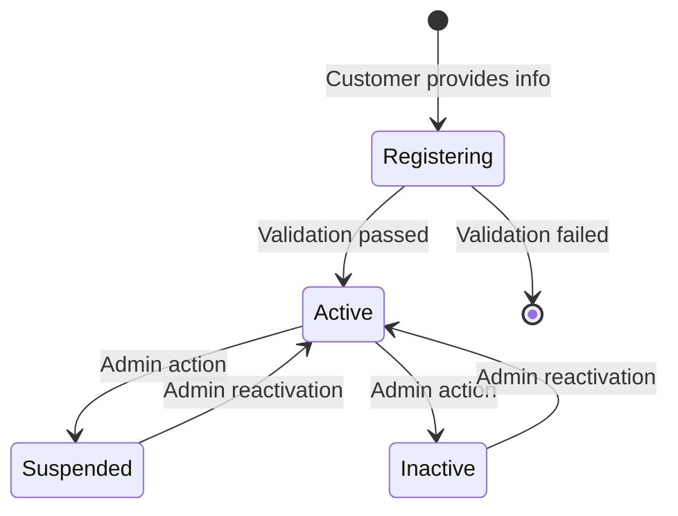

# Customer Registration Sequence Diagram

This diagram illustrates the sequence of interactions for the simplified customer registration workflow in the video rental system.

## Sequence Flow

## Key Aspects of the Registration Process

- **Streamlined Process**: The customer registration process is designed for direct self-service, allowing users to create accounts without requiring intervention from system administrators or employees.
- **System-Generated Fields**: Upon successful registration, the system automatically generates a unique `id` for the customer, sets the `memberSince` date to the current date, and assigns a default `status` (typically 'Active').
- **Optional Discount Configuration**: The `discountPercentage` field, which determines eligibility for rental discounts, is not set during the initial registration. It can be configured at a later time through separate administrative operations.
- **Immediate System Access**: Once the registration is complete and successful, customers gain immediate access to the system and can begin renting videos.
- **Comprehensive Validation**: To ensure data integrity and adherence to business rules, validation of the provided information is performed on both the client-side (within the Frontend UI) and on the server-side (by the Rental API).

## Customer Status Transitions

Upon successful completion of the registration process, a new customer record is created with an `Active` status, enabling them to utilize the video rental services immediately.
