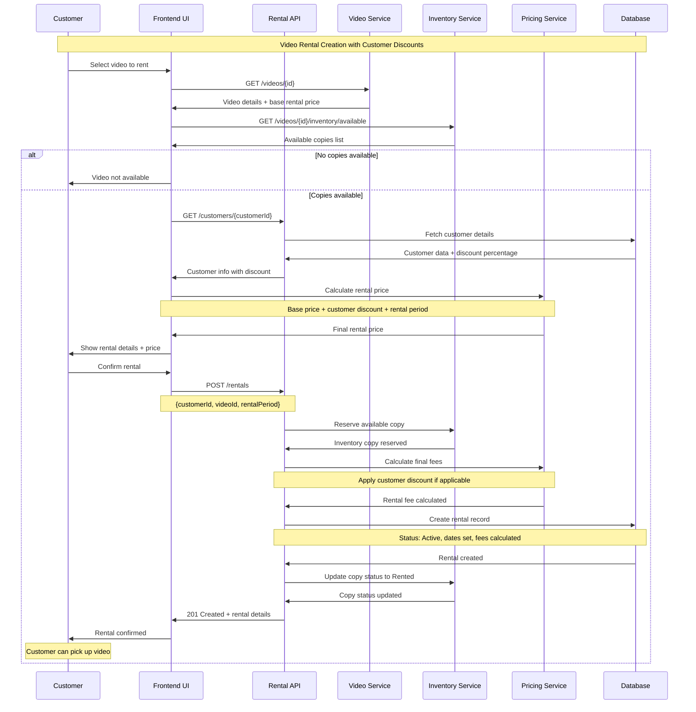

# Video Rental Creation Sequence Diagram

This document provides a detailed sequence diagram illustrating the interactions involved in the complete video rental creation workflow. It specifically includes the steps for identifying video availability, applying customer-specific discounts, processing the rental, and updating inventory status.

## Sequence Flow

## Pricing Calculation Details

```mermaid
flowchart TD
    A[Base Rental Price] --> B{Customer has discount?}
    B -->|Yes| C[Apply discount percentage]
    B -->|No| D[Use base price]
    C --> E[Calculate daily rate × rental period]
    D --> E
    E --> F[Final Rental Fee]

    style C fill:#e1f5fe
    style F fill:#c8e6c9
```

## Key Business Rules Applied

The video rental creation process adheres to several critical business rules:

1. **Inventory Management**: The system automatically identifies and reserves an available physical copy of the selected video for the rental.
2. **Customer Discounts**: Applicable customer-specific discounts, derived from the `Customer.discountPercentage` attribute, are automatically calculated and applied to the rental fee.
3. **Rental Period and Due Date**: A standard rental period is utilized, and the due date for the rental is calculated based on this period.
4. **Status Tracking**: Upon successful creation of a rental, its status is set to `Active`. Concurrently, the status of the corresponding physical `Inventory` copy is updated to `Rented`.
5. **Fee Calculation**: The final rental fee is determined by incorporating the base price, any applicable customer discounts, and relevant taxes (although tax calculation details are simplified in this illustrative model).

## Error Handling Considerations

Robust error handling is essential for a seamless rental process:

- **No Available Copies**: If no physical copies of the selected video are available, the customer is promptly notified. Conceptually, the system might offer an option for the customer to request notification when the video becomes available.
- **Invalid Customer Status**: Customers whose accounts are `Suspended` or `Inactive` are prevented from creating new rentals. This rule ensures compliance with account standing policies.
- **Upfront Payment Requirement**: Certain system configurations or promotional offers might necessitate upfront payment for rentals. This aspect is simplified in the current sequence model.
- **System Errors and Transaction Rollback**: In the event of system errors occurring during the rental creation process, the system must be designed to perform a graceful fallback. This includes rolling back any inventory reservations or other state changes made during the transaction to maintain data integrity.
