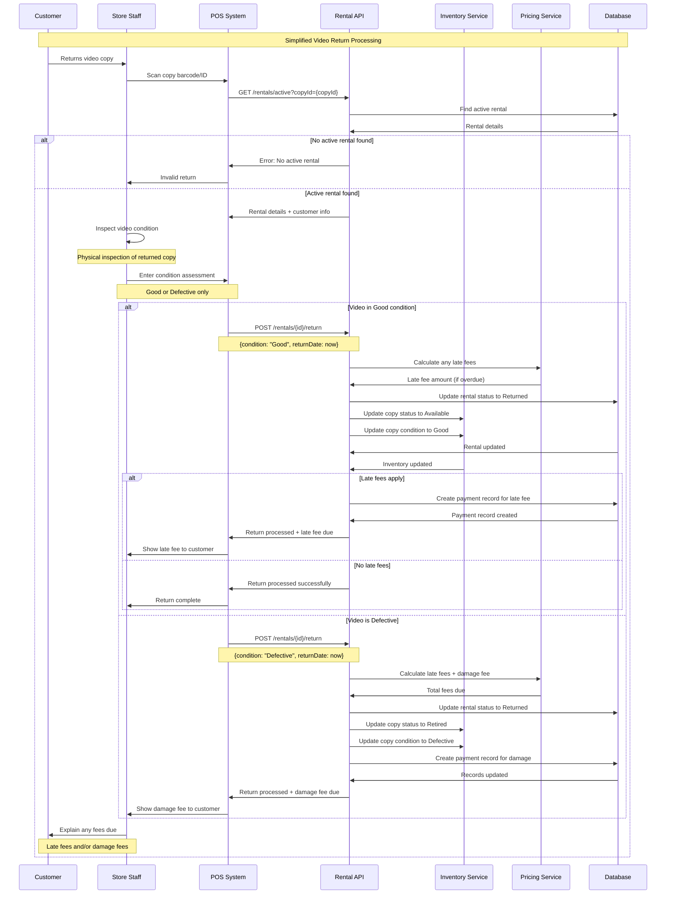
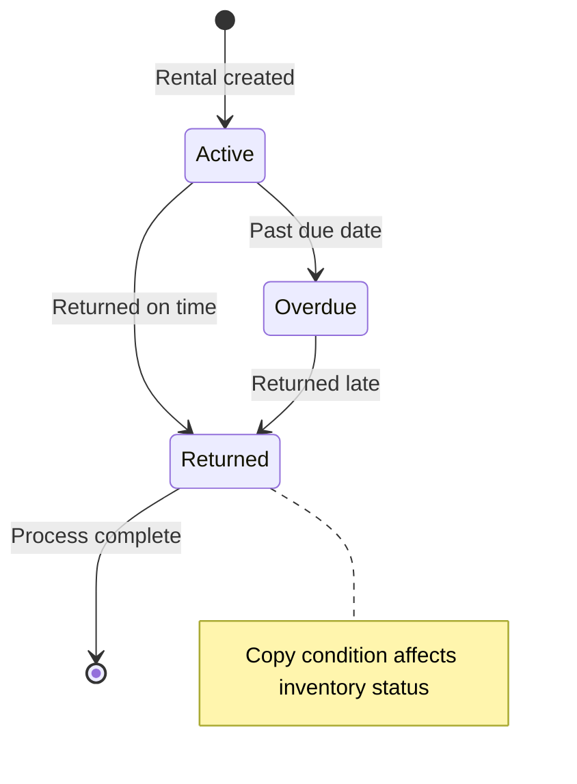
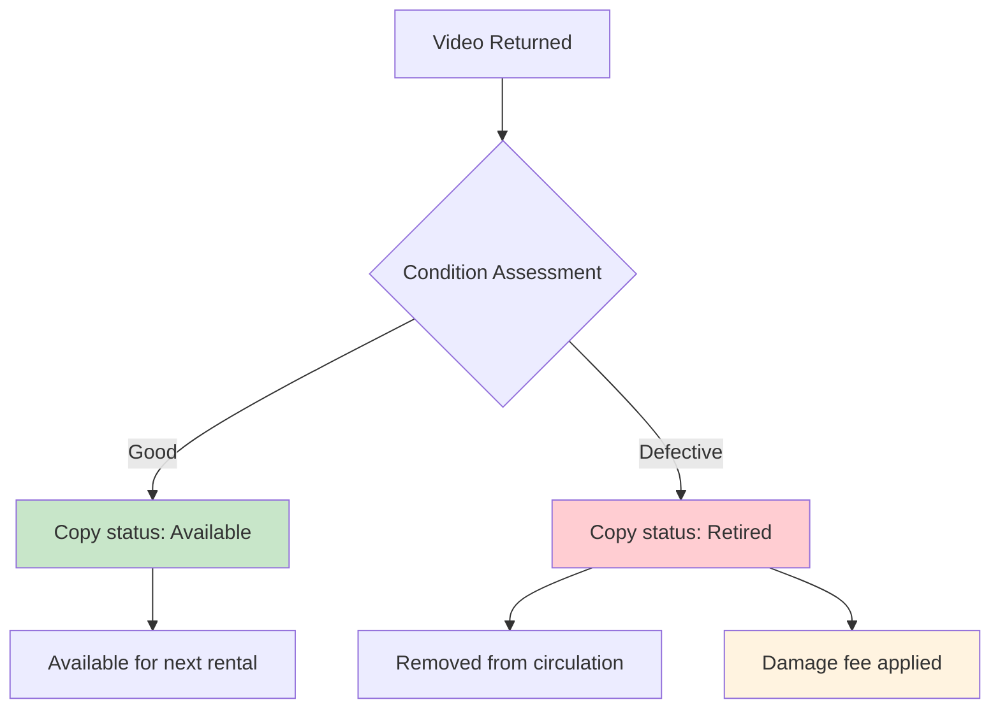

# Video Return Processing Sequence Diagram

This diagram illustrates the sequence of interactions for the simplified video return processing workflow, including video condition assessment and late fee calculation.

## Sequence Flow

## Rental Status Transitions During Return

## Impact of Condition Assessment on Inventory

## Key Features of Return Processing

1.  **Simplified Condition Assessment**: Store staff assess the returned video copy and categorize its condition as either `Good` or `Defective`.
2.  **Automated Fee Calculation**: The system automatically calculates any applicable late fees based on the actual return date compared to the due date.
3.  **Inventory Management Integration**: The status and condition of the returned `Inventory` copy are updated based on the assessment. `Good` copies become `Available`, while `Defective` copies are `Retired`.
4.  **Damage Handling Protocol**: If a video copy is returned in `Defective` condition, it is retired from circulation, and a damage fee may be applied to the customer's account.
5.  **Payment Record Creation**: Any assessed fees (late fees or damage fees) are automatically recorded as pending payments, to be handled by the payment processing workflow.

## Governing Business Rules

- **Late Fee Calculation**: Late fees are determined by multiplying the number of days overdue by the video's daily rental rate.
- **Damage Assessment**: The store staff makes a binary decision (`Good` or `Defective`) regarding the condition of the returned video copy.
- **Copy Retirement Policy**: Video copies assessed as `Defective` are permanently removed from the rentable inventory.
- **Fee Collection Process**: While fees are recorded during the return process, the actual collection of these fees is handled separately through the dedicated payment processing workflow.
