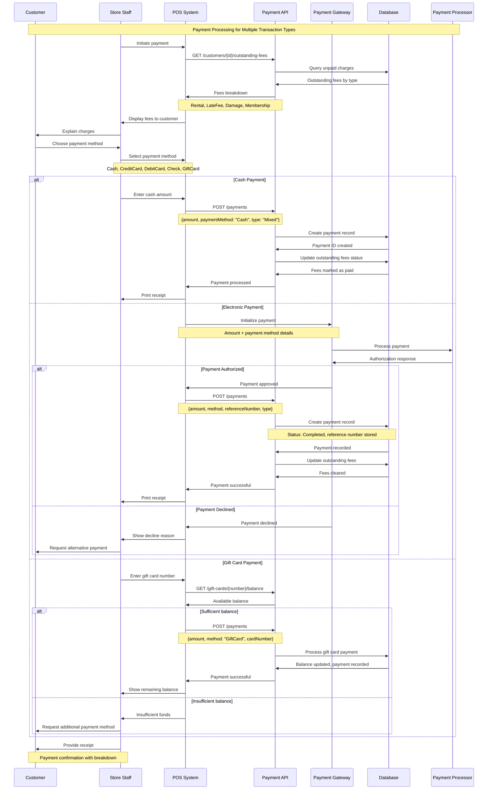
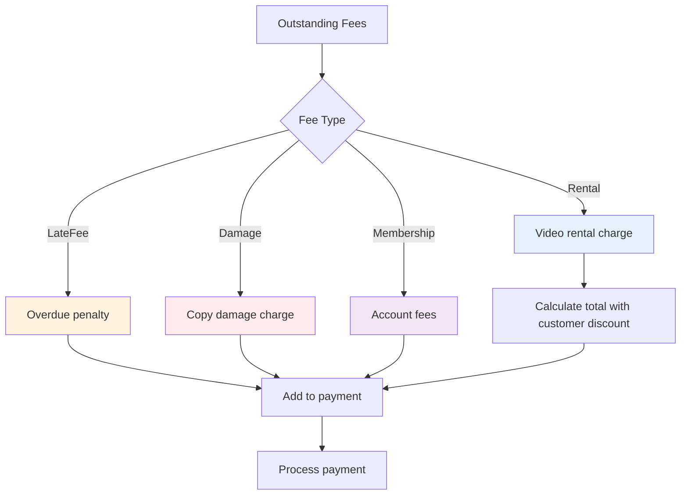
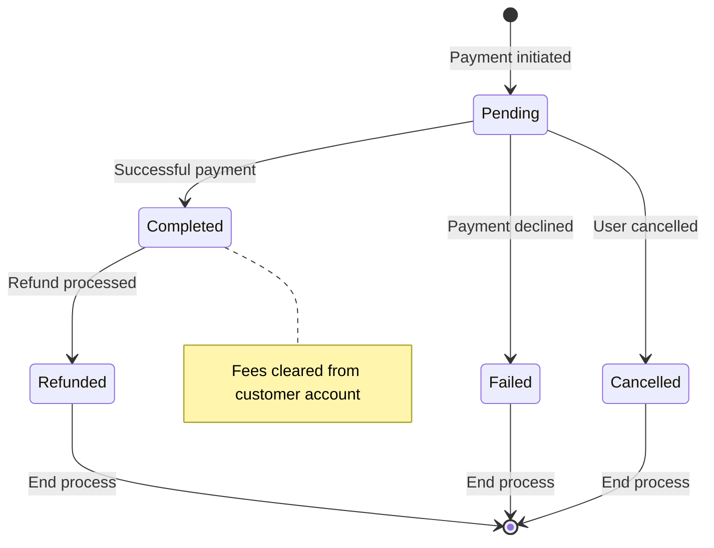

# Payment Processing Sequence Diagram

This document outlines the sequence of operations involved in processing customer payments for various transaction types within the video rental system. The diagram below illustrates the interactions between the customer, store staff, Point of Sale (POS) system, Payment API, Payment Gateway, Database, and Payment Processor.

## Sequence Flow

## Payment Type Handling

The system accommodates various types of fees that a customer might incur. The flowchart below details how these different fee types are handled and aggregated for payment.

## Payment Status Lifecycle

The state diagram below illustrates the lifecycle of a payment, from initiation through to completion, failure, cancellation, or refund.

## Key Features

The payment processing system incorporates several key features to ensure a comprehensive and user-friendly experience:

- **Multiple Fee Types**: The system supports payments for all rental-related charges, including rental fees, late fees, damage charges, and membership fees.
- **Payment Method Flexibility**: A variety of payment methods are accepted, such as cash, credit cards, debit cards, checks, and gift cards.
- **Customer Discount Integration**: Applicable customer discounts are automatically applied to rental fees during the payment calculation.
- **Transaction Tracking**: Electronic payments are tracked using unique reference numbers, facilitating auditing and reconciliation.
- **Partial Payment Handling**: The system can manage scenarios such as insufficient gift card balances, allowing for partial payments and the use of multiple payment methods for a single transaction.
- **Receipt Generation**: Upon successful payment, a detailed receipt is generated, providing a breakdown of all fees and payments made.

## Business Rules

The following business rules govern the payment processing workflow:

- **Fee Aggregation**: Multiple outstanding fee types (e.g., rental, late fee) can be consolidated and paid within a single transaction.
- **Payment Method Validation**: Each payment method is subject to specific validation rules to ensure authenticity and sufficiency of funds.
- **Reference Number Requirement**: A unique reference number is mandatory for all electronic payments. This is optional for cash transactions.
- **Discount Application Scope**: Customer discounts are exclusively applied to rental fees and do not extend to penalties such as late fees or damage charges.
- **Gift Card Integration**: The system performs real-time balance checks and updates for gift card payments.
