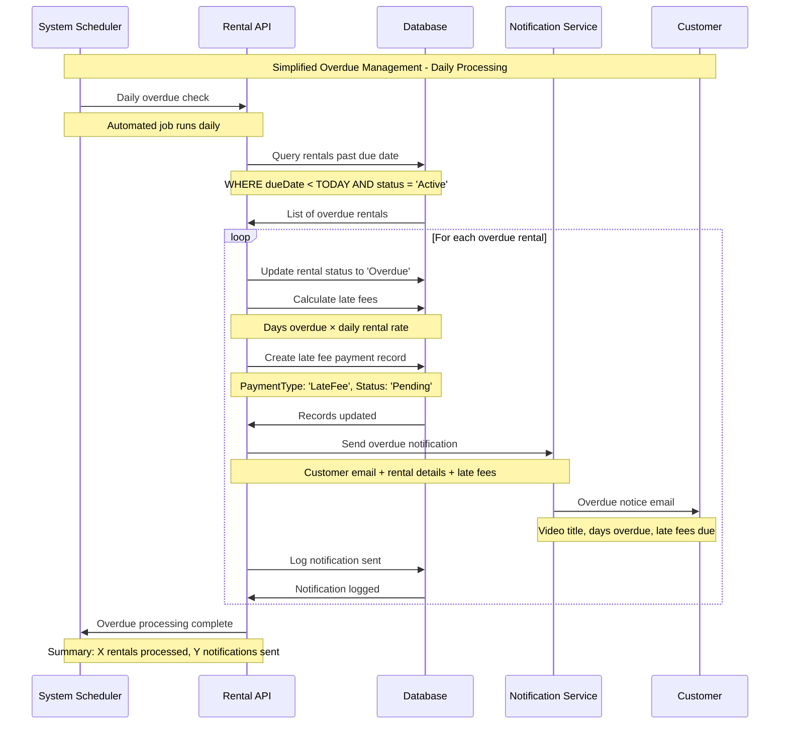
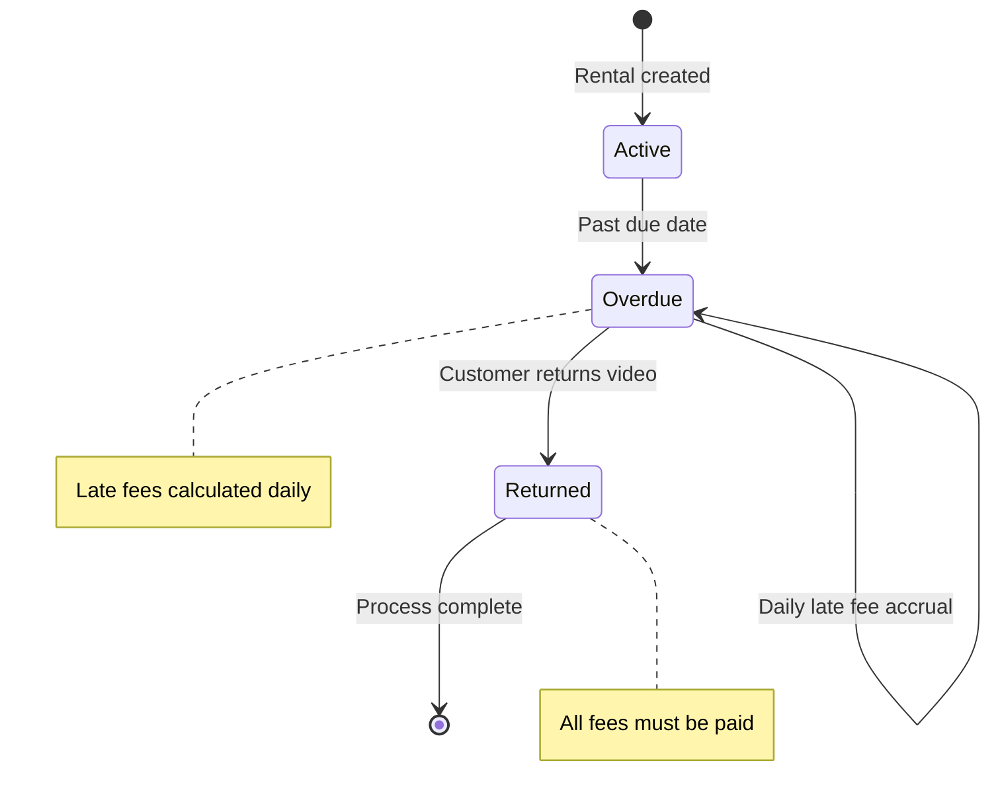
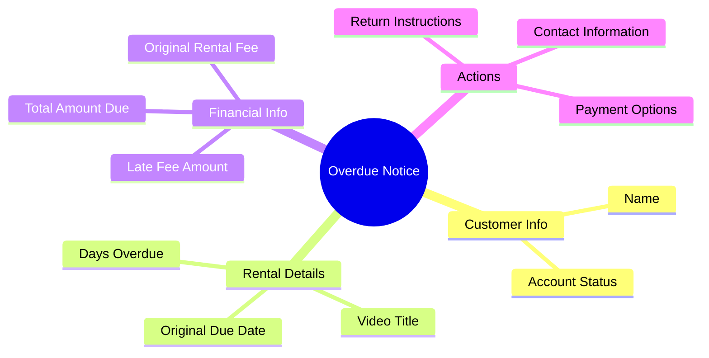

# Overdue Management Sequence Diagram

This document describes the simplified workflow for managing overdue video rentals. The diagram below illustrates the automated daily process involving the System Scheduler, Rental API, Database, Notification Service, and the Customer.

## Sequence Flow



## Overdue Status Management

The state diagram below depicts the lifecycle of a rental's status as it transitions from active to overdue and eventually to returned.



## Late Fee Calculation

The flowchart below outlines the logic for calculating late fees. It considers the number of days a rental is overdue and the daily rental rate, while also noting that customer discounts do not apply to penalty fees.

```mermaid
flowchart TD
    A[Rental Past Due] --> B[Calculate days overdue]
    B --> C[Days × Daily rental rate]
    C --> D{Customer has discount?}
    D -->|Yes| E[Apply discount to base rental only]
    D -->|No| F[Full late fee amount]
    E --> G[Late fees = Full late fee]
    F --> G
    G --> H[Create payment record]

    style G fill:#fff3e0
    style H fill:#ffcdd2

    note right of E: Discounts don't apply to penalties
```

## Notification Content

The mind map below details the information included in the overdue notification sent to customers. This ensures clarity regarding the overdue item, associated fees, and required actions.



## Key Features

The overdue management system includes the following key features:

- **Automated Processing**: A daily batch job automatically identifies and processes overdue rentals.
- **Progressive Fee Calculation**: Late fees are calculated based on the number of days a rental is overdue, ensuring fairness.
- **Customer Notifications**: Automated email alerts are sent to customers, providing a detailed breakdown of overdue items and associated fees.
- **Simplified Workflow**: The system employs a straightforward notification process without multiple escalation tiers for this simplified model.
- **Payment Integration**: Calculated late fees are automatically added to the customer's account for future payment.

## Business Rules

The overdue management process is governed by the following business rules:

- **Daily Processing Cycle**: The system performs the overdue check once every day.
- **Late Fee Formula**: Late fees are determined by multiplying the number of days overdue by the original daily rental rate of the item.
- **Discount Policy Adherence**: Customer discounts are not applicable to late fee penalties.
- **Notification Trigger**: Notifications are dispatched as soon as a rental's status changes to overdue.
- **Status Persistence**: A rental remains in the "Overdue" status until the item is returned by the customer.

## Error Handling

The system incorporates mechanisms to manage potential errors during overdue processing:

- **Email Delivery Failures**: If an email notification fails to send, the event is logged for manual follow-up by staff.
- **Database Transaction Errors**: In the event of database errors, transactions are rolled back to maintain data consistency and prevent an inconsistent state.
- **Calculation Discrepancies**: If errors occur during late fee calculation, the system defaults to using the base rental rate to determine the fee, ensuring a charge is still applied.
- **Customer Account Issues**: If issues related to a customer's account are detected, processing for that account continues, but the account is flagged for administrative review.
