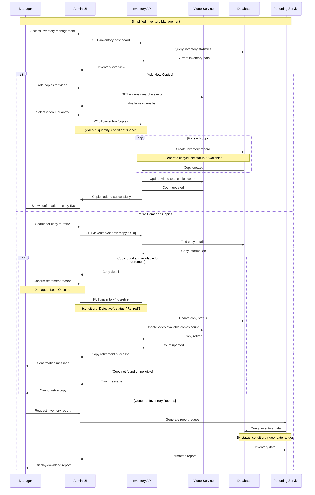
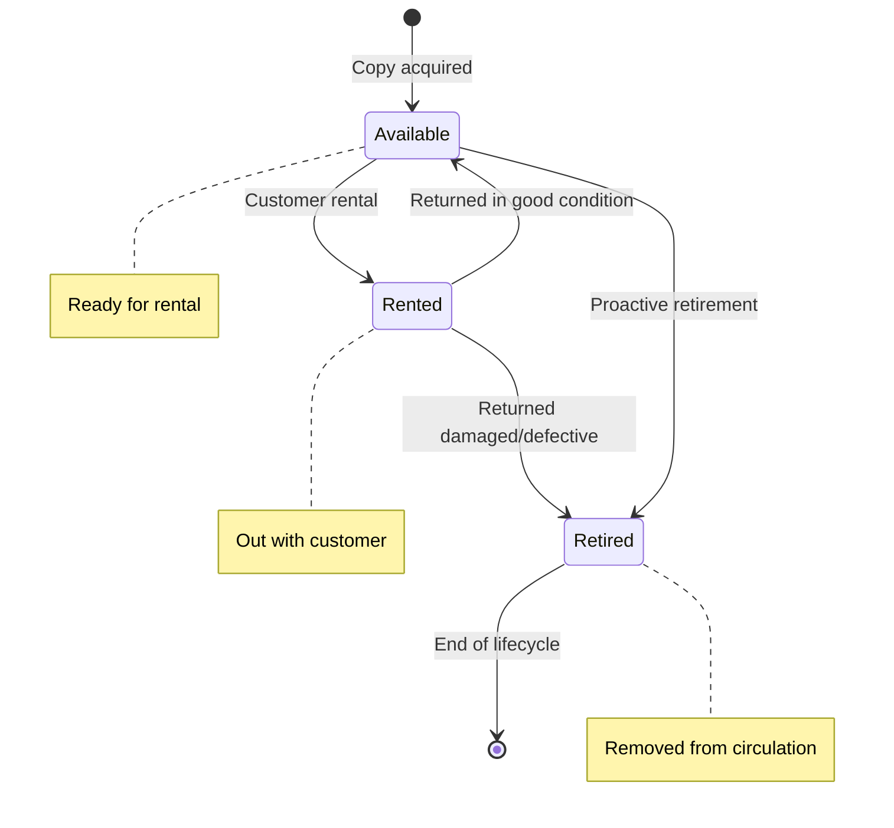
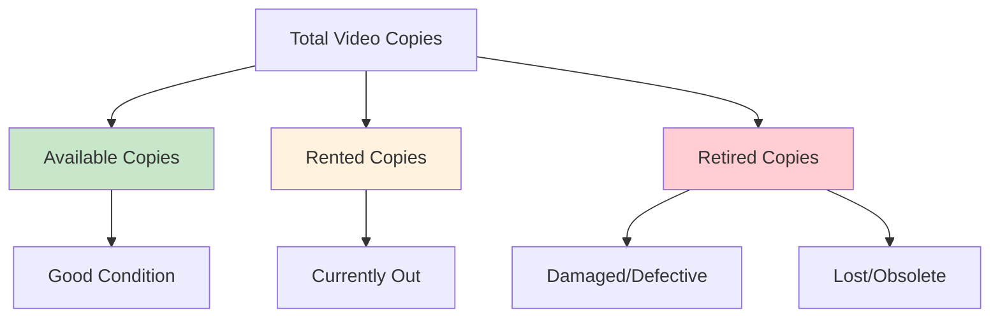
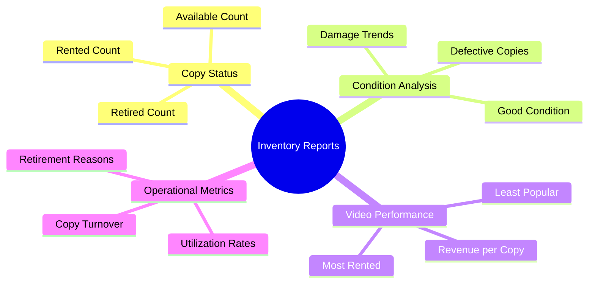

# Inventory Management Sequence Diagram

This document outlines the simplified workflow for managing the inventory of video copies within the rental system. The diagram below illustrates the interactions between a Manager, the Admin User Interface (UI), the Inventory API, the Video Service, the Database, and the Reporting Service.

## Sequence Flow

## Copy Lifecycle Management

The state diagram below illustrates the lifecycle of a video copy, from its acquisition to its eventual retirement.

## Inventory Status Overview

The flowchart below provides a high-level overview of how total video copies are categorized by their status (Available, Rented, Retired) and condition.

## Inventory Reporting

The mind map below details the types of information and analyses available through inventory reports, covering copy status, condition analysis, video performance, and operational metrics.

## Key Features

The inventory management system offers the following key features:

- **Simplified Workflow**: Core operations include adding new copies and retiring damaged or obsolete ones, minimizing complexity in maintenance tasks.
- **Automatic Availability Counting**: The system automatically calculates the availability of videos based on the status of individual copies.
- **Condition Tracking**: A straightforward binary assessment (Good/Defective) is used to track the condition of each copy.
- **Retirement Management**: A clear and defined process is in place for removing copies from circulation when they are no longer suitable for rental.
- **Reporting Integration**: The system provides access to real-time inventory status and enables historical analysis through integrated reporting features.

## Business Rules

The inventory management process is governed by the following business rules:

- **New Copy Defaults**: Newly added copies are automatically set to "Good" condition and "Available" status.
- **Status Transition Control**: Only predefined and logical transitions between statuses are permitted (as depicted in the state diagram).
- **Retirement Criteria**: Copies marked as defective must be retired and cannot be returned to active circulation.
- **Availability Accuracy**: The count of available videos accurately reflects the number of copies that are currently rentable.
- **Audit Trail Maintenance**: All changes to a copy's status are logged with timestamps and reasons for the change, ensuring a comprehensive audit trail.

## Administrative Controls

The system includes the following administrative controls to manage inventory effectively:

- **Access Control**: Inventory modification privileges (adding/retiring copies) are restricted to authorized personnel, typically managers.
- **Input Validation**: The system enforces rules to prevent invalid status transitions or data entries.
- **Bulk Operations Support**: Functionality is provided to support adding multiple copies of a video in a single operation.
- **Search Capabilities**: Robust search functionality allows users to find specific copies based on ID, video title, status, or condition.
- **Comprehensive Reporting**: Detailed reports are available for inventory analysis, trend identification, and operational oversight.
