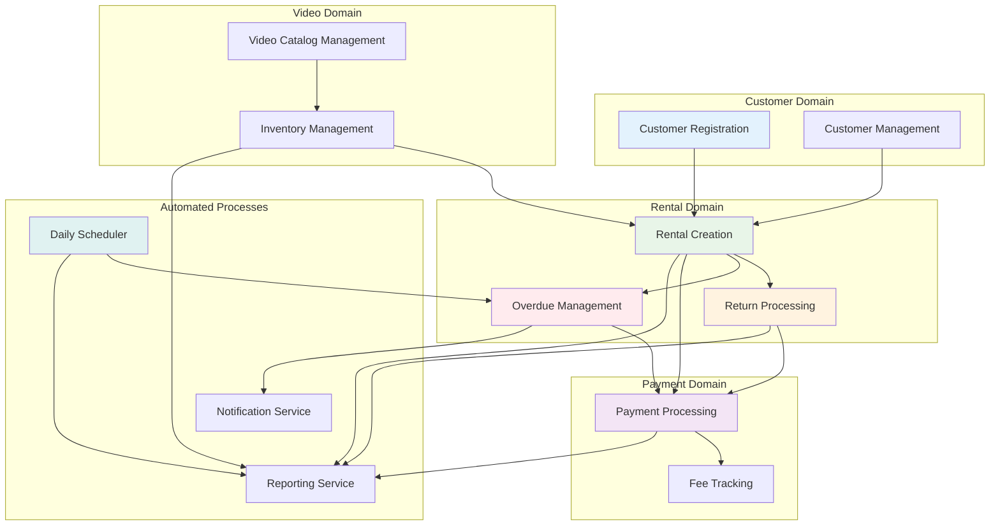
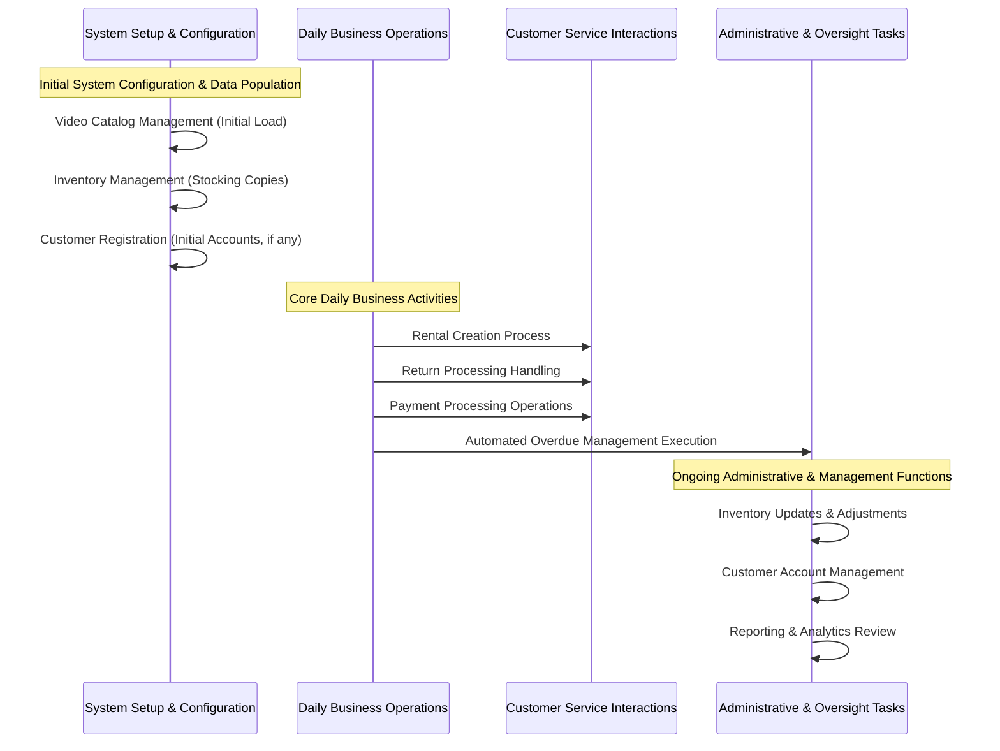

# Understanding Workflow Interconnections: How Business Processes Connect

## The Importance of Grasping Workflow Connections in System Design

Comprehending how various workflows interconnect is fundamental to learning about **system architecture** and defining **domain boundaries** within the framework of Domain-Driven Design (DDD). Real-world business operations are not isolated processes; they are intricate, interconnected systems where one business action often triggers a cascade of subsequent actions.

**Learning Objectives**: This document aims to elucidate how business workflows are interdependent, how data flows between different domains, the principles of event-driven architecture, and the critical role that well-defined boundaries play in ensuring system maintainability and scalability.

## Business System Architecture: A Holistic Overview

The following diagram provides a comprehensive view of how all business workflows within the video rental system are interconnected. Observe how this model mirrors the operational realities of a physical video rental business.

## System Overview Diagram

## Interconnectivity of Business Workflows: Domain-Driven Design in Practice

Analyzing these connections offers valuable insights into the concepts of **bounded contexts** and **domain relationships** as applied in Domain-Driven Design.

### Essential Business Dependencies (Illustrating Domain Relationships)

- **Customer Registration** → **Rental Creation**: A customer must be registered before a rental transaction can be initiated.
- **Video Catalog Management** → **Inventory Management**: Video titles and details must be defined in the catalog before physical copies can be tracked in inventory.
- **Inventory Management** → **Rental Creation**: Available physical copies of a video must exist in inventory before they can be rented out.
- **Rental Creation** → **Return Processing**: A video must be actively rented before it can be processed as a return.
- **Return Processing** → **Payment Processing**: If a returned video is damaged, this may generate fees that require collection through the payment processing workflow.

### Business Automation Dependencies (Illustrating Event-Driven Architecture)

- **Rental Creation** → **Overdue Management**: Active rentals are automatically monitored for potential late returns by the overdue management system.
- **Overdue Management** → **Payment Processing**: Late fees identified by the overdue management system are automatically generated and processed.
- **Daily Scheduler** → **Overdue Management**: The system automatically checks for overdue rentals on a daily basis as a scheduled task.
- **All Workflows** → **Reporting Service**: Data from all operational workflows flows into the reporting service for analytics and business intelligence.

**Architectural Insight**: Note how automated processes, such as overdue detection and reporting, depend on core business operations but are designed to function without disrupting them. This separation of concerns is a key architectural principle.

## Illustrative Sequence of Business Workflows

This sequence diagram demonstrates the typical flow of business operations throughout a standard operational day:

## Data Flow Across Domain Boundaries

Understanding how data is integrated and shared across different domains is crucial for appreciating the concepts of **domain boundaries** and **shared information models**.

### Critical Business Data Sharing Points

1. **Customer Information**: Consistently shared and utilized across rental, payment, and overdue management workflows, as customer identity is central to all operations.
2. **Inventory Status**: Real-time updates are maintained and synchronized between rental, return, and inventory management workflows to ensure accuracy.
3. **Pricing Data**: Customer-specific discounts and standard pricing information are applied consistently in both rental and payment processing workflows.
4. **Fee Calculation Data**: Information regarding late fees flows from the overdue management system to payment processing for automated billing.

### Business Event Flow: Understanding Triggers and Reactions

1. **Rental Creation Event** → Triggers an inventory reservation, signifying a business commitment.
2. **Return Processing Event** → Triggers an update to the inventory status, reflecting the condition assessment of the returned item.
3. **Overdue Detection Event** → Triggers customer notifications and the creation of late fee records, representing automated protective measures.
4. **Payment Completion Event** → Triggers an update to the customer's account balance, signifying financial closure for a transaction.

### Enforcement of Business Rules Across Workflows

- **Customer Eligibility Rules**: Enforced during the rental creation process as a protective business measure.
- **Inventory Availability Checks**: Performed during rental creation to ensure accurate promises to customers.
- **Condition Assessment Protocols**: Applied during return processing as a quality control measure.
- **Discount Application Logic**: Automatically applied within rental and payment workflows to deliver customer benefits consistently.

**Key Learning**: This interconnected system architecture ensures data consistency, robust enforcement of business rules, and a seamless customer experience across all video rental operations.

## Fundamental Architectural Lessons from Workflow Interconnections

- **Domain-Driven Organization**: Observe how workflows are naturally grouped by distinct business concerns (Customer, Video, Rental, Payment). This illustrates how to organize software code around specific business capabilities, a core tenet of DDD.
- **Event-Driven Design Principles**: Note how significant business events (e.g., a rental is created, a video is returned) automatically trigger subsequent business processes. This is a practical demonstration of event-driven architecture.
- **Maintaining Data Consistency**: Understand how shared business data, such as customer information and inventory status, flows between different domains while preserving accuracy and integrity.
- **Strategic Distribution of Business Rules**: Learn how business rules are enforced at appropriate points within the workflow chain to ensure compliance and operational correctness.
