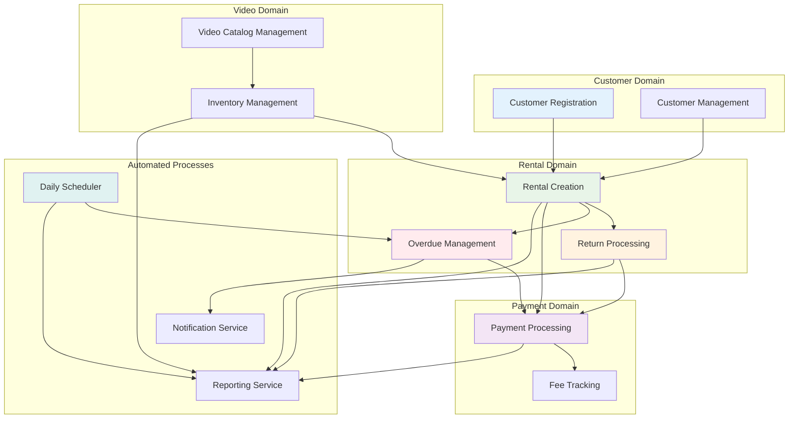
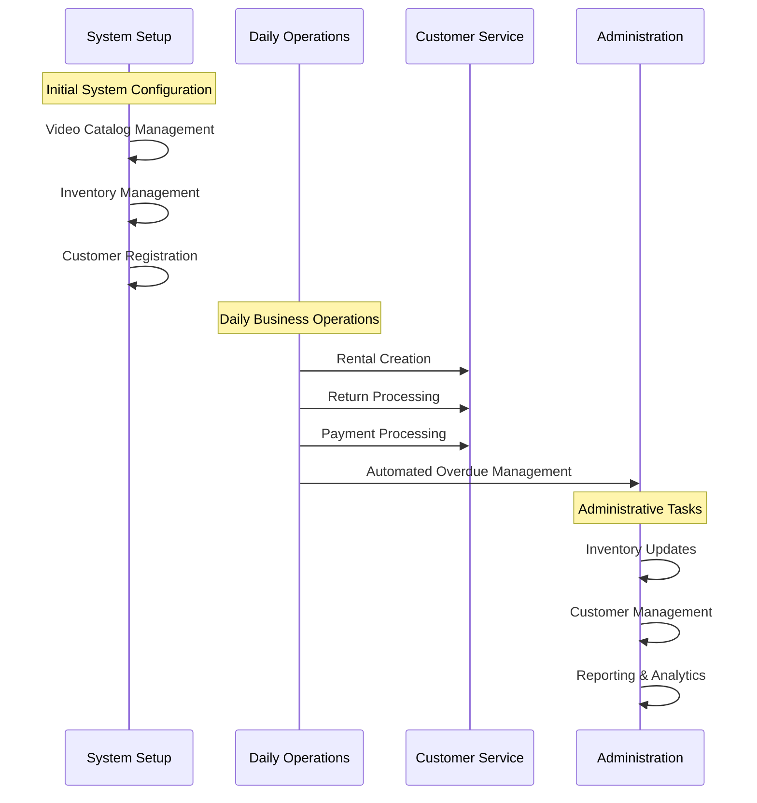

# Learning Workflow Interconnections - How Business Processes Connect

## Why Understanding Workflow Connections Is Essential Learning

Seeing how workflows connect teaches you **system architecture** and **domain
boundaries** in Domain-Driven Design. Real businesses aren't isolated
processes - they're interconnected systems where one business action triggers
others.

**What You'll Learn**: How business workflows depend on each other, data flows
between domains, event-driven architecture, and why good boundaries matter for
system maintainability.

## Your Business System Architecture - The Big Picture

This diagram shows how all your business workflows connect. Notice how it
mirrors how a real video rental business actually operates:

## System Overview

## How Your Business Workflows Connect - Domain-Driven Design in Action

Understanding these connections teaches you about **bounded contexts** and
**domain relationships** in Domain-Driven Design.

### Essential Business Dependencies (Domain Relationships)

- **Customer Registration** → **Rental Creation**: You need customers before
  you can rent to them
- **Video Catalog** → **Inventory Management**: You need movies defined before
  you can track physical copies
- **Inventory Management** → **Rental Creation**: You need available copies
  before you can rent them out
- **Rental Creation** → **Return Processing**: You need active rentals before
  customers can return videos
- **Return Processing** → **Payment Processing**: Damaged returns generate fees
  that need collection

### Business Automation Dependencies (Event-Driven Architecture)

- **Rental Creation** → **Overdue Management**: Active rentals get monitored
  automatically for late returns
- **Overdue Management** → **Payment Processing**: Late fees get generated
  automatically
- **Daily Scheduler** → **Overdue Management**: System checks for overdue
  rentals every day
- **All Workflows** → **Reporting Service**: Business data flows to analytics
  and reporting

**Architecture Insight**: Notice how business automation (overdue detection,
reporting) depends on core business operations but doesn't disrupt them.

## Learning the Business Workflow Sequence

This sequence shows you how business operations flow through a typical day:

## How Business Data Flows Between Domains

Understanding data integration teaches you about **domain boundaries** and
**shared information**:

### Critical Business Data Sharing

1. **Customer Information**: Shared across rental, payment, and overdue workflows (customer identity drives everything)

2. **Inventory Status**: Real-time updates between rental, return, and inventory workflows (accuracy matters)

3. **Pricing Data**: Customer discounts applied in rental and payment workflows (consistent pricing)

4. **Fee Calculations**: Late fees flow from overdue to payment processing (automated business rules)

### Business Event Flow (What Triggers What)

1. **Rental Creation** → Triggers inventory reservation (business commitment)

2. **Return Processing** → Triggers inventory status update (condition
   assessment)

3. **Overdue Detection** → Triggers notification and fee creation (automated
   protection)

4. **Payment Completion** → Triggers account balance update (financial
   closure)

### How Business Rules Get Enforced

- **Customer Eligibility**: Enforced in rental creation (business protection)

- **Inventory Availability**: Checked during rental creation (accurate
  promises)

- **Condition Assessment**: Applied during return processing (quality control)

- **Discount Application**: Automatic in rental and payment workflows
  (customer benefits)

**Key Learning**: This interconnected system ensures data consistency, business
rule enforcement, and seamless customer experience across all rental
operations.

## Critical Architecture Lessons

**Domain Boundaries**: Notice how workflows group by business concern -
Customer, Video, Rental, Payment. This teaches you how to organize code around
business capabilities.

**Event-Driven Design**: See how business events (rental created, video
returned) trigger other business processes automatically.

**Data Consistency**: Observe how shared business data (customer info,
inventory status) flows between domains while maintaining accuracy.

**Business Rule Distribution**: Learn how business rules get enforced at the
right places in the workflow chain.
