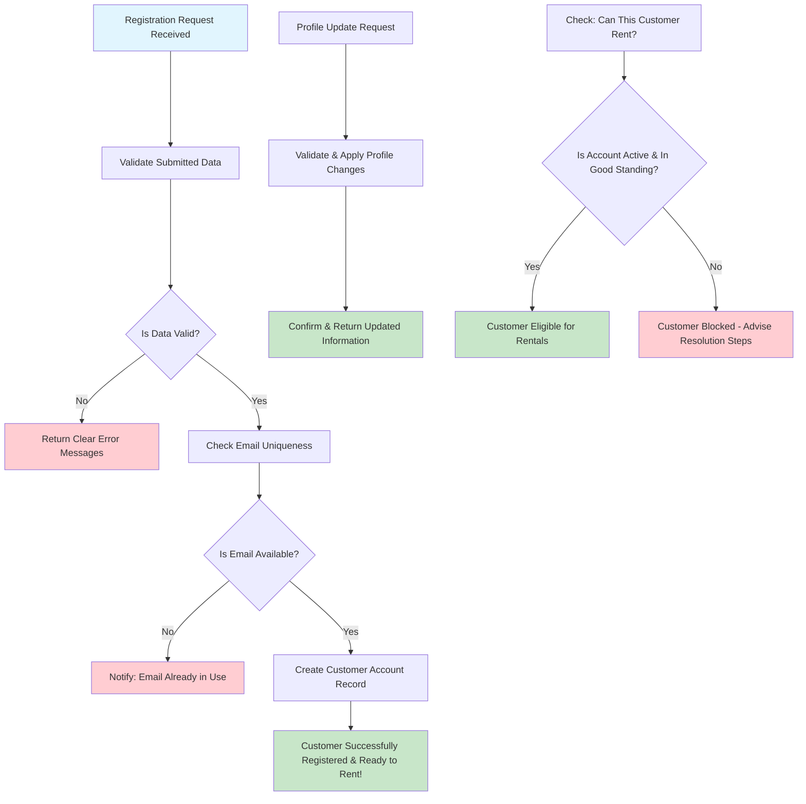

# Learning Customer Registration: Your First Business Workflow

## Why Commence with Customer Registration?

Customer registration serves as an ideal introduction to Domain-Driven Design (DDD) because it embodies a process that is **simultaneously simple and complete**. The concept of signing up for a service is universally understood, yet the underlying business logic is sufficiently nuanced to illustrate important DDD patterns effectively.

**Learning Objectives**: This workflow will elucidate key concepts such as data validation, business rule enforcement, error handling strategies, and the importance of approaching data from a business-centric perspective rather than a purely technical, database-oriented one.

## The Business Scenario

Consider the operation of a video rental store. When new prospective customers enter the establishment intending to rent movies, certain information must be gathered. What specific details are required? Which business rules govern this interaction? How can their information be managed securely and efficiently to facilitate business operations?

**The Goal**: To transform an individual expressing a desire to rent videos into a recognized customer who is authorized and able to rent videos from the system.

## Essential Business Rules (Domain Logic)

These rules are not arbitrary technical constraints but are derived from genuine business necessities:

- **Valid Contact Information**: Essential data such as name, email address, physical address, and phone number are required to conduct business effectively.
- **Unique Email Addresses**: Each customer account must be associated with a unique email address to prevent confusion, facilitate accurate communication, and mitigate potential fraud.
- **Standardized Phone Format**: Phone numbers should adhere to the E.164 international format to ensure compatibility with various communication systems and enable reliable customer contact.
- **Verifiable Addresses**: Physical addresses must be valid US addresses, including proper state codes, for purposes such as potential delivery services and regulatory compliance.
- **Flexible Discount System**: A customer discount percentage (ranging from 0 to 100%) allows for the implementation of loyalty programs and targeted promotions.
- **Status Management**: Customer accounts can be categorized as Active, Suspended, or Inactive, enabling the business to control access to services based on account standing.

## The Registration Process: A Step-by-Step Breakdown

**Learning Focus**: Observe how each step in the process serves a distinct business purpose. This is not merely data entry; it is a structured business process.

### Key Learning Points from the Process

1. **Dual-Layer Validation**: Validation occurs at two levels: client-side for an optimal user experience (immediate feedback) and server-side for ensuring business integrity and security.
2. **Significance of Unique Constraints**: Enforcing email uniqueness is crucial for preventing business problems such as duplicate accounts and misdirected communications.
3. **Meaningful Status Indicators**: The status of a customer account directly impacts business operations, determining, for example, their eligibility to rent videos.
4. **User-Centric Error Messaging**: When validation fails, it is imperative to provide users with clear, actionable information on how to rectify the errors.

## API Design in Support of Business Capabilities

Rather than adhering to simple CRUD (Create, Read, Update, Delete) operations, the API endpoints are designed to reflect specific business capabilities:

| Business Need or Question            | API Endpoint                      | Design Rationale & Significance                                                        |
| :----------------------------------- | :-------------------------------- | :------------------------------------------------------------------------------------- |
| "Register a new customer"            | `POST /customers`                 | Creates a complete customer account, including all necessary validations.              |
| "Retrieve customer information"      | `GET /customers/{id}`             | Fetches all data required to provide comprehensive customer service.                   |
| "Update customer details"            | `PATCH /customers/{id}`           | Allows for modifications to a customer's profile while enforcing business rules.       |
| "Is this customer eligible to rent?" | `GET /customers/{id}/eligibility` | Directly answers a critical business question, providing a clear, actionable response. |

**Domain-Driven Design Insight**: Note how the `/customers/{id}/eligibility` endpoint directly addresses a business question, rather than requiring the calling system to infer eligibility by interpreting raw customer data against business rules.

## Distinguishing Features of This Customer Management Approach

- **Business-Centric Validation**: The uniqueness of email addresses is enforced not merely for technical reasons, but because it is vital for effective customer service and account management.
- **Flexible and Integrated Discount System**: Percentage-based discounts are designed to integrate seamlessly with all pricing calculations throughout the system.
- **Real-Time Eligibility Assessment**: The system provides instantaneous answers to the crucial question: "Can this customer rent additional videos at this time?"
- **Integrity-Preserving Profile Updates**: Mechanisms for updating customer profiles are designed to ensure that changes do not compromise the integrity of business data.

## Interconnections with Other Business Workflows

Understanding how customer registration connects with other workflows is key to appreciating the holistic system architecture:

- **Foundation for Rental Creation**: The customer eligibility check, informed by registration data, is crucial for preventing problematic rental transactions.
- **Enabler for Payment Processing**: Customer information is linked to payment histories and preferred payment methods, facilitating smooth financial transactions.
- **Support for Customer Service**: Access to complete and accurate customer profile data empowers staff to provide effective assistance and support.

## Managing Errors: Learning from Imperfections

**The Importance of Effective Error Handling**: Well-crafted error messages can transform potentially frustrating user experiences into opportunities for successful resolution and customer satisfaction.

- **Distinguishing Validation Errors**: Instead of a generic "Invalid input," provide specific feedback like, "The email address format is invalid. Please enter a valid email address (e.g., user@example.com)."
- **Clarifying Business Rule Violations**: Communicate issues in business terms, such as, "A duplicate email address was detected. Do you already have an account with us? You can try logging in or use our password recovery option."
- **Handling System-Level Problems**: Implement graceful fallback mechanisms for situations like temporary database unavailability, informing the user appropriately.
- **Providing User Guidance for Resolution**: For errors like "Customer ID not found," guide the user: "The Customer ID you entered was not found. Please double-check the number and try again, or contact support for assistance."

**Learning Point**: Domain-driven error handling focuses on explaining problems in terms that are meaningful to the business and the user, rather than exposing technical jargon or internal system states.
