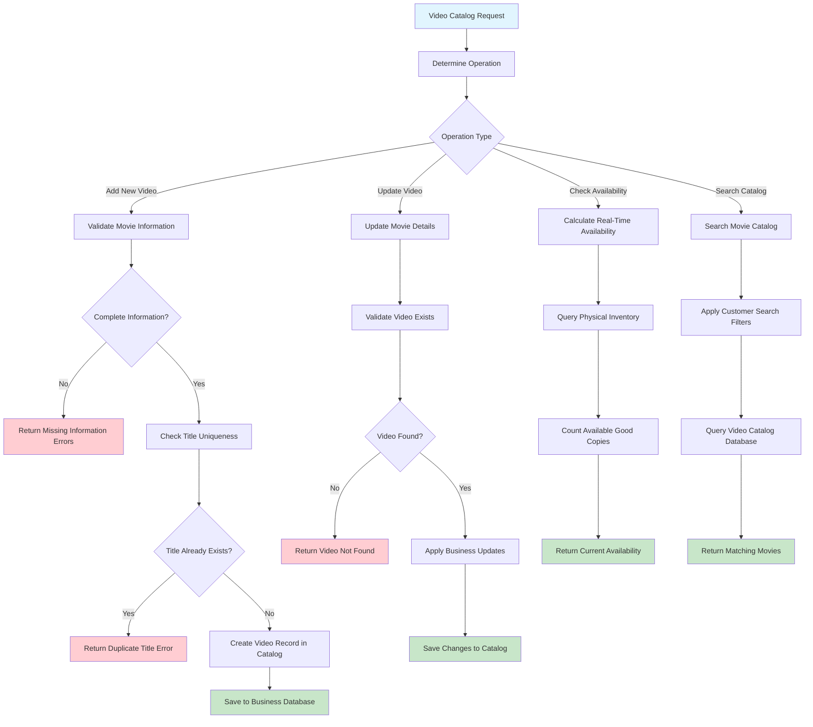

# Learning Video Catalog Management - The Foundation of Your Business

## Why Video Catalog Management Is Essential Learning

Every rental business starts with **what can we rent?** Video catalog management teaches you how to organize, maintain, and present business inventory through Domain-Driven Design principles.

**What You'll Learn**: Master data management, business validation rules, search capabilities, and how real-time inventory connects to customer-facing catalogs.

## The Business Reality of Video Catalogs

Your catalog is more than a database - it's your business storefront. Every video catalog decision affects:

- What movies can customers rent? (business offerings)
- How do customers find what they want? (user experience)
- Are there enough copies available? (inventory reality)
- What's the rental price? (business revenue)
- Is this video still available to rent? (business status)

**The Goal**: Maintain an accurate, searchable catalog that connects seamlessly with physical inventory while making it easy for customers to find great movies.

## Essential Business Rules (Catalog Logic)

These rules keep your catalog organized and accurate:

- **Unique Video Titles**: No duplicate movies in the catalog (customer confusion prevention)
- **Complete Movie Information**: Genre, rating, description, rental price required (customer decision support)
- **Real-Time Availability**: Catalog shows current copy availability from inventory (no disappointments)
- **Active Status Management**: Videos can be Active, Inactive, or Discontinued (business lifecycle)
- **Pricing Consistency**: Clear rental rates for all active videos (transparent pricing)
- **Searchable Organization**: Categories and ratings help customers find movies (business discoverability)

## The Video Catalog Journey - From Movie to Customer

Following how video catalog management works teaches you about master data and business organization:

## Business Decision Points Explained

Understanding catalog management decisions teaches you about master data management:

- **Title Uniqueness**: Prevents customer confusion and maintains clean catalog organization
- **Complete Information**: Ensures customers have enough details to make rental decisions
- **Real-Time Availability**: Connects catalog to physical inventory to prevent disappointments
- **Search & Filter Logic**: Helps customers find movies quickly (good user experience drives business)
- **Status Management**: Active/Inactive/Discontinued lifecycle reflects business reality

## Critical Learning Points

**Master Data Management**: Video catalog teaches you how to manage the core data that drives business operations - essential for any business application.

**Business-Driven Validation**: Notice how validation rules serve customer needs (complete information) and business needs (unique titles) rather than just technical requirements.

**Real-Time Integration**: The catalog demonstrates how Domain-Driven Design connects different business capabilities (catalog + inventory) seamlessly.

## How the API Supports Catalog Business Logic

The API design reflects business thinking about video catalogs:

| Method | Endpoint         | Business Purpose                     | DDD Insight                                     |
| ------ | ---------------- | ------------------------------------ | ----------------------------------------------- |
| POST   | `/videos`        | Add new movie to business catalog    | Business capability: "Expand Movie Offerings"   |
| GET    | `/videos/{id}`   | Retrieve movie details for customers | Business query: "Show Movie Information"        |
| PATCH  | `/videos/{id}`   | Update movie information as needed   | Business operation: "Maintain Catalog Accuracy" |
| GET    | `/videos/search` | Help customers find movies they want | Business capability: "Discover Movies"          |

**Design Insight**: Notice how endpoints represent business capabilities around movie discovery and catalog management, not just database operations.

## Business System Connectivity

Video catalog management connects across your entire business:

- **With Inventory Management**: Real-time availability calculations (customers see accurate stock)
- **With Rental Creation**: Provides movie details for rental transactions (business fulfillment)
- **With Customer Search**: Powers customer movie discovery (business revenue driver)
- **With Business Reporting**: Tracks popular movies and rental patterns (business intelligence)

**Architecture Lesson**: See how the catalog serves as foundational master data that enables all other business operations.

## Learning from Catalog Management

Catalog management teaches essential business software lessons:

- **Data Quality**: Incomplete or duplicate catalog entries hurt customer experience and business credibility
- **User Experience**: Search and filter capabilities directly impact customer satisfaction and sales
- **System Integration**: Real-time inventory connections prevent customer disappointments
- **Business Lifecycle**: Managing video status (Active/Inactive/Discontinued) reflects real business needs

**Business Rule**: Master data quality determines the quality of every business process that depends on it.
