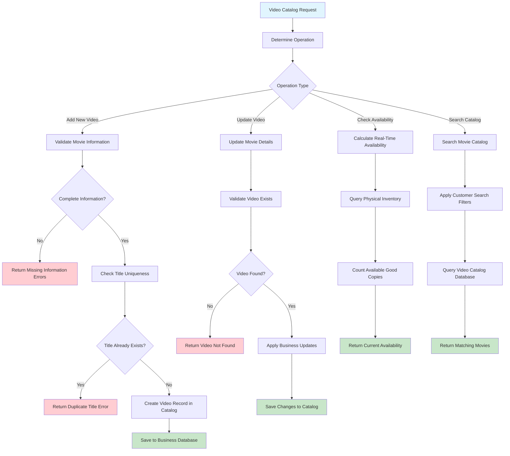

# Video Catalog Management: The Foundation of Your Rental Business

## The Importance of Video Catalog Management

Effective video catalog management is crucial for any rental business. It involves organizing, maintaining, and presenting the business's inventory, guided by Domain-Driven Design (DDD) principles. This process is fundamental to defining **what items are available for rent**.

**Key Learning Outcomes**: This document will help you understand data management, business validation rules, search functionalities, and the connection between real-time inventory and customer-facing catalogs.

## Business Impact of Video Catalogs

The video catalog is more than a mere database; it serves as the digital storefront of the business. Decisions regarding the video catalog directly influence:

- **Business Offerings**: Which movies are available for customers to rent?
- **User Experience**: How easily can customers find desired movies?
- **Inventory Accuracy**: Are there sufficient copies of a movie available?
- **Revenue Generation**: What is the rental price for each movie?
- **Service Availability**: Is a specific video still offered for rent?

**Primary Goal**: To maintain an accurate, easily searchable catalog that integrates seamlessly with physical inventory, enabling customers to effortlessly find and rent movies.

## Core Business Rules for Catalog Logic

These rules ensure the catalog remains organized, accurate, and reliable:

- **Unique Video Titles**: Each movie in the catalog must have a unique title to prevent customer confusion.
- **Comprehensive Movie Information**: Essential details such as genre, rating, description, and rental price must be provided for each movie to aid customer decision-making.
- **Real-Time Availability Updates**: The catalog must reflect the current availability of copies from the inventory to avoid unfulfilled rental orders.
- **Video Status Management**: Videos must be categorized by status (e.g., Active, Inactive, Discontinued) to reflect their lifecycle within the business.
- **Pricing Consistency**: Clear and consistent rental rates must be defined for all active videos.
- **Searchable Organization**: Effective categorization and rating systems should help customers discover movies easily, enhancing business discoverability.

## The Video Catalog Journey: From Movie Acquisition to Customer Access

Understanding the video catalog management workflow provides insights into master data management and business organization:

## Key Business Decision Points in Catalog Management

Effective catalog management involves several critical decisions that highlight the importance of master data:

- **Title Uniqueness**: Enforcing unique titles prevents customer confusion and maintains a clean, organized catalog.
- **Information Completeness**: Ensuring customers have access to comprehensive movie details facilitates informed rental decisions.
- **Real-Time Availability**: Integrating the catalog with physical inventory prevents customer disappointment due to out-of-stock items.
- **Search and Filter Logic**: Implementing robust search and filtering capabilities enhances user experience and drives business by helping customers find movies quickly.
- **Status Management**: Managing the lifecycle of videos (Active, Inactive, Discontinued) accurately reflects business realities and operational status.

## Critical Learning Points from Video Catalog Management

- **Master Data Management**: The video catalog serves as a prime example of managing core data that drives business operations. This is an essential skill for any business application developer.
- **Business-Driven Validation**: Validation rules should be designed to meet both customer needs (e.g., complete information) and business requirements (e.g., unique titles), rather than solely technical constraints.
- **Real-Time Integration**: The catalog demonstrates how Domain-Driven Design facilitates seamless integration between different business capabilities, such as catalog management and inventory control.

## API Design for Supporting Catalog Business Logic

The API design should reflect the business's perspective on video catalog operations:

| Method | Endpoint         | Business Purpose                        | DDD Insight                                     |
| ------ | ---------------- | --------------------------------------- | ----------------------------------------------- |
| POST   | `/videos`        | Add a new movie to the business catalog | Business Capability: "Expand Movie Offerings"   |
| GET    | `/videos/{id}`   | Retrieve movie details for customers    | Business Query: "Show Movie Information"        |
| PATCH  | `/videos/{id}`   | Update movie information as needed      | Business Operation: "Maintain Catalog Accuracy" |
| GET    | `/videos/search` | Help customers find desired movies      | Business Capability: "Discover Movies"          |

**Design Insight**: API endpoints should represent distinct business capabilities related to movie discovery and catalog management, rather than mere database operations.

## Business System Connectivity and Interdependencies

Video catalog management is interconnected with various other business systems:

- **Inventory Management**: Enables real-time availability calculations, ensuring customers see accurate stock levels.
- **Rental Creation**: Provides essential movie details for processing rental transactions, facilitating business fulfillment.
- **Customer Search**: Powers the movie discovery process for customers, acting as a key revenue driver.
- **Business Reporting**: Supplies data for tracking popular movies and rental patterns, contributing to business intelligence.

**Architecture Lesson**: The catalog functions as foundational master data, enabling and supporting all other business operations within the system.

## Key Takeaways from Catalog Management

Studying catalog management offers valuable lessons for developing business software:

- **Data Quality**: Incomplete or duplicate catalog entries can negatively impact customer experience and damage business credibility.
- **User Experience**: The effectiveness of search and filter capabilities directly influences customer satisfaction and sales.
- **System Integration**: Real-time connections with inventory systems are crucial for preventing customer disappointment.
- **Business Lifecycle Management**: Accurately managing video statuses (e.g., Active, Inactive, Discontinued) reflects genuine business needs and operational changes.

**Fundamental Business Rule**: The quality of master data dictates the quality of every business process that relies on it.
