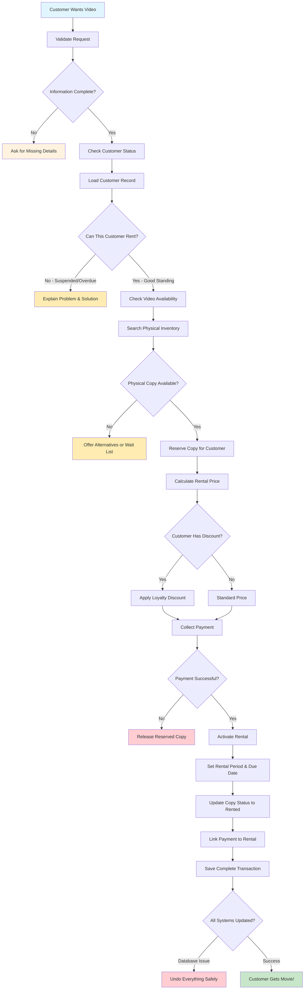

# Rental Creation Workflow: The Core of Business Operations

## Significance of the Rental Creation Workflow

The rental creation process is central to the video store's revenue generation. From a Domain-Driven Design (DDD) perspective, this workflow is an excellent example of how complex business processes can be deconstructed into manageable, validated steps.

**Key Learning Outcomes**: This document will guide you through understanding multi-step business validation, ensuring transaction integrity, implementing automatic discount applications, and coordinating multiple services while maintaining clean, organized code.

## The Business Reality of Creating a Rental

A customer's request to rent a video, while seemingly straightforward, triggers a sophisticated underlying business process:

- Is the customer eligible to rent additional videos (e.g., no outstanding overdue items)?
- Is the requested movie currently in stock and available for rent?
- What is the correct rental price, including any applicable discounts for the customer?
- How can payment be securely processed and confirmed?
- How should system or process failures be handled to maintain data integrity and customer satisfaction?

**Primary Goal**: To transform a customer's rental request into a successful transaction that satisfies the customer (receives the movie), benefits the store (receives payment), and ensures accurate inventory tracking.

## Essential Business Rules for Rental Creation

These rules are designed to protect the business while providing excellent customer service:

- **Customer Eligibility**: The customer must have an active account and no overdue rentals. This prevents further rentals if previous items have not been returned.
- **Inventory Availability**: The requested video must have physical copies available in inventory. A video cannot be rented if it's not in stock.
- **Automatic Discount Application**: Applicable customer discounts (e.g., loyalty rewards) should be applied automatically without requiring the customer to request them.
- **Payment Confirmation**: Payment must be successfully processed and confirmed before the rental is activated and the video is dispensed.
- **Asset Tracking**: Each rental transaction must be linked to a specific physical copy of the video for inventory accountability.
- **Rental Period Determination**: The duration of the rental period should be determined based on factors such as video type and customer status, reflecting codified business policies.

## The Rental Creation Journey: A Step-by-Step Breakdown of Business Logic

**Learning Focus**: This workflow illustrates how business complexity is managed through a sequence of clear, logical steps. Each decision point within the flow represents a specific business rule or policy.

### Critical Learning Points from the Workflow

1. **Business-First Approach**: Every decision and validation step is driven by established business rules, not by technical limitations or convenience.
2. **Fail-Fast Principle**: Implement checks in an order that minimizes resource consumption. For example, verify customer status (a relatively inexpensive check) before reserving inventory.
3. **Automated Customer Benefits**: Discounts and other loyalty benefits should be applied automatically, enhancing the customer experience.
4. **Transactional Integrity**: In the event of any failure during the process, all preceding actions must be rolled back cleanly to maintain data consistency.
5. **Clear and Actionable Outcomes**: A successful transaction results in the customer receiving their movie. A failed transaction should provide a clear explanation and, if possible, alternative solutions.

## API Design Aligned with Business Processes

The API endpoints should reflect the natural language and thought processes of rental staff:

| Business Question                                  | API Endpoint                         | DDD Insight                                                                 |
| -------------------------------------------------- | ------------------------------------ | --------------------------------------------------------------------------- |
| "Rent this specific video to this customer."       | `POST /rentals`                      | Encapsulates complex operations as single, cohesive business transactions.  |
| "What are the details of this rental transaction?" | `GET /rentals/{id}`                  | Business entities should expose rich, meaningful information, not just IDs. |
| "What videos is this customer currently renting?"  | `GET /customers/{id}/rentals/active` | API queries should directly answer relevant business questions.             |
| "Is this particular video available to rent now?"  | `GET /videos/{id}/availability`      | Provides direct access to critical business capability checks.              |

**DDD Learning**: APIs should use business-oriented language and abstractions, effectively hiding underlying technical implementation details.

## Distinguishing Features of This Workflow

- **Business Process Integrity**: The multi-step validation process ensures that no incomplete or inconsistent transactions are committed.
- **Customer Experience Focus**: Automatic application of discounts and clear communication contribute to a positive customer experience.
- **Real-Time Accuracy**: Inventory reservations prevent the same physical copy from being promised to multiple customers simultaneously.
- **Robust Recovery Mechanisms**: The ability to perform a complete rollback in case of errors is crucial for data integrity.

## System-Wide Connections and Integrations

Understanding the integration points of the rental creation workflow highlights how DDD fosters cohesive and interconnected systems:

- **Customer Service Integration**: Real-time eligibility checks prevent problematic rentals before they are initiated, improving operational efficiency.
- **Video Catalog Connection**: Rental creation relies on current availability information, which is derived from actual physical inventory data linked to the catalog.
- **Inventory Coordination**: The workflow includes reserving specific copies and updating their status, ensuring accurate inventory tracking and availability information.
- **Payment System Linkage**: Secure payment processing, including the automatic application of discounts, is an integral part of the workflow.
- **Data Consistency Assurance**: Transactional integrity is maintained across all relevant business data stores (e.g., customer records, inventory, rental history).

## Learning from Potential Failure Scenarios

**The Business Importance of Error Handling**: The way failures are managed significantly impacts customer satisfaction and the business's reputation.

- **Customer-Related Issues**: Example: "Your account currently has overdue items. Please return them to enable new rentals."
- **Inventory-Related Issues**: Example: "This video is currently unavailable. Would you like to be notified when it becomes available?"
- **Payment Failures**: Example: "The payment was declined. Would you like to try a different payment method or update your payment information?"
- **System-Related Problems**: Graceful transaction rollbacks are essential to maintain data consistency during unexpected technical difficulties.

**Learning Point**: Effective error handling can transform potential problems into opportunities for positive customer service interactions. Robust transaction management is fundamental to protecting business data integrity.
