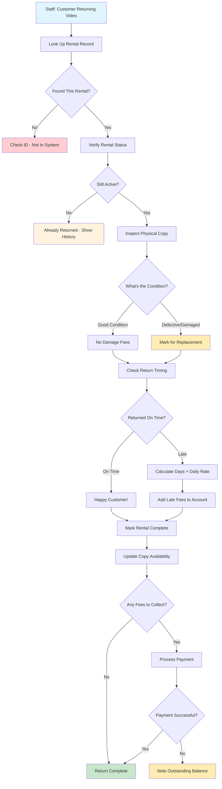

# Learning Return Processing - Completing the Business Cycle

## Why Return Processing Is Educational Gold

Returns teach you about **state transitions** and **business rule complexity**. What seems simple ("customer brings video back") actually involves multiple business decisions that affect customer satisfaction and business profitability.

**What You'll Learn**: Conditional logic based on business rules, fee calculations, inventory management, and how to handle the "end" of a business transaction gracefully.

## The Business Reality of Returns

A customer returns a video. Your staff needs to:

- Is this actually a rental we have on file?
- What condition is the video copy in?
- Is this return late? If so, how much do they owe?
- How do we update our inventory accurately?
- Should we charge additional fees?

**The Goal**: Complete the rental transaction fairly - customer returns their video, pays any applicable fees, and the video becomes available for the next customer.

## Essential Business Rules (Return Logic)

These rules balance customer satisfaction with business protection:

- **Staff-Only Processing**: Returns processed during business hours by authorized staff (prevents self-service conflicts)
- **Automatic Late Fee Calculation**: Late fees calculated automatically based on overdue days (no manual math errors)
- **Condition Assessment**: Copy condition inspected and recorded (Good or Defective only - keep it simple)
- **Immediate Inventory Updates**: Defective copies removed from circulation immediately (prevent customer dissatisfaction)
- **Real-Time Availability**: Returns update inventory status instantly (next customer can rent immediately)
- **Account Balance Updates**: Customer accounts updated with return completion status (clear financial records)
- **Management Flexibility**: Staff can override late fees with manager approval (customer service wins)

## The Return Processing Journey - Business Logic in Action

**Learning Focus**: Watch how business rules create conditional paths. Each decision point reflects real business policies that protect both customers and the store.

### Business Decision Points Explained

1. **Rental Verification**: Can't process returns for rentals that don't exist or are already complete
2. **Condition Assessment**: Physical inspection determines whether copy stays in circulation
3. **Time-Based Fees**: Late fees calculated automatically - removes human error and bias
4. **Immediate Updates**: Inventory status changes instantly so next customer sees accurate availability
5. **Flexible Payment**: Outstanding balances can be noted for later collection (customer service flexibility)

## API Design for Return Processing

These endpoints reflect how staff actually process returns:

| Staff Action                  | API Endpoint                    | What This Teaches About Business APIs          |
| ----------------------------- | ------------------------------- | ---------------------------------------------- |
| "Process this return"         | `POST /api/rentals/{id}/return` | Single endpoint for complete business process  |
| "Update condition assessment" | `PUT /api/rentals/{id}/inspect` | Separate endpoint for detailed inspection      |
| "Calculate fees"              | `GET /api/rentals/{id}/fees`    | Business calculations as explicit capabilities |
| "Print receipt"               | `GET /api/rentals/{id}/receipt` | Business documents as first-class endpoints    |

**DDD Learning**: APIs should match staff workflows, not database table operations.

## What Makes Return Processing Special

- **Physical World Integration**: Copy condition assessment bridges digital and physical inventory
- **Automatic Fee Calculation**: Late fees computed by business rules, not manual calculation
- **Real-Time Inventory**: Return processing immediately updates availability for other customers
- **Payment Flexibility**: Can handle immediate payment or note outstanding balances
- **Staff-Friendly Interface**: Override capabilities with proper authorization

## How Returns Connect to Your Business System

Understanding these connections shows you how business processes integrate:

- **Completes Rental Lifecycle**: Return processing marks the end of successful rental transactions
- **Updates Inventory Reality**: Copy condition and availability changes affect future rental capabilities
- **Drives Payment Processing**: Late fees and damage charges create payment obligations
- **Informs Customer Service**: Complete rental history helps with customer questions and disputes
- **Supports Business Analytics**: Return patterns inform inventory decisions and policy adjustments

## Learning from Return Complications

**Why Complex Returns Teach Important Patterns**: Edge cases in returns reveal how robust business logic works.

- **Validation Issues**: "Rental ID not found - please verify the rental number"
- **Status Problems**: "This rental was already processed on [date] - showing previous return details"
- **Payment Challenges**: "Late fees calculated but payment declined - noting outstanding balance"
- **System Recovery**: Transaction rollback when database updates fail during return processing

**Learning Point**: Good return processing handles edge cases gracefully while maintaining data integrity and customer service quality.
