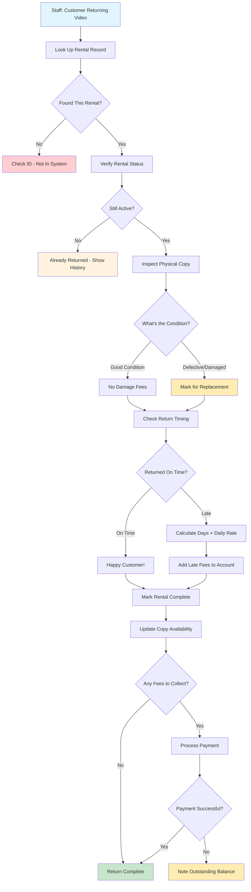

# Return Processing Workflow: Completing the Rental Cycle

## Educational Value of Understanding Return Processing

The return processing workflow is highly instructive for understanding **state transitions** and the **complexity of business rules** in a real-world scenario. What might appear as a simple action—a customer returning a video—actually encompasses multiple business decisions that significantly impact customer satisfaction, inventory accuracy, and business profitability.

**Key Learning Outcomes**: This document will help you grasp conditional logic driven by business rules, methods for fee calculation (e.g., late fees), inventory management practices during returns, and how to gracefully conclude a business transaction.

## The Business Reality of Processing Returns

When a customer returns a video, staff members must address several key questions:

- Is this an active, valid rental currently on file in our system?
- What is the physical condition of the returned video copy?
- Is the video being returned late? If so, what are the applicable overdue fees?
- How should our inventory records be updated to reflect this return accurately?
- Are there any additional fees (e.g., for damage) that need to be assessed?

**Primary Goal**: To complete the rental transaction in a fair and efficient manner. This means the customer successfully returns their video, pays any applicable fees, and the video is processed to become available for the next rental, or is appropriately handled if damaged.

## Essential Business Rules for Return Logic

These rules are designed to balance customer satisfaction with the protection of business assets and revenue:

- **Staff-Mediated Processing**: Returns must be processed by authorized staff members during business hours. This prevents potential conflicts or errors that might arise from self-service return systems.
- **Automated Late Fee Calculation**: Late fees should be calculated automatically based on the number of overdue days and predefined rates, eliminating manual calculation errors and ensuring consistency.
- **Condition Assessment Protocol**: The condition of the returned video copy must be inspected and recorded (e.g., Good, Defective). A simple, clear classification is preferred.
- **Immediate Inventory Updates for Defective Items**: Copies identified as defective or damaged must be immediately removed from the rentable circulation to prevent dissatisfaction for subsequent customers.
- **Real-Time Inventory Availability Updates**: Successful returns should instantly update the inventory status, making the video available for the next customer without delay.
- **Account Balance Reconciliation**: Customer accounts must be updated promptly to reflect the completion of the return and any associated financial transactions (e.g., late fees paid or pending).
- **Management Override Capability**: Authorized staff (e.g., managers) should have the flexibility to override or waive late fees in specific situations to enhance customer service.

## The Return Processing Journey: Business Logic in Action

**Learning Focus**: Observe how specific business rules create conditional pathways within the workflow. Each decision point reflects established business policies designed to protect both the customer and the store's interests.

### Key Business Decision Points Explained

1. **Rental Verification**: The system must confirm that the rental exists and is currently active before processing a return. Returns for non-existent or already completed rentals cannot be processed.
2. **Condition Assessment**: A physical inspection of the returned item determines whether the copy can be returned to circulation or requires replacement/repair.
3. **Time-Based Fee Calculation**: Late fees are calculated automatically based on predefined rules, which removes the potential for human error or subjective bias.
4. **Immediate Inventory Updates**: The status of the returned item in the inventory system is changed instantly to ensure that availability information for other customers is accurate.
5. **Flexible Payment Handling**: The system should allow for immediate collection of outstanding fees or, if necessary, note an outstanding balance on the customer's account for later collection, providing customer service flexibility.

## API Design for Return Processing Workflow

The API endpoints should mirror the actions and information needs of staff members processing returns:

| Staff Action                                      | API Endpoint                    | DDD Insight: What This Teaches About Business APIs                                            |
| ------------------------------------------------- | ------------------------------- | --------------------------------------------------------------------------------------------- |
| "Process this video return."                      | `POST /api/rentals/{id}/return` | A single endpoint can represent a complete, multi-step business process.                      |
| "Update the condition assessment for this item."  | `PUT /api/rentals/{id}/inspect` | A separate endpoint can be dedicated to a detailed sub-process like item inspection.          |
| "Calculate any outstanding fees for this rental." | `GET /api/rentals/{id}/fees`    | Business calculations (e.g., fee computation) can be exposed as explicit capabilities.        |
| "Print a receipt for this return transaction."    | `GET /api/rentals/{id}/receipt` | Generation of business documents (like receipts) can be treated as first-class API endpoints. |

**DDD Learning**: APIs should be designed to align with staff workflows and business language, rather than directly exposing underlying database table structures or operations.

## Distinguishing Features of Return Processing

- **Physical-Digital Integration**: The assessment of a returned copy's physical condition bridges the gap between digital records and tangible inventory.
- **Automated Fee Calculation**: Late fees are computed systematically based on business rules, ensuring fairness and accuracy, rather than relying on manual calculations.
- **Real-Time Inventory Synchronization**: Return processing immediately updates inventory availability, benefiting other customers seeking to rent items.
- **Payment Flexibility**: The system can accommodate immediate payment of fees or allow for outstanding balances to be noted and managed.
- **Staff-Friendly Interface with Authorization**: The system should provide override capabilities for authorized personnel (e.g., waiving fees), enhancing operational flexibility.

## System-Wide Connections of the Return Process

Understanding these interconnections demonstrates how various business processes integrate within a cohesive system:

- **Completes the Rental Lifecycle**: Return processing marks the successful conclusion of a rental transaction.
- **Updates Inventory Reality**: Changes in copy condition and availability directly impact future rental capabilities and inventory management decisions.
- **Drives Payment Processing**: The assessment of late fees or damage charges can create new payment obligations for the customer.
- **Informs Customer Service Operations**: A complete and accurate rental history, including return details, is crucial for addressing customer inquiries and resolving potential disputes.
- **Supports Business Analytics**: Data from return patterns (e.g., frequency of late returns, common damages) can inform inventory stocking decisions and policy adjustments.

## Learning from Complications in Return Processing

**Why Complex Return Scenarios Offer Important Design Patterns**: Handling edge cases and exceptions in the return process reveals the robustness and sophistication of the underlying business logic.

- **Validation Issues**: Example: "Rental ID not found. Please verify the rental number and try again."
- **Status Inconsistencies**: Example: "This rental was already processed on [Date]. Displaying previous return details for your reference."
- **Payment Challenges**: Example: "Late fees have been calculated, but the payment was declined. The outstanding balance has been noted on the account."
- **System Recovery Needs**: In the event of database update failures or other system errors during return processing, transactional rollbacks are necessary to maintain data integrity.

**Learning Point**: Effective return processing logic handles common scenarios efficiently and edge cases gracefully, all while maintaining data integrity and upholding a high standard of customer service.
