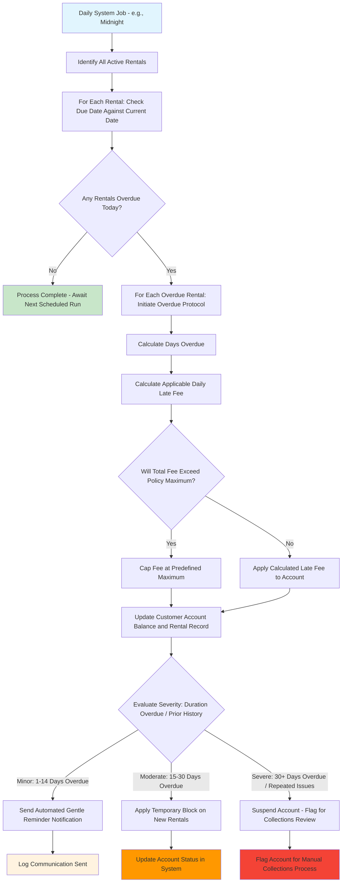

# Overdue Management Workflow: Automating Business Processes

## Significance of Overdue Management in Business Automation

Overdue management serves as an excellent case study for understanding **business process automation** and **batch processing**. It illustrates how businesses leverage software to handle routine operational tasks consistently, fairly, and with minimal manual intervention.

**Key Learning Outcomes**: This document will explore scheduled business processes, automated customer notifications, the enforcement of business rules in an automated context, and the design principles for systems that operate autonomously.

## The Business Challenge of Managing Overdue Rentals

Video rental businesses must efficiently track and manage overdue items without overburdening staff with manual, repetitive tasks. Key considerations include:

- Identifying which rentals are currently overdue on any given day.
- Determining the duration for which each item has been overdue.
- Calculating and applying appropriate late fees according to business policy.
- Notifying customers about overdue items and outstanding fees in a timely and appropriate manner.
- Deciding when and how to restrict accounts for repeated or egregious violations of rental policies.

**Primary Goal**: To implement an automated system for managing overdue rentals that is fair to customers, significantly reduces staff workload, and effectively protects the business's financial interests and inventory.

## Essential Business Rules for Automated Overdue Logic

These rules ensure consistent and fair treatment for all customers while safeguarding business assets:

- **Daily Automated Processing**: The system should automatically run a detection process every business day to identify overdue items, ensuring consistent enforcement.
- **Graduated Late Fee Structure**: Late fees should be calculated based on a predefined, graduated scale, potentially with configurable caps to prevent excessive or unreasonable penalties.
- **Automated Account Status Management**: The system should implement progressive changes to account statuses (e.g., warnings, temporary rental blocks, suspension) based on the severity and history of overdue items, thereby protecting business assets.
- **Automated Customer Communication**: Automated email or SMS notifications should be sent to customers at various stages of the overdue process to keep them informed.
- **Staff Support Tools**: The system should provide reports and management interfaces for staff to review overdue accounts, handle exceptions, and support customer service inquiries.
- **Comprehensive Fee Calculation History**: A complete audit trail of all assessed late fees must be maintained for transparency, dispute resolution, and compliance purposes.

## The Automated Overdue Processing Journey: Business Rules Operating Autonomously

**Learning Focus**: This workflow demonstrates how business automation can reduce human error and ensure consistent application of policies, even operating unattended (e.g., overnight batch jobs).

### Key Lessons from Business Automation

1. **Consistency in Timing and Execution**: Daily (or other regularly scheduled) processing ensures that no overdue rentals are missed or handled inconsistently.
2. **Fair and Objective Fee Calculation**: Automated calculations based on defined rules eliminate human bias, errors, or subjective interpretations in fee assessment.
3. **Progressive and Graduated Enforcement**: Implementing a series of graduated responses (warnings, then restrictions, then suspension) gives customers opportunities to rectify the situation before more severe penalties are applied.
4. **Adherence to Business Policy Limits**: Enforcing maximum fee caps protects customers from excessive penalties and aligns with fair business practices.
5. **Maintenance of a Complete Audit Trail**: Logging every automated action, fee calculation, and notification provides essential transparency for dispute resolution and compliance.

## API Design for Supporting Automated and Manual Overdue Operations

Effective API design should support both the automated overdue processes and the necessary staff oversight and intervention capabilities:

| Business Need                                            | API Endpoint                    | DDD Insight: What This Teaches About Automation APIs                                      |
| -------------------------------------------------------- | ------------------------------- | ----------------------------------------------------------------------------------------- |
| "Show me a list of all currently overdue rentals."       | `GET /rentals/overdue`          | APIs should provide query capabilities essential for business reporting and oversight.    |
| "Manually trigger the daily overdue processing job now." | `POST /rentals/overdue/process` | Exposing a manual trigger for automated processes can be useful for testing or recovery.  |
| "What are the total outstanding fees for this customer?" | `GET /customers/{id}/overdue`   | APIs should support customer-specific queries that consolidate relevant business data.    |
| "Adjust or waive a specific late fee for this rental."   | `PATCH /rentals/{id}/fees`      | Staff override capabilities, with proper authorization and auditing, are often necessary. |

**DDD Learning**: Even fully automated processes require well-designed APIs to support human oversight, manual intervention (when authorized), and integration with other business systems.

## Distinguishing Features of Overdue Management

- **Business Consistency and Fairness**: All customers are treated uniformly according to predefined business policies, ensuring equitable application of rules.
- **Graduated Response Mechanism**: Progressive enforcement actions provide customers with multiple opportunities to address overdue items before facing more significant consequences.
- **Staff Support and Efficiency**: Automation significantly reduces manual workload for staff, while still providing them with tools for oversight and exception handling.
- **Proactive Customer Communication**: Automated notifications keep customers informed about their account status and overdue items, often preventing further escalation.
- **Business Asset Protection**: Automated account restrictions and flagging for collections help prevent further losses from chronically delinquent accounts.

## System-Wide Connections of Overdue Management

Understanding these integration points reveals how automated processes like overdue management fit into the broader business ecosystem:

- **Drives Payment Processing**: Assessed late fees become payment obligations that need to be processed through the payment system.
- **Controls Rental Creation Eligibility**: A customer's overdue status can automatically block their ability to create new rentals until outstanding issues are resolved.
- **Supports Customer Service Operations**: A complete history of overdue items and communications helps staff assist customers effectively with inquiries or disputes.
- **Informs Business Policy and Decisions**: Analyzing patterns in overdue rentals can help optimize rental policies, fee structures, and even inventory decisions.
- **Maintains Data Integrity and Consistency**: Automated processing ensures the consistent application of business rules to all relevant records.

## Learning from Challenges in Automation

**Why Addressing Edge Cases in Automation is Crucial**: Automated systems must be designed to handle unusual situations and potential failure points gracefully and transparently.

- **Processing Failures**: What is the contingency plan if a scheduled daily job fails to run (e.g., due to server issues)? This might involve backup processing triggers, alerts to technical staff, and clear error logging.
- **Communication Delivery Issues**: Email or SMS delivery failures should not prevent the system from correctly calculating fees or updating account statuses. These are often separate concerns.
- **Status Conflicts and Race Conditions**: How does the system handle scenarios where a customer makes a payment or returns an item while an overdue processing job is running? Transaction coordination and locking mechanisms might be needed.
- **Policy Evolution and Changes**: When business policies (e.g., fee structures) change, how does the system handle existing overdue items? Clear rules for transitioning or grandfathering may be required.

**Learning Point**: Robust business automation not only handles common cases efficiently but also anticipates and manages edge cases transparently. It maintains the integrity of business rules and provides clear audit trails for accountability and troubleshooting.
