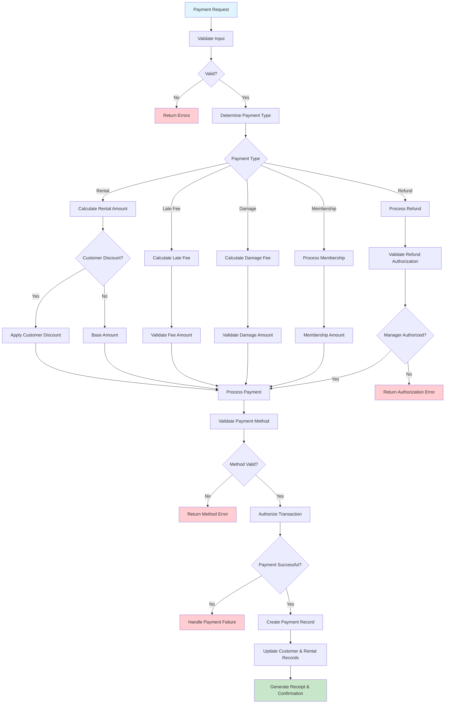

# Payment Processing Workflow: Integrating Business Rules and Financial Transactions

## Why Payment Processing Is Essential for Understanding Domain-Driven Design

Payment processing is a critical domain that combines the enforcement of **business rules** with the integration of **external systems**. This workflow illustrates how Domain-Driven Design (DDD) effectively manages the complexities inherent in real-world financial transactions, ensuring that the core business logic remains clear and maintainable.

**Key Learnings**: This document explores the handling of multiple payment methods, the automation of business rules (such as applying discounts), the intricacies of external system integration, and best practices for secure monetary transactions within software applications.

## The Business Reality of Payments

Financial transactions are a cornerstone of business operations. Every payment involves several considerations:

- What is the nature of this payment (e.g., rental fee, late fee, damage charge, refund)?
- Which payment method does the customer prefer to use?
- Are there any automatic discounts applicable to this transaction?
- How can the payment be authorized and processed securely?
- What is the contingency plan if a payment attempt fails?
- How are partial payments or refunds managed?

**Objective**: To process payments with accuracy and security, fostering customer confidence and providing robust support for staff.

## Essential Business Rules for Financial Transactions

These rules are designed to protect the interests of both the business and its customers:

- **Precision in Processing**: Payments must be processed for the exact, calculated amounts to prevent rounding errors.
- **Flexible Payment Options**: Support for various payment methods, including cash, credit/debit cards, checks, and gift cards, to accommodate customer preferences.
- **Automated Discount Application**: Customer discounts are applied automatically prior to payment processing, ensuring consistency and preventing omissions.
- **Robust Failure Handling**: Implementation of retry mechanisms or the option to use alternative payment methods in case of payment failure, to mitigate lost sales.
- **Authorization Controls**: Refunds exceeding a predefined threshold necessitate manager approval to prevent fraud.
- **Comprehensive Audit Trails**: A complete history of all payment transactions is maintained for accounting, customer service, compliance, and transparency.

## Workflow Diagram

## The Payment Processing Journey: Where Business Logic Meets Financial Operations

Understanding the payment processing lifecycle reveals the inherent complexities of managing financial transactions in software:

1. **Establish Business Context**: Determine the type of payment (e.g., rental fee, late fee, damage charge, refund).
2. **Apply Customer Benefits**: Ascertain if any automatic discounts are applicable.
3. **Enforce Authorization Logic**: Ensure that significant refunds receive managerial approval, safeguarding business interests.
4. **Provide Payment Method Flexibility**: Allow customers to choose their preferred payment method (e.g., cash, card, check, gift card).
5. **Ensure Secure Processing**: Authorize and process payments through secure channels.
6. **Maintain Comprehensive Records**: Keep a detailed payment history for accounting and customer service purposes.
7. **Confirm Transaction with Customer**: Generate a receipt to provide customer assurance.

**Key Business Decision Points**:

- **Discount Application**: Discounts are applied automatically before payment processing. This ensures that staff do not overlook them and that customers receive their entitled benefits.
- **Manager Authorization for Refunds**: Refunds exceeding a specified amount (e.g., $50) require managerial approval. This rule serves as a fraud prevention measure and protects business assets.
- **Flexible Payment Methods**: Offering multiple payment options enhances customer satisfaction and helps maintain a steady flow of sales.
- **Failed Payment Recovery Strategies**: In the event of a payment failure, the system should suggest alternative payment methods or retry options to prevent the loss of a sale.

## Critical Learning Points from Payment Processing

**Secure Financial Data Handling**: Payment processing underscores the importance of data accuracy, robust security measures, and comprehensive audit trails—skills that are indispensable for any application dealing with financial data.

**The Role of Business Rules in Financial Transactions**: Observe how business rules are strategically implemented to safeguard business interests (e.g., through authorization thresholds for refunds) while simultaneously protecting customer rights and enhancing their experience (e.g., via automatic discounts and receipt generation).

**Integrating External Financial Systems**: This workflow demonstrates how Domain-Driven Design facilitates the integration of external services, such as payment gateways, while maintaining a clean, testable, and well-defined core business logic.

## How the API Design Supports Payment Business Logic

The API design is a direct reflection of the business requirements and logic governing payment processing:

| Method | Endpoint                   | Business Purpose                                         | DDD Insight                                       |
| ------ | -------------------------- | -------------------------------------------------------- | ------------------------------------------------- |
| POST   | `/payments`                | Process any type of payment transaction                  | Business capability: "Handle Payment"             |
| GET    | `/payments/{id}`           | Retrieve payment details for disputes or inquiries       | Business query: "Show Payment Details"            |
| GET    | `/customers/{id}/payments` | Access a customer's payment history for service          | Business relationship: "Customer Payment History" |
| POST   | `/payments/{id}/refund`    | Process a refund according to established business rules | Business operation: "Issue Refund"                |

**API Design Principle**: A key design insight is that API endpoints should represent distinct business capabilities (e.g., "Handle Payment," "Issue Refund") rather than being simple CRUD operations on database tables. This approach ensures that the API is aligned with business processes and driven by domain requirements.

## Business System Connectivity and Dependencies

Payment processing is an integral capability that interconnects with various other business systems and workflows:

- **Integration with Rental Creation**: Payments are the final step in completing rental transactions, signifying business event completion.
- **Support for Customer Service**: Access to payment history is crucial for customer service representatives to efficiently resolve inquiries and disputes.
- **Linkage with Return Processing**: Refunds are often initiated during the return process, particularly for damaged items, ensuring fairness to the customer.
- **Connection to Overdue Management**: The payment system is utilized for collecting late fees, automating a key aspect of overdue account management.

**Architectural Significance**: This interconnectedness highlights payment processing as a central and critical business capability upon which numerous other workflows and processes depend.

## Learning from Payment Failures: Business and System Implications

Analyzing payment failures provides valuable insights and lessons for business improvement:

- **Enhancing Customer Experience**: A failed payment should not terminate the customer interaction; instead, the system should offer alternative solutions or assistance.
- **Ensuring Business Continuity**: Supporting multiple payment methods is essential for maintaining sales flow, especially if one method encounters issues.
- **Empowering Staff**: Clear and informative error messages enable staff to effectively assist customers experiencing payment difficulties.
- **Building System Resilience**: Payment systems must be designed to gracefully handle failures in external services (e.g., payment gateways) to minimize disruption.

**Guiding Business Principle**: In instances of technological failure, established business rules should empower staff to provide superior customer service rather than creating additional obstacles.
