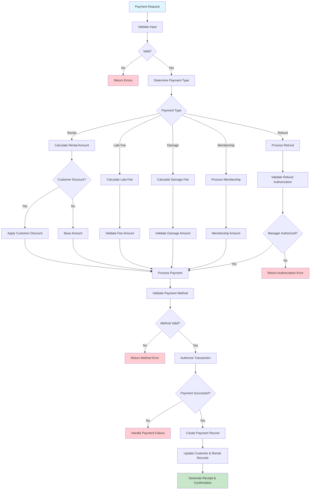

# Learning Payment Processing - Where Business Meets Money

## Why Payment Processing Is Essential Learning

Payment processing combines **business rules** with **external systems** integration. It teaches you how Domain-Driven Design handles the complexity of real-world financial transactions while keeping business logic clear.

**What You'll Learn**: Multiple payment methods, business rule automation (discounts), external system integration, and how to handle money safely in software.

## The Business Reality of Payments

Money is serious business. Every payment involves:

- What type of payment is this? (rental fee, late fee, damage charge, refund)
- What payment method does the customer want to use?
- Are there automatic discounts that should apply?
- How do we authorize and process the payment securely?
- What happens if the payment fails?
- How do we handle partial payments or refunds?

**The Goal**: Process payments accurately, securely, and in a way that makes customers feel confident and staff feel supported.

## Essential Business Rules (Money Logic)

These rules protect both the business and customers:

- **Exact Amount Processing**: Payments processed for precisely calculated amounts (no rounding errors)
- **Multiple Payment Methods**: Cash, credit/debit cards, checks, gift cards (customer choice)
- **Automatic Customer Discounts**: Applied before payment processing (no manual discounts to forget)
- **Failed Payment Recovery**: Retry capability or alternative payment methods (don't lose sales)
- **Manager Authorization**: Refunds over threshold require approval (fraud protection)
- **Complete Payment History**: Full audit trail maintained for accounting and customer service (compliance and transparency)

## Workflow Diagram

## The Payment Processing Journey - Business Logic Meets Money

Following how payments work shows you the complexity of handling money in software:

1. **Business Context First** - What type of payment is this? (rental fee, late fee, damage charge, refund)
2. **Customer Benefits** - Are there automatic discounts that should apply?
3. **Authorization Logic** - Large refunds need manager approval (business protection)
4. **Payment Method Flexibility** - Customer chooses how to pay (cash, card, check, gift card)
5. **Secure Processing** - Authorization and processing happen safely
6. **Complete Records** - Payment history maintained for accounting and customer service
7. **Customer Confirmation** - Receipt generated for customer confidence

**Business Decision Points Explained**:

- **Discount Application**: Happens automatically before payment (staff don't forget, customers get benefits)
- **Manager Authorization**: Refunds over $50 need approval (prevents fraud, protects business)
- **Payment Method Choice**: Multiple options keep customers happy and sales flowing
- **Failed Payment Recovery**: System suggests alternatives rather than losing the sale

## Critical Learning Points

**Money Safety in Software**: Processing payments teaches you about data accuracy, security, and audit trails - essential skills for any business application.

**Business Rules Around Money**: Notice how the rules protect both the business (authorization thresholds) and customers (automatic discounts, receipt generation).

**External System Integration**: Payment processing shows how Domain-Driven Design handles external services (payment gateways) while keeping business logic clean and testable.

## How the API Supports Payment Business Logic

The API design reflects business thinking about payments:

| Method | Endpoint                   | Business Purpose                        | DDD Insight                                       |
| ------ | -------------------------- | --------------------------------------- | ------------------------------------------------- |
| POST   | `/payments`                | Process any type of payment transaction | Business capability: "Handle Payment"             |
| GET    | `/payments/{id}`           | Retrieve payment details for disputes   | Business query: "Show Payment Details"            |
| GET    | `/customers/{id}/payments` | Customer payment history for service    | Business relationship: "Customer Payment History" |
| POST   | `/payments/{id}/refund`    | Process refund with business rules      | Business operation: "Issue Refund"                |

**Design Insight**: Notice how endpoints represent business capabilities, not database operations. The business drives the API design.

## Business System Connectivity

Payment processing connects across the entire business:

- **With Rental Creation**: Payments complete rental transactions (business completion)
- **With Customer Service**: Payment history helps resolve customer issues (service enablement)
- **With Returns**: Refunds happen when customers return damaged items (business fairness)
- **With Overdue Management**: Late fees collected through payment system (business automation)

**Architecture Lesson**: See how payment processing serves as a central business capability that other workflows depend on.

## Learning from Payment Failures

Payment failures teach important business lessons:

- **Customer Experience**: Failed payments shouldn't end the conversation - offer alternatives
- **Business Continuity**: Multiple payment methods keep sales flowing
- **Staff Support**: Clear error messages help staff assist customers
- **System Reliability**: Payment systems need to handle external service failures gracefully

**Business Rule**: When technology fails, business rules should help staff serve customers better, not create barriers.
