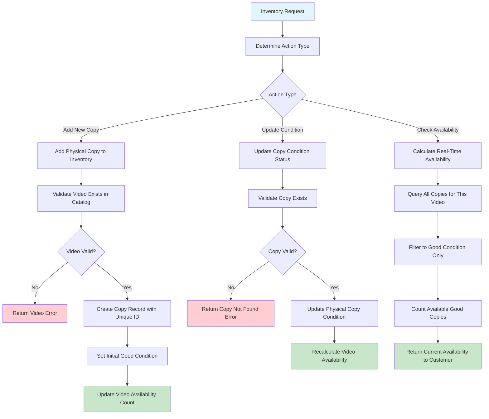

# Learning Inventory Management - Tracking Every Physical Copy

## Why Inventory Management Is Essential Learning

Inventory management bridges the gap between **what you offer** (catalog) and **what you actually have** (physical copies). It teaches you how Domain-Driven Design handles the complexity of tracking individual items while maintaining business-level information.

**What You'll Learn**: Individual item tracking, condition management, real-time availability calculations, and how physical inventory drives customer-facing features.

## The Business Reality of Physical Inventory

Every video in your catalog might have multiple physical copies, and each copy has its own story:

- Which specific copy of "The Matrix" is this? (individual tracking)
- What condition is this copy in? (Good, Defective)
- Can this copy be rented today? (availability logic)
- When was this copy last inspected? (maintenance tracking)
- Should this copy be retired? (business lifecycle)

**The Goal**: Track every physical copy accurately so customers always get good-condition videos and availability information is always current.

## Essential Business Rules (Physical Asset Logic)

These rules protect both the business and customer experience:

- **Individual Copy Tracking**: Every physical copy has unique identifier (no mix-ups)
- **Condition Classification**: Copies are either Good (rentable) or Defective (not rentable)
- **Available = Good Condition**: Only good-condition copies count toward customer availability
- **Immediate Defective Removal**: Damaged copies removed from rental pool instantly (customer satisfaction)
- **Real-Time Calculations**: Availability reflects current condition status (accurate promises to customers)
- **Complete Copy History**: Track condition changes for maintenance patterns (business intelligence)

## The Inventory Management Journey - Every Copy Matters

Following how inventory management works teaches you about individual asset tracking within business systems:

## Business Decision Points Explained

Understanding inventory management decisions teaches you about physical asset tracking:

- **Individual Copy Tracking**: Each physical copy gets unique identifier (prevents mix-ups, enables specific copy histories)
- **Good vs Defective**: Simple condition classification that directly impacts customer experience
- **Immediate Availability Impact**: Condition changes instantly affect what customers can rent
- **Real-Time Calculations**: System always knows exactly how many good copies are available

## Critical Learning Points

**Physical vs. Logical Assets**: Inventory management teaches the important distinction between what you offer (videos in catalog) and what you actually have (physical copies).

**Condition-Based Business Logic**: Notice how condition directly drives business rules - only good copies count as available inventory.

**Real-Time Business Intelligence**: Availability calculations demonstrate how Domain-Driven Design keeps business information current and accurate.

## How the API Supports Physical Inventory Logic

The API design reflects business thinking about physical asset management:

| Method | Endpoint                         | Business Purpose                       | DDD Insight                                      |
| ------ | -------------------------------- | -------------------------------------- | ------------------------------------------------ |
| POST   | `/inventory`                     | Add new physical copy to stock         | Business capability: "Expand Physical Inventory" |
| PATCH  | `/inventory/{copyId}`            | Update copy condition after inspection | Business operation: "Maintain Copy Quality"      |
| GET    | `/inventory/video/{videoId}`     | List all copies for a video            | Business query: "Show Physical Stock"            |
| GET    | `/videos/{videoId}/availability` | Check current customer availability    | Business capability: "Promise Availability"      |

**Design Insight**: Notice how endpoints separate physical copy management from customer-facing availability - different business concerns require different operations.

## Business System Connectivity

Inventory management connects physical reality to customer experience:

- **With Video Catalog**: Provides real-time availability for customer-facing catalog (accurate promises)
- **With Rental Creation**: Ensures only good copies get rented to customers (quality assurance)
- **With Return Processing**: Updates copy condition after customer returns (quality control)
- **With Maintenance Operations**: Tracks which copies need repair or replacement (asset lifecycle)

**Architecture Lesson**: See how inventory management serves as the bridge between physical operations and customer-facing business functions.

## Learning from Physical Asset Management

Inventory management teaches essential business software lessons:

- **Individual vs. Aggregate**: Managing individual items while providing aggregate information (copies vs. availability)
- **Condition Impact**: How physical condition directly affects business capabilities
- **Real-Time Accuracy**: Keeping business promises (availability) aligned with physical reality
- **Quality Control**: How condition tracking protects customer experience and business reputation

**Business Rule**: Physical reality always wins - software must accurately reflect what's actually available to customers.
