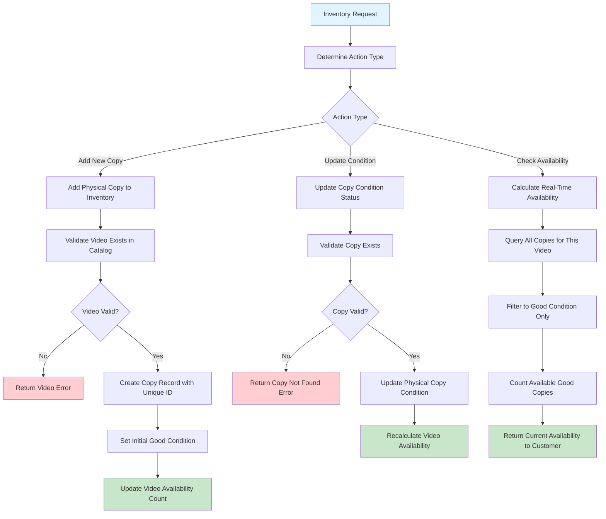

# Inventory Management Workflow: Tracking Individual Physical Assets

## The Importance of Inventory Management in Domain-Driven Design

Inventory management is a crucial domain that bridges the conceptual offering (the video catalog) with the tangible reality (physical copies of videos). This workflow demonstrates how Domain-Driven Design (DDD) effectively addresses the complexities of tracking individual items while simultaneously maintaining accurate, business-level information about stock and availability.

**Key Learnings**: This document explores the principles of individual item tracking, managing item conditions, performing real-time availability calculations, and understanding how physical inventory status directly influences customer-facing features and business decisions.

## The Business Reality of Physical Inventory

Each title in the video catalog can correspond to multiple physical copies, and every individual copy has a unique lifecycle and set of attributes:

- What is the unique identifier for this specific copy of "The Matrix"? (ensuring individual tracking)
- What is the current condition of this copy (e.g., Good, Fair, Defective)?
- Is this particular copy currently available for rental?
- When was this copy last inspected or serviced? (maintenance and quality control)
- Based on its condition or age, should this copy be retired from circulation? (asset lifecycle management)

**Objective**: To accurately track every physical copy, ensuring that customers consistently receive videos in good condition and that availability information is always up-to-date and reliable.

## Essential Business Rules for Physical Asset Management

These rules are fundamental to protecting business assets and ensuring a positive customer experience:

- **Unique Identification of Copies**: Every physical copy must possess a unique identifier to prevent mix-ups and enable precise tracking.
- **Condition Classification**: Copies are categorized by their condition (e.g., Good, Defective), which directly determines their rentability.
- **Availability Based on Condition**: Only copies classified as being in "Good" condition are considered available for rental by customers.
- **Immediate Removal of Defective Items**: Copies identified as damaged or defective are promptly removed from the rentable pool to maintain customer satisfaction and quality standards.
- **Real-Time Availability Updates**: The system must reflect the current condition status of all copies in real-time to provide accurate availability information to customers.
- **Comprehensive Copy History**: A detailed history of condition changes and maintenance activities is tracked for each copy, providing valuable business intelligence for maintenance patterns and lifecycle management.

## The Inventory Management Journey: Every Copy Matters

Understanding the inventory management workflow highlights the critical aspects of tracking individual physical assets within a broader business system:

## Key Business Decision Points in Inventory Management

Examining the decision points within inventory management provides insights into effective physical asset tracking:

- **Individual Copy Tracking**: Assigning a unique identifier to each physical copy is crucial. This practice prevents confusion, enables the maintenance of specific histories for each copy, and supports detailed auditing.
- **Condition States (Good vs. Defective)**: A clear and simple condition classification system directly impacts the customer experience. Only items in "Good" condition should be available for rent.
- **Immediate Impact of Condition Changes on Availability**: Any change in a copy's condition (e.g., from "Good" to "Defective" after a return inspection) must instantly update its availability status, ensuring customers are only offered rentable items.
- **Real-Time Availability Calculations**: The system must always possess an accurate, real-time count of available "Good" condition copies for each video title.

## Critical Learning Points from Inventory Management

**Distinction Between Physical and Logical Assets**: Inventory management clearly illustrates the vital difference between the conceptual offerings (videos listed in the catalog) and the actual, physical items in stock (individual copies).

**Condition-Driven Business Logic**: A key takeaway is how an item's physical condition directly dictates business rules and processes—most notably, only copies in good condition are considered part of the available inventory for customers.

**Real-Time Business Intelligence for Accurate Operations**: The calculation and reporting of availability demonstrate how Domain-Driven Design helps maintain current and precise business information, which is essential for operational efficiency and customer trust.

## How the API Design Supports Physical Inventory Logic

The API design for inventory management reflects the specific business requirements and thinking related to physical asset management:

| Method | Endpoint                         | Business Purpose                                         | DDD Insight                                         |
| ------ | -------------------------------- | -------------------------------------------------------- | --------------------------------------------------- |
| POST   | `/inventory`                     | Add a new physical copy to the existing stock            | Business capability: "Expand Physical Inventory"    |
| PATCH  | `/inventory/{copyId}`            | Update the condition of a specific copy after inspection | Business operation: "Maintain Copy Quality"         |
| GET    | `/inventory/video/{videoId}`     | List all physical copies associated with a video title   | Business query: "Show Physical Stock Details"       |
| GET    | `/videos/{videoId}/availability` | Check the current customer-facing availability           | Business capability: "Provide Availability Promise" |

**API Design Principle**: It's important to note how the API endpoints differentiate between the management of individual physical copies (e.g., updating condition) and the customer-facing concern of availability. These distinct business concerns necessitate separate, specialized operations and endpoints.

## Business System Connectivity and Dependencies

Inventory management acts as a critical link, connecting the physical reality of stock with the customer's experience and other business processes:

- **Integration with Video Catalog**: Provides real-time availability data that is displayed in the customer-facing catalog, ensuring that promises made to customers are accurate.
- **Linkage with Rental Creation**: Ensures that only copies in good condition are assigned and rented to customers, upholding quality assurance standards.
- **Connection to Return Processing**: The condition of a returned copy is updated during return processing, forming a crucial part of quality control.
- **Support for Maintenance Operations**: Tracks which specific copies require repair, refurbishment, or retirement, facilitating effective asset lifecycle management.

**Architectural Significance**: This interconnectedness highlights inventory management as a foundational capability that bridges physical operations with customer-facing business functions and information systems.

## Learning from Physical Asset Management: Key Takeaways

Effective inventory management imparts several essential lessons applicable to broader business software development:

- **Managing Individual Items vs. Aggregate Data**: The challenge and importance of managing individual, uniquely identifiable items while simultaneously providing accurate aggregate information (e.g., total available copies for a title versus details of each specific copy).
- **The Impact of Physical Condition**: Understanding how the physical state or condition of an asset directly influences business capabilities, availability, and customer satisfaction.
- **The Imperative of Real-Time Accuracy**: The necessity of keeping business promises (such as item availability) perfectly aligned with the actual physical reality of the inventory.
- **The Role of Quality Control**: Recognizing how meticulous condition tracking and management are vital for protecting the customer experience and maintaining the business's reputation for quality.

**Guiding Business Principle**: The physical reality of inventory is paramount. Software systems must accurately reflect what is actually available and in what condition, ensuring transparency and reliability for customers and internal operations alike.
