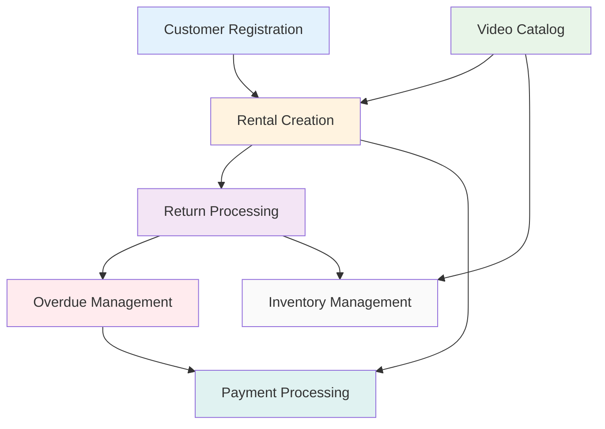

# Learning Business Workflows Through Domain-Driven Design

## Welcome to Your Workflow Learning Lab

Think of this as your guided tour through how a video rental business actually
operates! These aren't just technical diagrams - they're stories about real
business processes that happen every day in a rental store.

**What Makes This Educational**: Each workflow shows you both the "what"
(business operations) and the "how" (technical implementation), helping you
understand how Domain-Driven Design translates business knowledge into working
software.

**Learning Architecture**: We follow a simple **Customer/Staff → Business Logic
→ Data** pattern that mirrors how real businesses work.

## Your Business Process Learning Journey

### [🔗 Start Here: Workflow Interconnections](./00-workflow-interconnections.md)

**Understanding the Big Picture** - Before diving into individual processes,
see how everything connects:

- How business workflows depend on each other
- Where data flows between different operations
- How business rules get enforced across the system
- Why automated processes need careful coordination

_Learning Goal_: Understand that no business process exists in isolation -
they're all part of a larger system.

## Essential Business Operations - Learn by Following Real Scenarios

Each workflow teaches you something different about running a business through
software:

| Business Story                                                           | What You'll Learn                    | Key DDD Insights                                               |
| ------------------------------------------------------------------------ | ------------------------------------ | -------------------------------------------------------------- |
| [📝 Customer Registration](./01-customer-registration-workflow.md)       | How new customers join your business | Direct data modeling, validation, business rules               |
| [🎬 Video Catalog Management](./02-video-catalog-management-workflow.md) | Managing your inventory catalog      | Search capabilities, metadata, availability calculations       |
| [💰 Rental Creation](./03-rental-creation-workflow.md)                   | The money-making transaction         | Multi-step validation, discount logic, transaction integrity   |
| [📦 Return Processing](./04-return-processing-workflow.md)               | Completing the rental lifecycle      | Condition assessment, fee calculation, state transitions       |
| [⏰ Overdue Management](./05-overdue-management-workflow.md)             | Automated business housekeeping      | Background processing, notifications, business rule automation |
| [💳 Payment Processing](./06-payment-processing-workflow.md)             | How money moves through your system  | Payment methods, financial transactions, customer service      |
| [📋 Inventory Management](./07-inventory-management-workflow.md)         | Physical asset tracking              | Asset lifecycle, condition monitoring, reporting               |

## How Business Workflows Connect - Your System Architecture Lesson

Understanding workflow dependencies teaches you how to design systems that
mirror business reality:

**Why This Matters**: Notice how the rental creation sits at the center?
That's because it's the core business transaction - everything else supports
or extends it. This is a key DDD insight: identify your core domain and build
around it.

## What You'll Learn About Business Rules

### Understanding Customer Operations

- **Simple but Complete**: Customer registration demonstrates validation
  without over-engineering
- **Automatic Benefits**: Customer discounts show how business policies
  become code
- **Status Lifecycle**: Active → Suspended → Inactive teaches state
  management

### Mastering Transaction Logic

- **Smart Discounts**: Watch how customer benefits get applied automatically
  to rentals
- **Keep It Simple**: Good/Defective conditions - we avoid complexity that
  doesn't add business value
- **Money Flows**: Multiple payment types (Rental, Late Fee, Damage,
  Membership) with different business rules
- **Late Fees That Make Sense**: Daily accumulation based on rental rates,
  not arbitrary penalties

### Learning System Design

- **Real-Time Everything**: Live availability calculations, instant pricing
  updates
- **Validation Everywhere**: Input validation with clear, helpful error
  messages
- **No Broken States**: Every workflow includes rollback and error recovery
- **Business History**: Complete audit trails because compliance and customer
  service matter

## How We Simplified the Domain for Learning

### What We Removed (And Why)

**Complex Inheritance Patterns**: Instead of abstract `PersonBase` classes,
customers store their information directly. _Learning Point_: Sometimes simple
is better than "proper" OOP.

**Employee Management**: This tutorial focuses on customer operations.
_Learning Point_: Define clear boundaries for your domain scope.

**Maintenance Workflows**: We track only Good/Defective conditions. _Learning
Point_: Model the complexity your business actually needs, not what seems
theoretically complete.

**Multi-Tier Escalations**: One notification type keeps things understandable.
_Learning Point_: Start simple, add complexity only when business demands it.

### What We Enhanced (And Why)

**Customer Discounts**: Automatic percentage-based discounts show policy
automation. _Learning Point_: When business rules are clear, code should be
too.

**Streamlined Enums**: Four payment types, two conditions - enough for real
business, simple enough to understand. _Learning Point_: Resist the urge to
model every possible variation upfront.

**Better Documentation**: These workflows teach patterns, not just features.
_Learning Point_: Documentation should explain "why," not just "what."

## Your Implementation Learning Path

### When Things Go Wrong (Error Handling)

- **Clear Validation Messages**: Learn how to give users helpful feedback,
  not cryptic error codes
- **Business Rule Protection**: Prevent invalid state transitions before they
  cause problems
- **Graceful System Recovery**: Database and integration failures happen -
  handle them professionally
- **Recovery Patterns**: Transaction rollback and compensation - how to "undo"
  complex operations

### Performance in the Real World

- **Smart Indexing**: Which database queries need optimization (and which
  don't)
- **Strategic Caching**: Availability calculations and pricing - cache what
  changes slowly
- **Monitor What Matters**: Business metrics (rentals per day) + system
  metrics (response times)

### Getting Started

1. **Pick a Workflow**: Start with Customer Registration - it's simple but complete
2. **Follow the Sequence**: Each diagram shows the conversation between your
   application parts
3. **Understand the "Why"**: Don't just implement the API - understand the
   business need it serves
4. **Build Incrementally**: Get one workflow working, then add the next

---

**Remember**: This isn't just about building a rental system - it's about
learning to think in business domains and translate real-world processes into
maintainable software. Every pattern you see here applies to any business
domain you'll encounter.
