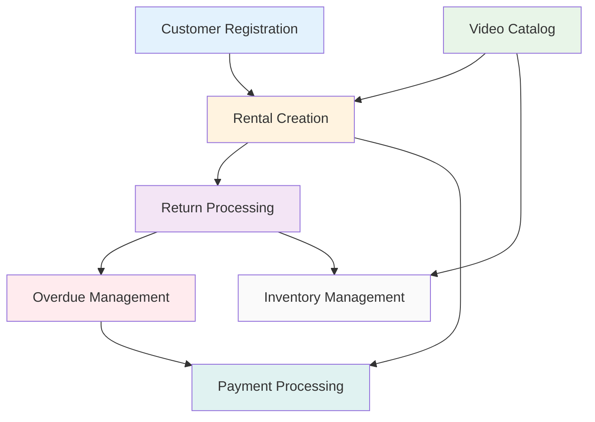

# Understanding Business Workflows Through Domain-Driven Design

## Welcome to Your Workflow Learning Laboratory

This section serves as a guided exploration of the operational dynamics of a video rental business. These are not merely technical diagrams; they represent the narratives of real-world business processes that occur daily within a typical rental store environment.

**Educational Value**: Each workflow presented illustrates both the "what" (the business operations) and the "how" (the technical implementation). This approach is designed to help you comprehend how Domain-Driven Design (DDD) principles facilitate the translation of business knowledge into functional software.

**Architectural Approach**: The workflows adhere to a straightforward **Customer/Staff Interaction → Business Logic Execution → Data Persistence** pattern, mirroring the operational flow of actual businesses.

## Your Business Process Learning Journey

### [🔗 Start Here: Workflow Interconnections](./00-workflow-interconnections.md)

**Understanding the Holistic View** - Before delving into individual processes, it is crucial to grasp how they interconnect:

- How distinct business workflows are interdependent.
- The pathways through which data flows between different operational units.
- The mechanisms by which business rules are enforced across the entire system.
- The importance of careful coordination for automated processes.

_Learning Objective_: To understand that no business process operates in isolation; all are integral components of a larger, interconnected system.

## Essential Business Operations: Learning Through Real-World Scenarios

Each workflow provides insights into different aspects of managing a business through software:

| Business Scenario                                                        | Learning Focus                          | Key Domain-Driven Design Insights                                                      |
| :----------------------------------------------------------------------- | :-------------------------------------- | :------------------------------------------------------------------------------------- |
| [📝 Customer Registration](./01-customer-registration-workflow.md)       | Onboarding new customers                | Direct data modeling, validation logic, business rule enforcement                      |
| [🎬 Video Catalog Management](./02-video-catalog-management-workflow.md) | Managing the product inventory catalog  | Search functionalities, metadata handling, availability calculation                    |
| [💰 Rental Creation](./03-rental-creation-workflow.md)                   | The core revenue-generating transaction | Multi-step validation, discount application logic, transactional integrity             |
| [📦 Return Processing](./04-return-processing-workflow.md)               | Completing the rental service lifecycle | Condition assessment, fee determination, state transitions                             |
| [⏰ Overdue Management](./05-overdue-management-workflow.md)             | Automated operational maintenance       | Background task processing, notification systems, business rule automation             |
| [💳 Payment Processing](./06-payment-processing-workflow.md)             | Managing financial flows                | Diverse payment methods, financial transaction handling, customer service interactions |
| [📋 Inventory Management](./07-inventory-management-workflow.md)         | Tracking physical assets                | Asset lifecycle management, condition monitoring, analytical reporting                 |

## Interconnectivity of Business Workflows: A System Architecture Perspective

Understanding the dependencies between workflows is fundamental to designing systems that accurately reflect business realities:

**Significance**: Observe that Rental Creation is central to this diagram. This centrality arises because it represents the core business transaction; all other processes either support or extend it. This illustrates a key DDD principle: identify and build around your core domain.

## Insights into Business Rule Implementation

### Understanding Customer-Facing Operations

- **Simplicity and Completeness**: Customer registration exemplifies effective validation without unnecessary over-engineering.
- **Automated Benefits**: The application of customer discounts demonstrates how business policies are translated into executable code.
- **Status Lifecycle Management**: The progression Active → Suspended → Inactive illustrates state management for customer accounts.

### Mastering Transactional Logic

- **Intelligent Discount Application**: Observe how customer-specific benefits are automatically applied during rental transactions.
- **Pragmatic Condition Assessment**: Using simple Good/Defective conditions avoids complexity that does not add tangible business value.
- **Diverse Financial Flows**: The system handles multiple payment types (e.g., Rental, Late Fee, Damage, Membership), each governed by distinct business rules.
- **Logical Late Fee Calculation**: Late fees accumulate daily based on rental rates, rather than arbitrary penalty amounts.

### Learning System Design Principles

- **Real-Time Data Processing**: The system features live availability calculations and instant pricing updates.
- **Comprehensive Validation**: Input validation is implemented throughout the system, providing clear and helpful error messages.
- **State Integrity**: All workflows are designed to include mechanisms for rollback and error recovery, preventing inconsistent states.
- **Business Event History**: A complete audit trail is maintained, recognizing the importance of compliance and customer service.

## Domain Simplification for Educational Purposes

### Exclusions and Rationale

- **Complex Inheritance Structures**: Instead of abstract base classes like `PersonBase`, customer information is stored directly. _Learning Point_: Simplicity can often be more effective than strict adherence to traditional OOP paradigms if it meets business needs.
- **Employee Management Subdomain**: This tutorial focuses on customer-centric operations. _Learning Point_: Clearly define the boundaries of your domain scope.
- **Elaborate Maintenance Workflows**: Only Good/Defective conditions are tracked for inventory. _Learning Point_: Model the level of complexity that your business genuinely requires, not what seems theoretically exhaustive.
- **Multi-Tiered Escalation Processes**: A single notification type is used to maintain clarity. _Learning Point_: Begin with a simple model and introduce complexity only when driven by explicit business requirements.

### Enhancements and Rationale

- **Automated Customer Discounts**: Percentage-based discounts are automatically applied, showcasing policy automation. _Learning Point_: When business rules are clearly defined, the corresponding code should reflect that clarity.
- **Streamlined Enumerations**: A limited set of four payment types and two conditions is used—sufficient for realistic business scenarios yet simple enough for comprehension. _Learning Point_: Resist the temptation to model every conceivable variation from the outset.
- **Purposeful Documentation**: These workflows are designed to teach underlying patterns, not just specific features. _Learning Point_: Effective documentation should explain the "why," not merely the "what."

## Your Implementation Learning Trajectory

### Managing Error Scenarios (Error Handling)

- **Clear Validation Messaging**: Learn to provide users with helpful, informative feedback instead of cryptic error codes.
- **Business Rule Enforcement**: Implement safeguards to prevent invalid state transitions before they can cause data integrity issues.
- **Graceful System Resilience**: Anticipate and handle potential database and integration failures professionally.
- **Recovery Strategies**: Understand and implement patterns like transaction rollback and compensation mechanisms to reliably "undo" complex operations.

### Achieving Real-World Performance

- **Strategic Database Indexing**: Identify which database queries require optimization and which do not, to balance performance and resource usage.
- **Judicious Caching**: Implement caching for data that changes infrequently, such as availability calculations and pricing information.
- **Targeted Monitoring**: Monitor key business metrics (e.g., rentals per day) alongside system performance metrics (e.g., response times).

### Getting Started on Your Learning Path

1. **Select a Workflow**: Begin with Customer Registration; it offers a balance of simplicity and completeness.
2. **Follow the Sequence Diagram**: Each diagram illustrates the interactions between different components of the application.
3. **Understand the "Why"**: Do not merely implement an API; strive to understand the underlying business need it fulfills.
4. **Adopt an Incremental Approach**: Implement and verify one workflow before proceeding to the next.

---

**Key Takeaway**: This educational material is not solely about constructing a rental system. It is fundamentally about cultivating the ability to think in terms of business domains and to translate real-world processes into robust, maintainable software. The patterns and principles demonstrated here are applicable to virtually any business domain you may encounter in your career.
